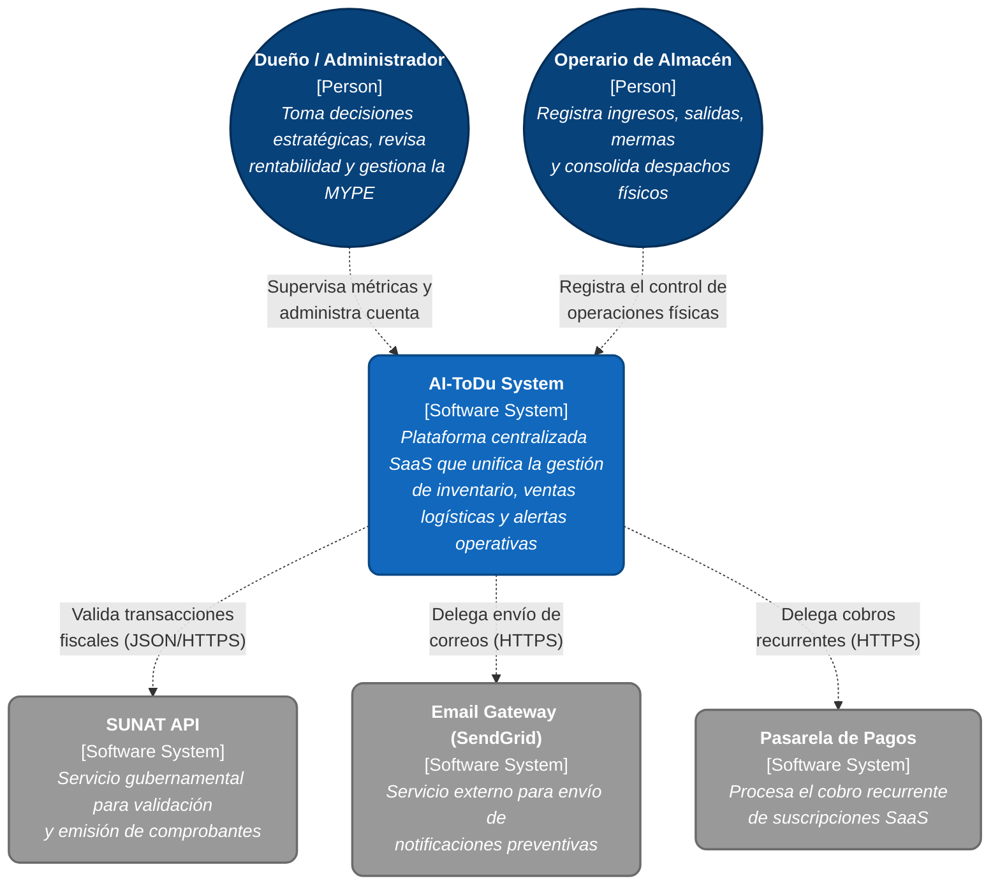
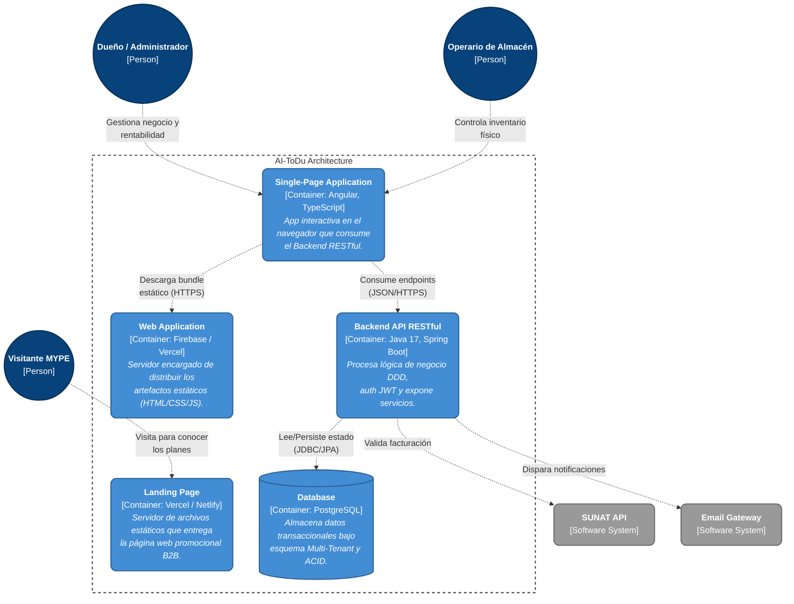
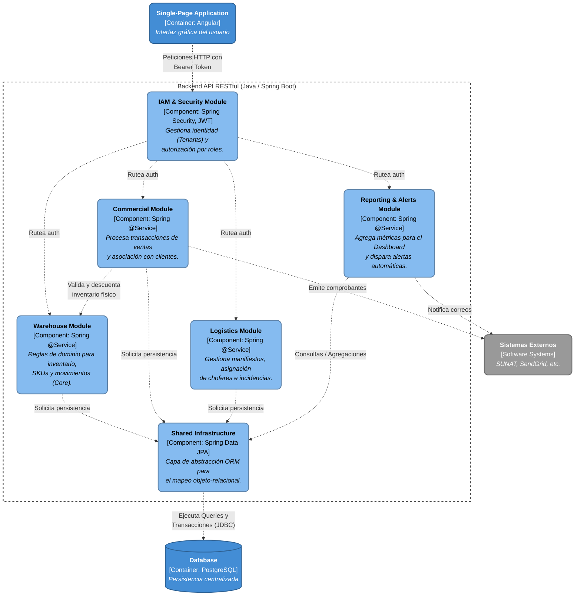
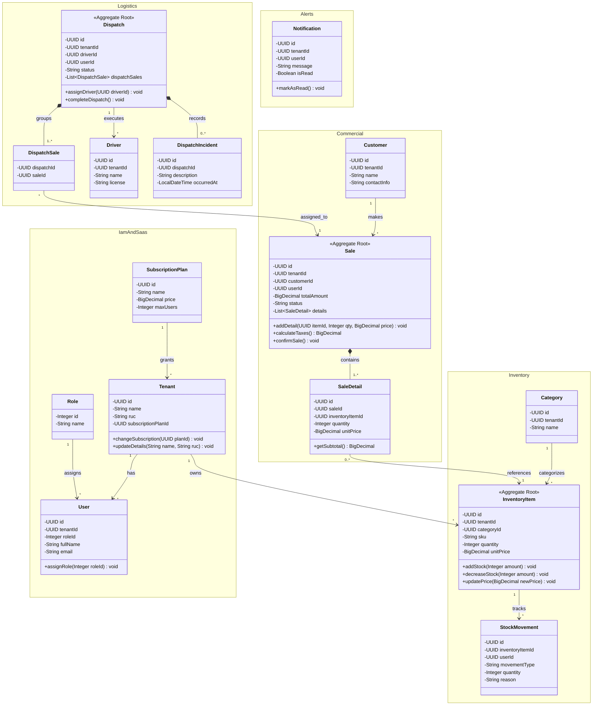
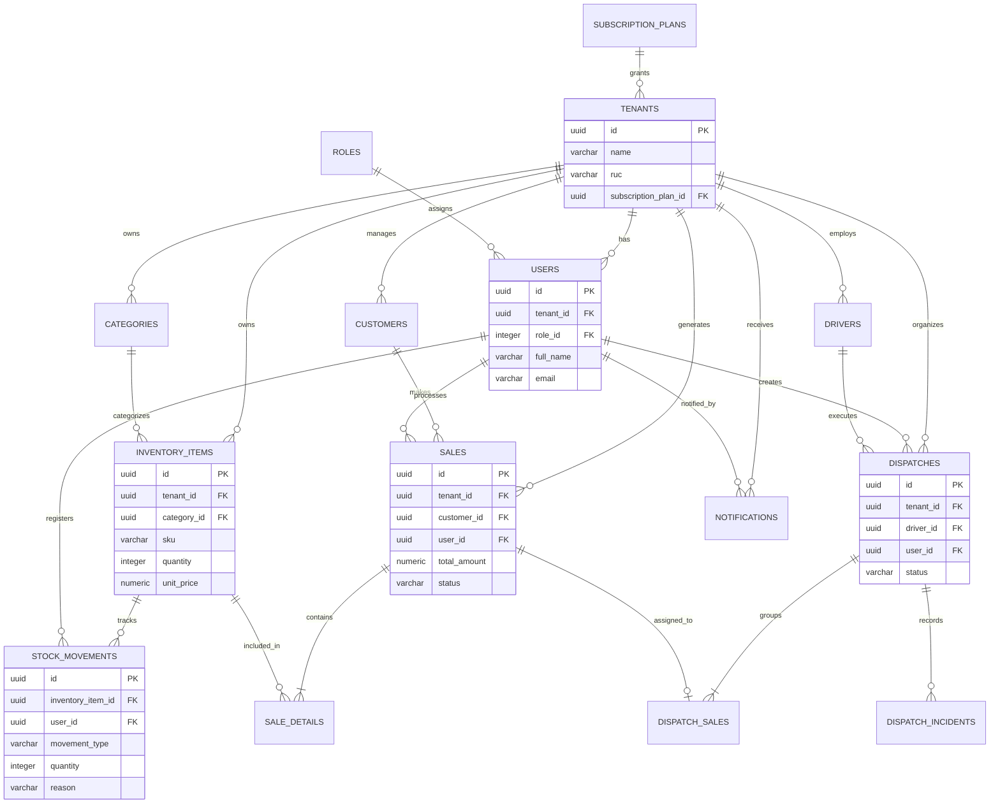

# Capítulo IV: Product Design

En este capítulo detallamos las directrices visuales, arquitectónicas y de experiencia de usuario que guiarán el desarrollo de AI-ToDu. El diseño de nuestro producto se fundamenta en heurísticas de usabilidad estandarizadas, garantizando una curva de aprendizaje mínima y una alta eficiencia operativa para las MYPES.

## 4.1. Style Guidelines

El sistema de diseño de AI-ToDu se fundamenta en principios de claridad, confianza y eficiencia operativa. Dado que la plataforma será utilizada por dueños y administradores de MYPES, así como por jefes de logística y operarios de almacén con diferentes niveles de experiencia tecnológica, la interfaz debe priorizar la legibilidad, la intuición y la consistencia visual en todos los puntos de contacto.

### 4.1.1. General Style Guidelines

La identidad visual de AI-ToDu se fundamenta en los elementos conceptuales de una plataforma digital orientada a la gestión de inventario, ventas y despachos. El diseño integra conceptos relacionados con la organización de productos, el control de existencias, la centralización de información y la automatización de procesos empresariales. El tono de comunicación es profesional, directo y resolutivo, diseñado para transmitir confianza B2B en el entorno de las Micro y Pequeñas Empresas.

**4.1.1.1. Branding**

Para AI-ToDu, el branding se diseñó para mostrar innovación tecnológica, control empresarial y eficiencia operativa. Los elementos conceptuales del isotipo representan la centralización de la información, el seguimiento de los productos y la conexión entre los procesos de almacén, ventas y despacho.

El diseño incluye el imagotipo y el nombre del producto “AI-ToDu” de forma clara y legible, permitiendo que la marca sea reconocida fácilmente dentro de la Landing Page, la aplicación web, los documentos del proyecto y los dispositivos móviles.

  

**4.1.1.2. Typography**

La tipografía de AI-ToDu ha sido definida con el objetivo de mantener una interfaz clara, profesional y legible. La familia tipográfica principal de la plataforma es **Inter**, seleccionada por su alta legibilidad en interfaces digitales y su versatilidad para establecer distintos niveles de jerarquía visual:

* **Page Title / H1:** Inter Bold, 32 px
* **Section Heading / H2:** Inter SemiBold, 24 px
* **Subheading / H3:** Inter SemiBold, 20 px
* **Body Text:** Inter Regular, 16 px
* **Small / Auxiliary Text:** Inter Regular, 14 px
* **Labels / Caption:** Inter Regular, 12 px

El interlineado se establece aproximadamente entre 1.3 y 1.5 veces el tamaño de la fuente, favoreciendo la lectura tanto en bloques de contenido como en interfaces que presentan información operativa.

**4.1.1.3. Paleta de Colores**

La paleta de colores de AI-ToDu busca transmitir confianza, innovación y eficiencia. Se utilizan tonos corporativos para la navegación y colores semánticos para comunicar los estados del sistema:

* **Corporate Navy (`#0F172A`):** Títulos, navegación y elementos estructurales.
* **Primary Teal (`#0D9488`):** Botones y acciones principales.
* **Teal Light (`#CCFBF1`):** Fondos informativos y elementos destacados.
* **Background Light (`#F8FAFC`):** Fondo general de la aplicación.
* **Success Green (`#16A34A`):** Operaciones completadas y stock disponible.
* **Warning Amber (`#F59E0B`):** Stock bajo y revisiones pendientes.
* **Error Red (`#DC2626`):** Stock agotado, errores e incidencias críticas.

**4.1.1.4. Spacing**

El sistema de espaciado se basa en una cuadrícula de 4 píxeles, permitiendo mantener consistencia entre los diferentes componentes. La escala utilizada es:
* **4 px:** Separación mínima (ej. ícono y etiqueta).
* **8 px:** Elementos relacionados del mismo grupo.
* **12 px:** Componentes pequeños o separaciones internas frecuentes.
* **16 px:** Separación interna de componentes (tarjetas, formularios).
* **24 px:** Separación visual clara entre tarjetas y subsecciones.
* **32 px:** División de bloques principales dentro de una vista.
* **48 px:** Separación amplia entre secciones de la Landing Page.

**4.1.1.5. Iconography**

La iconografía sigue un estilo simple, lineal, reconocible y consistente. Se priorizan íconos de apariencia limpia, evitando ilustraciones excesivamente complejas. Entre los principales elementos representados se encuentran: Dashboard, Inventario, Registrar entrada/salida, Ventas, Despachos, Reportes, Alertas, y Perfil.
Los íconos no reemplazan por completo el contenido textual en las operaciones importantes; se acompañan de una etiqueta descriptiva para reducir la carga cognitiva.

**4.1.1.6. Tone of Communication and Applied Language**

El tono de comunicación es claro, profesional, respetuoso, sereno y orientado a la acción. Se evitan tecnicismos innecesarios y mensajes ambiguos.
* **Acciones:** “Registrar entrada”, “Registrar salida”, “Registrar merma”, “Buscar producto”, “Ver detalles”.
* **Estados y datos:** “Stock disponible”, “Stock bajo”, “Stock agotado”, “Producto en cuarentena”, “Movimiento registrado”.

### 4.1.2. Web Style Guidelines

En el diseño visual de AI-ToDu se utiliza una línea gráfica moderna, profesional y funcional. La jerarquía visual se construye mediante la tipografía Inter, tamaños diferenciados y colores de alto contraste (Corporate Navy y Primary Teal). Los componentes interactivos presentan estados visuales claros (*normal, hover, focus, active*). Se utilizan tarjetas con bordes suaves y tablas organizadas. Además, el diseño *responsive* permite que AI-ToDu conserve su funcionalidad en computadoras, tablets y smartphones.

## 4.2. Information Architecture

La arquitectura de información de AI-ToDu está diseñada para que visitantes y usuarios operativos encuentren lo que necesitan con el menor número de clics posible, reduciendo la fricción.

### 4.2.1. Organization Systems

Para AI-ToDu se opta por una organización visual jerárquica con elementos secuenciales. El contenido se organiza en categorías como “Dashboard”, “Inventario”, “Ventas”, “Despachos”, “Reportes” y “Configuración”. En determinadas secciones se incorporan flujos secuenciales que guían al usuario paso a paso (ej. registrar una entrada o crear una transacción comercial).

  <em>Enlace a la estructura en Miro: <a href="https://miro.com/app/board/uXjVHlZ7CiQ=/?share_link_id=480881319023">Ver Arquitectura de Información AI-ToDu</a></em>

### 4.2.2. Labeling Systems

El sistema de etiquetas utiliza una terminología clara y uniforme:

| Sección / Etiqueta | Descripción |
| :--- | :--- |
| **Inicio / Dashboard** | Presenta un resumen del estado del negocio, incluyendo ventas, inventario, alertas y rentabilidad. |
| **Inventario / Inventory** | Permite consultar y administrar los productos, SKU, cantidades, ubicaciones y estados. |
| **Registrar entrada / Register Input** | Permite ingresar nueva mercadería y actualizar la cantidad disponible. |
| **Registrar salida / Register Output** | Permite registrar la salida de productos por venta o despacho. |
| **Registrar merma / Register Loss** | Permite registrar productos dañados, vencidos o perdidos. |
| **Ventas / Sales** | Permite crear y consultar transacciones comerciales y estados de pago. |
| **Despachos / Shipments** | Permite gestionar manifiestos, productos enviados y estados de entrega. |
| **Reportes / Reports** | Presenta información sobre ventas, stock, mermas, movimientos y rentabilidad. |
| **Usuarios y roles / Users and Roles** | Permite administrar las cuentas y asignar permisos. |
| **Configuración / Settings** | Permite gestionar los datos del negocio y las preferencias del sistema. |

### 4.2.3. SEO Tags and Meta Tags

Los metadatos se definen con el objetivo de posicionar correctamente la plataforma y proporcionar información clara a los navegadores:

| Página | Title | Description | Keywords | Author |
| :--- | :--- | :--- | :--- | :--- |
| **Landing Page** | AI-ToDu \| Gestión de inventario y ventas para MYPES | Centraliza el inventario, las ventas y despachos mediante una plataforma web sencilla. | inventario MYPE, control de stock, gestión de ventas, AI-ToDu | IA-INNOVATION Team |
| **Login / Registro** | Accede a AI-ToDu \| Iniciar sesión o registrarse | Inicia sesión o crea una cuenta en AI-ToDu para gestionar las operaciones de tu negocio. | AI-ToDu, iniciar sesión, registro, inventario, MYPES | IA-INNOVATION Team |
| **Dashboard** | Dashboard \| AI-ToDu | Consulta el estado de tu inventario, ventas, mermas, alertas y principales indicadores. | dashboard, inventario, ventas, reportes, rentabilidad | IA-INNOVATION Team |

La Landing Page utilizará el atributo `lang="es-PE"` y el Meta Tag `viewport` para mantener una presentación adaptable a diferentes tamaños de pantalla.

### 4.2.4. Searching Systems

AI-ToDu incorpora mecanismos de búsqueda y filtrado ágiles.

**Searching System para productos:**
| Criterio | Descripción |
| :--- | :--- |
| **SKU** | Localiza un producto mediante su código único. |
| **Nombre** | Busca artículos por coincidencia de texto. |
| **Categoría** | Filtra productos de una categoría específica. |
| **Ubicación** | Busca artículos según su zona o repisa. |

**Searching System mediante filtros:**
| Filtro | Descripción |
| :--- | :--- |
| **Fecha** | Filtra registros por un periodo. |
| **Tipo de movimiento** | Muestra entradas, salidas o mermas. |
| **Estado** | Filtra productos disponibles, con stock bajo, agotados o en cuarentena. |

*Nota: El dueño o administrador puede buscar en todos los módulos, mientras que el operario de almacén solo accede a la información permitida por su rol.*

### 4.2.5. Navigation Systems

**Navegación de la Landing Page:**
Utiliza una navegación horizontal en escritorio y un menú hamburguesa adaptable en móviles. Incorpora llamados a la acción dirigidos a los dueños ("Registrarse") y operarios.

**Navegación para el Dueño o Administrador (Web App):**
| Nombre | Descripción |
| :--- | :--- |
| **Dashboard** | Presenta indicadores de ventas, inventario, mermas y rentabilidad. |
| **Inventario** | Permite consultar productos, stock y movimientos. |
| **Ventas / Despachos** | Gestión de transacciones comerciales y salidas de mercadería. |
| **Reportes / Roles** | Información financiera y administración de permisos de empleados. |

**Navegación para el Operario de Almacén:**
| Nombre | Descripción |
| :--- | :--- |
| **Inicio** | Presenta tareas pendientes y alertas de inventario. |
| **Registrar entrada / salida / merma** | Accesos rápidos enfocados en la operación física del almacén. |
| **Buscar producto** | Localización rápida de artículos por SKU. |

## 4.3. Landing Page UI Design

La propuesta visual traduce nuestras decisiones de Arquitectura de Información y Guías de Estilo en una interfaz orientada a la conversión B2B. El diseño se enfoca en transmitir confianza institucional y guiar al visitante hacia el registro.

### 4.3.1. Landing Page Wireframe

Hemos priorizado la heurística de "Diseño estético y minimalista", asegurando que el *Hero Section* contenga una propuesta de valor clara y un único *Call to Action* prominente.

  
   <em>Enlace a Figma: <a href="https://www.figma.com/design/ANY4VrfpB2hySc15nBdAhz/Sin-t%C3%ADtulo?node-id=0-1&t=k8B8SCaVRYBwmB9R-1">Ver Wireframes AI-ToDu</a></em>

### 4.3.2. Landing Page Mock-up

Los mock-ups integran nuestro *Design System*. Utilizamos la paleta de colores corporativa (Navy y Teal) para resaltar los botones de acción sobre fondos limpios, cumpliendo con los estándares de contraste (WCAG).

  
   <em>Enlace a Figma: <a href="https://www.figma.com/design/ANY4VrfpB2hySc15nBdAhz/Sin-t%C3%ADtulo?node-id=0-1&t=k8B8SCaVRYBwmB9R-1">Ver Mockups AI-ToDu</a></em>

## 4.4. Web Applications UX/UI Design

El diseño de la aplicación web organiza las experiencias de los dos roles principales: el Dueño/Administrador (supervisión e indicadores) y el Operario de Almacén (registro rápido de movimientos).

### 4.4.1. Web Applications Wireframes

En el dashboard se prioriza la visualización de indicadores de inventario, ventas y rentabilidad. La distribución se adapta a dispositivos móviles para los operarios.

| Familia de vistas | Propósito | Historias relacionadas |
| :--- | :--- | :--- |
| **Acceso y cuenta** | Registro, inicio y cierre de sesión. | US01 |
| **Dashboard** | Consulta de inventario, ventas, mermas y rentabilidad. | US03 |
| **Inventario** | Consulta de productos, SKU, cantidades y estados. | US02, US04 |
| **Registrar entrada / salida** | Registro de nueva mercadería o despachos. | US02, US03 |
| **Notificaciones y Roles** | Avisos sobre stock bajo y administración de permisos. | US03, US05 |

### 4.4.2. Web Applications Wireflow Diagrams

Los wireflows representan la secuencia de pantallas y acciones que debe seguir cada usuario:

| Wireflow | Usuario y objetivo | Secuencia funcional |
| :--- | :--- | :--- |
| **W1** | **Admin/Operario:** Registrar entrada | Módulo Inventario → "Registrar entrada" → completar SKU → guardar → visualizar actualizado. |
| **W2** | **Admin:** Eliminar producto | Módulo Inventario → seleccionar ícono eliminar → confirmar mensaje → visualizar listado. |
| **W3** | **Admin/Operario:** Consultar ventas | Menú lateral → "Ventas" → consultar registro de transacciones. |
| **W4** | **Admin/Operario:** Consultar despachos | Menú lateral → "Despachos" → organizar y hacer seguimiento. |
| **W5** | **Admin:** Consultar reportes | Menú lateral → "Reportes" → consultar finanzas y compras. |
| **W6** | **Admin/Operario:** Notificaciones | Dashboard → ícono de notificaciones → revisar alertas de stock. |

  
   <em>Nota. Representación secuencial de las acciones W1 a W6.</em>

### 4.4.3. Web Applications Mock-ups

Los mock-ups presentan la propuesta visual final. Utilizan un menú lateral de navegación, tarjetas de resumen y tablas. Los estados del inventario se diferencian como “Óptimo”, “Alerta” y “Quiebre”.

  

### 4.4.4. Web Applications User Flow Diagrams

Las representaciones de decisiones complementan la secuencia de pantallas al incorporar las condiciones lógicas de AI-ToDu:
* El registro de una entrada válida actualiza la cantidad.
* No se permite registrar una salida mayor al stock disponible.
* Un producto en cuarentena no puede venderse ni despacharse.
* Las alternativas incluyen datos incompletos, SKU inexistente, stock insuficiente y errores de guardado.

  

### 4.5. Web Applications Prototyping

El prototipo de AI-ToDu reúne las interfaces y conexiones de navegación para explorar la experiencia de usuario. Su evaluación comprueba la continuidad de las interacciones en computadoras y dispositivos móviles, simulando la experiencia de uso ágil.

  

## 4.6. Domain-Driven Software Architecture

AI-ToDu adopta el enfoque de *Domain-Driven Design* (DDD) con el objetivo de organizar la solución según los procesos reales de gestión de las MYPES. El sistema se estructura en diferentes *Bounded Contexts*, encapsulando las reglas de negocio y facilitando la mantenibilidad técnica.

| Bounded Context | Descripción |
| :--- | :--- |
| **IAM** | Gestiona la autenticación, usuarios, roles y permisos de acceso. |
| **Warehouse & Inventory Management** | Administra productos, SKU, existencias, entradas, salidas y mermas (Core Domain). |
| **Sales & Commercial Transactions** | Gestiona ventas, productos vendidos y totales. |
| **Logistics & Dispatch** | Administra manifiestos y seguimiento de envíos. |
| **Reporting & Notifications** | Genera indicadores financieros y alertas de stock. |

### 4.6.1. Design-Level Event Storming

A través del EventStorming a nivel de diseño, se identificaron las interdependencias e integración entre los módulos:

| Origen — Evento | Destino — Comando | Descripción |
| :--- | :--- | :--- |
| **IAM:** User Authenticated | **Warehouse:** Register Movement | Un usuario autenticado puede registrar movimientos según permisos. |
| **Warehouse:** Merchandise Received | **Warehouse:** Update Inventory | La recepción de mercadería incrementa la cantidad disponible. |
| **Warehouse:** Low Stock Triggered | **Notifications:** Send Alert | El stock bajo genera una alerta para el usuario autorizado. |
| **Sales:** Transaction Created | **Warehouse:** Dispatch Merch. | Una venta confirmada solicita la salida de los productos. |

  
   <em>Nota. Flujo de comandos, agregados y políticas de AI-ToDu.</em>

### 4.6.2. Software Architecture Context Diagram

El Diagrama de Contexto (Nivel 1 C4) ilustra el sistema central en su ecosistema operativo. Está liderado por el Dueño/Administrador y el Operario de Almacén. Se integra con plataformas externas como SUNAT API, Email Gateway (SendGrid) y Pasarelas de Pago.

### 4.6.3. Software Architecture Container Diagrams

El Diagrama de Contenedores (Nivel 2 C4) expone las unidades de ejecución y despliegue:
* **Landing Page:** Sitio estático (Vercel/Netlify).
* **Web Application (SPA):** Desarrollada con **Angular y TypeScript**, interfaz responsiva para operarios y gerentes.
* **Backend API:** Desarrollado en **Java 17 con Spring Boot** bajo arquitectura DDD. Procesa peticiones autenticadas vía JWT.
* **Database:** **PostgreSQL** para persistir el registro transaccional bajo garantías ACID.

### 4.6.4. Software Architecture Components Diagrams

El Diagrama de Componentes (Nivel 3 C4) descompone el contenedor del **Backend API (Spring Boot)**. Muestra los módulos cohesivos: *IAM Module, Warehouse Module, Sales Module, Logistics Module* y la capa de *Shared Infrastructure* apoyada en **Spring Data JPA**.

## 4.7. Software Object-Oriented Design

Detallamos cómo los conceptos del DDD se traducen en código **Java**. El diseño orientado a objetos protege rigurosamente los invariantes encapsulando el estado.

### 4.7.1. Class Diagrams

Los Diagramas de Clases UML para los Bounded Contexts principales en Spring Boot (Java) son:
* **Warehouse Context:** La clase `InventoryItem` actúa como el Aggregate Root. Sus atributos se mantienen privados para evitar modificaciones externas directas. Exponemos métodos de dominio (ej. `updateConservationStatus`) que validan reglas de negocio.
* **Logistics Context:** La clase `ShipmentManifest` es el Aggregate Root. Contiene a `IoTTelemetry` como un *Value Object* inmutable sin ID propio.
* **Billing Context:** La clase `CommercialTransaction` almacena una referencia lógica (`linkedManifestId`) en lugar de un acoplamiento directo de objeto para mantener la independencia del módulo.

## 4.8. Database Design

El diseño en PostgreSQL sigue la filosofía de separación por Bounded Contexts, utilizando referencias lógicas blandas en lugar de Foreign Keys estrictas entre módulos separados para evitar el antipatrón "Big Ball of Mud".

### 4.8.1. Database Diagrams

Mapeado mediante **Spring Data JPA**, el ERD refleja:
* **Esquema WAREHOUSE:** Tabla `inventory_items` con llave primaria UUID. Enum de estados persistidos como VARCHAR.
* **Esquema LOGISTICS:** Tabla `shipment_manifests`. Atributos de Value Objects se aplana mediante la anotación `@Embedded`.
* **Esquema BILLING:** Tabla `commercial_transactions` incluye `linked_manifest_id` como referencia lógica al despacho.

