

    

# UNIVERSIDAD PERUANA DE CIENCIAS APLICADAS

### Facultad de Ingeniería
### Carrera de Ingeniería de Software

 

### **7750**
### **Desarrollo de aplicaciones Open Source**

 

# **Informe del Trabajo Final**

Docente
### **Bautista Ubillús, Efraín Ricardo**

 

Startup
### **IA-INNOVATION**

Producto
### **AI-ToDu**

 

## **INTEGRANTES**

| Código | Apellidos y Nombres |
| :---: | :--- |
| U202420071 | Bernal Torres, Carlos Alberto |
| U20241i327 | Chui Kcomt, Luis Carlos |
| U202411324 | Condezo Pacheco, Fernando André |
| U202417747 | Salazar Marquina, Kevin Junior |
| U202422620 | Salazar Quiche, Darikson Bill |

 

### **Período 2026-2**
### **Septiembre 2026**

## Registro de Versiones del Informe

    <table style="margin: 0 auto; display: inline-table; text-align: left;">
        <tr>
            <th>Versión</th>
            <th>Fecha</th>
            <th>Autor</th>
            <th>Descripción de modificación</th>
        </tr>
        <tr>
            <td><strong>1.0</strong></td>
            <td>12/09/2026</td>
            <td>- Equipo IA-INNOVATION</td>
            <td>Estructuración inicial del repositorio de documentación. Redacción del <strong>Capítulo I</strong> (Startup Profile, Antecedentes) y <strong>Capítulo II</strong>.</td>
        </tr>
        <tr>
            <td><strong>AV1 (1.1)</strong></td>
            <td>19/09/2026</td>
            <td>- Equipo IA-INNOVATION</td>
            <td>Desarrollo del <strong>Capítulo V</strong>. Despliegue de la Landing Page v1.0.0 (Sprint 1), adición de Student Outcome ABET y consolidación de la primera entrega (AV1).</td>
        </tr>
        <tr>
            <td><strong>TF (2.0)</strong></td>
            <td>08/10/2026</td>
            <td>- Equipo IA-INNOVATION</td>
            <td>Actualización de ABET, corrección de métricas de Sprints, adición completa del <strong>Sprint 3</strong> (WebApp, Dashboard, POS, Logística) y evaluación heurística. Despliegue final en GitHub Pages.</td>
        </tr>
    </table>

# Project Report Collaboration Insights

El desarrollo y evolución de este informe de proyecto se gestiona de forma colaborativa a través de un repositorio de control de versiones en GitHub, perteneciente a la organización pública de nuestro equipo (IA-INNOVATION).

Durante todas las etapas del proyecto (desde la entrega AV1 hasta el Trabajo Final - TF), todos los miembros del equipo han colaborado en la redacción integral de los capítulos utilizando la sintaxis Markdown. Para asegurar la calidad de la documentación técnica y de negocio, se aplicaron flujos de trabajo basados en branches (ramas) para el desarrollo de cada sección y se realizaron Pull Requests obligatorios para su revisión cruzada antes de la integración a la rama principal (main).

A continuación, se presenta la consolidación del desarrollo de actividades para la elaboración del informe final, respaldada por las capturas de los analíticos de colaboración y el registro final de commits en GitHub.

  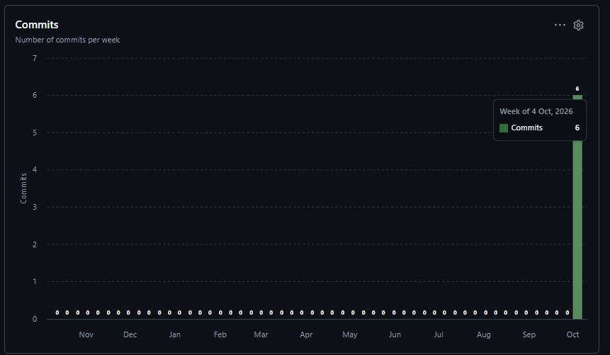  
  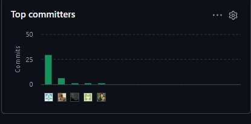  
  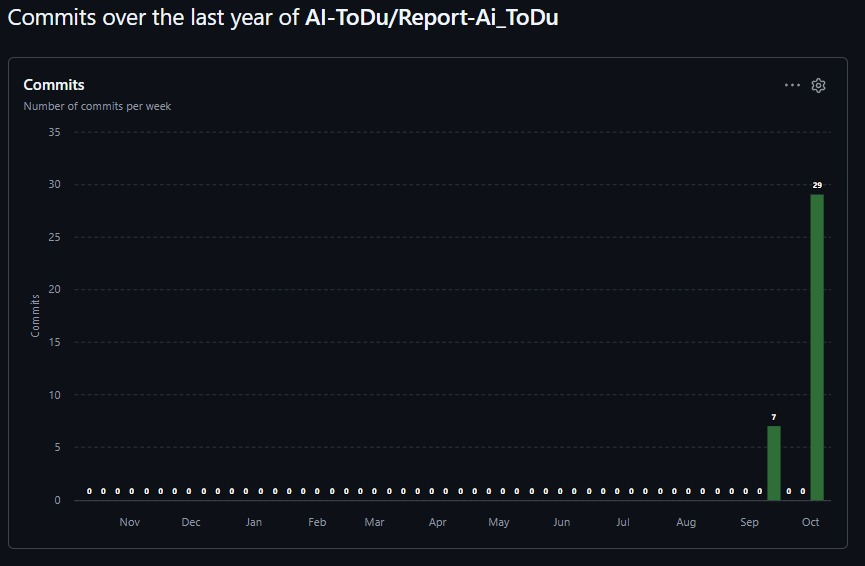  
  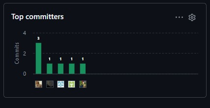  

## Commits por integrante (AV1)

- **Bernal Torres, Carlos Alberto (`CharlesBernal-Hub`)**: 8 commits
- **Chui Kcomt, Luis Carlos (`OffEnergy`)**: 8 commits
- **Condezo Pacheco, Fernando André (`LEFEROX`)**: 6 commits
- **Salazar Marquina, Kevin Junior (`AresSalamar`)**: 12 commits
- **Salazar Quiche, Darikson Bill (`darikson26`)**: 4 commits
- **Total de commits en AV1:** 38

---

Repositorio de GitHub (Reporte): [https://github.com/AI-ToDu-Aplicaciones-Web](https://github.com/AI-ToDu)

## Contenido
**Tabla de Contenidos:**

- [Carátula](#universidad-peruana-de-ciencias-aplicadas)
- [Registro de Versiones del Informe](#registro-de-versiones-del-informe)
- [Project Report Collaboration Insights](#project-report-collaboration-insights)
- [Student Outcome ABET 3](#abet---eac---student-outcome-3)
- [Capítulo I: Introducción](01-Chapter-1.md)
- [Capítulo II: Requirements Elicitation & Analysis](02-Chapter-2.md)
- [Capítulo III: Requirements Specification](03-Chapter-3.md)
- [Capítulo IV: Product Design](04-Chapter-4.md)
- [Capítulo V: Product Implementation, Validation & Deployment](05-Chapter-5.md)
- [Conclusiones](06-Conclusions.md)

---

# ABET - EAC - Student Outcome 3

**Criterio:** _Capacidad de comunicarse efectivamente con un rango de audiencias._

| Criterio específico | Acciones realizadas | Conclusiones |
| :--- | :--- | :--- |
| **Comunica oralmente con efectividad a diferentes rangos de audiencia.** | **Salazar Marquina, Kevin Junior** TF: Expuso en la sustentación final la arquitectura técnica (DDD, Angular Signals, Vercel/GitHub Pages), adaptando la complejidad técnica para el jurado evaluador.  **Chui Kcomt, Luis Carlos** TF: Presentó el flujo funcional del sistema, demostrando el impacto del producto desde la perspectiva de negocios B2B y logística operativa.  **Salazar Quiche, Darikson Bill** TF: Condujo la demostración en vivo (Live Demo) del Punto de Venta (POS) y el Dashboard, articulando claramente la propuesta de valor para el usuario final. | El equipo logró articular el valor integral del proyecto tanto para una audiencia técnica (explicando la arquitectura DDD y el consumo de APIs) como para una audiencia de negocios (MYPEs), evidenciado en la claridad y fluidez de la sustentación final del software operativo. |
| **Comunica por escrito con efectividad a diferentes rangos de audiencia.** | **Bernal Torres, Carlos Alberto** TF: Redactó y refinó las User Stories aplicando el formato Gherkin (Given-When-Then) y diseñó las evaluaciones heurísticas, estandarizando la comunicación con el equipo de QA.  **Condezo Pacheco, Fernando André** TF: Documentó el Lean UX Process, actualizó el informe y configuró los manuales de despliegue en el README.md, garantizando un formato corporativo y sin ambigüedades. | A través de la documentación en GitHub y el uso de Markdown, se consiguió un nivel de redacción profesional. El equipo aplicó el Lenguaje Ubicuo (Ubiquitous Language) en inglés y documentó la API y la arquitectura, logrando que el informe sea comprensible para stakeholders técnicos y de negocio. |

# Capítulo I: Introducción

## 1.1. Startup Profile

### 1.1.1. Descripción de la Startup

Nuestra startup, IA-INNOVATION, nace de la experiencia directa de sus fundadores lidiando con ineficiencias operativas en diferentes rubros comerciales. Habiendo trabajado desde el interior de negocios familiares de gastronomía, almacenes corporativos, empresas textiles recientes y consorcios de distribución de alimentos para el Estado, el equipo identificó un "dolor" compartido: la ausencia crítica de herramientas tecnológicas adaptadas a la realidad de las Micro y Pequeñas Empresas (MYPES).

Nos dedicamos a desarrollar soluciones de software B2B (Business-to-Business) ágiles y generalizables que democratizan la digitalización, siendo nuestro producto estrella AI-ToDu.

> **Misión:** Democratizar el acceso a la tecnología para las MYPES latinoamericanas, proporcionando herramientas digitales intuitivas y centralizadas que optimicen su cadena de suministro y les permitan competir con mayor eficiencia en el mercado.
>
> **Visión:** Convertirnos en el aliado tecnológico líder (el "sistema nervioso central") de la logística y operaciones para pequeñas y medianas empresas, escalando nuestras plataformas hacia la integración con tecnologías avanzadas como el Internet de las Cosas (IoT).
>
> **Valores:**
> * **Empatía:** Entendemos los problemas de nuestros usuarios porque los hemos vivido en carne propia.
> * **Innovación adaptable:** Creamos soluciones que se amoldan a la realidad y tamaño de cada negocio, no al revés.
> * **Transparencia:** Promovemos la claridad de la información tanto en el interior de nuestra startup como en las operaciones de nuestros clientes.
> * **Eficiencia:** Buscamos hacer más con menos, eliminando los procesos repetitivos y manuales.

### 1.1.2. Perfiles de integrantes del equipo

<table border="1" cellspacing="0" cellpadding="8" style="border-collapse: collapse; width: 100%;">
<thead>
<tr style="background-color: #f2f2f2; text-align: center;">
<th>Apellido y nombre</th>
<th>Carrera</th>
<th style="text-align: left;">Perfil</th>
</tr>
</thead>
<tbody>
<tr>
<td align="center" valign="middle">
  <b>Bernal Torres, Carlos Alberto</b> 
  <small>Código: U202420071</small>
    

</td>
<td align="center">Ingeniería de Software</td>
<td>Estudiante con sólidos conocimientos en el desarrollo frontend y backend. Aporta al equipo habilidades en la implementación de arquitecturas orientadas a dominio (DDD).</td>
</tr>
<tr>
<td align="center" valign="middle">
  <b>Chui Kcomt, Luis Carlos</b> 
  <small>Código: U20241i327</small>
    

</td>
<td align="center">Ingeniería de Software</td>
<td>Estudiante responsable con conocimientos en Python, C++, HTML. Aporto calidad y buen rendimiento en trabajos en equipo asi como buen ambiente y compromiso.</td>
</tr>
<tr>
<td align="center" valign="middle">
  <b>Condezo Pacheco, Fernando André</b> 
  <small>Código: U202411324</small>
    

</td>
<td align="center">Ingeniería de Software</td>
<td>Estudiante con conocimientos en C++ y Python. Aporto colaboración con el equipo y buen ambiente.</td>
</tr>
<tr>
<td align="center" valign="middle">
  <b>Salazar Marquina, Kevin Junior</b> 
  <small>Código: U202417747</small>
    

</td>
<td align="center">Ingeniería de Software</td>
<td>Estudiante con sólidos conocimientos en el desarrollo frontend y backend. Aporta al equipo habilidades en el uso de frameworks como Angular y Spring Boot, enfocado en asegurar la escalabilidad del sistema B2B.</td>
</tr>
<tr>
<td align="center" valign="middle">
  <b>Salazar Quiche, Darikson Bill</b> 
  <small>Código: U202422620</small>
    

</td>
<td align="center">Ingeniería de Software</td>
<td>Estudiante proactivo, enfocado en el desarrollo de interfaces amigables (UI/UX) y en el análisis de las necesidades operativas de los negocios MYPE.</td>
</tr>
</tbody>
</table>

*(Nota: Los Capítulos I, II, III y IV se mantienen consistentes con el AV1, cubriendo Lean UX, Impact Mapping, Arquitectura DDD, Componentes y Diagramas de Base de Datos).*

## 1.2. Solution Profile

### 1.2.1. Antecedentes y problemática

Históricamente, las Micro y Pequeñas Empresas (MYPES) han administrado su logística mediante procesos rudimentarios, apoyándose en registros manuales o herramientas ofimáticas básicas sin integración. Esta falta de digitalización genera cuellos de botella críticos, tales como la pérdida de trazabilidad en los suministros, desajustes imprevistos en el stock y una visibilidad limitada sobre la rentabilidad real de sus transacciones comerciales.

En el panorama tecnológico actual, las alternativas de software robustas suelen ser inaccesibles para los pequeños empresarios, ya sea por sus elevadas tarifas de licenciamiento o por la complejidad técnica que exige su configuración. Se evidencia, así, una desconexión entre la urgencia de modernización de este sector y la oferta de mercado, que frecuentemente ignora las limitaciones financieras y la agilidad operativa propias de las MYPES.

Con el propósito de profundizar en la naturaleza del problema identificado, hemos empleado la metodología de análisis **The 5 'W's y 2 'H's**:

* **Who (¿Quién lo sufre?):** Propietarios, gestores administrativos y colaboradores operativos de MYPES que carecen de ecosistemas tecnológicos estandarizados para sus procesos.
* **What (¿Cuál es el problema?):** Inexistencia de un entorno digital unificado para articular el inventario, las ventas y el despacho, resultando en una gestión basada en la empirismo o registros aislados.
* **Where (¿Dónde ocurre?):** En el núcleo de las actividades empresariales diarias, particularmente dentro de los almacenes, centros de distribución y puntos críticos de venta.
* **When (¿Cuándo ocurre?):** Se manifiesta durante el control de flujos de mercadería, en la conciliación de existencias y al intentar rastrear la trazabilidad de cada transacción comercial.
* **Why (¿Por qué ocurre?):** Debido a que las soluciones ERP del mercado actual suelen ser financieramente prohibitivas, técnicamente complejas y poco flexibles ante la agilidad que requiere una pequeña empresa.
* **How (¿Cómo se manifiesta?):** Mediante ineficiencias operativas, pérdida de trazabilidad de suministros, descuadres de stock imprevistos y una visibilidad limitada sobre la salud financiera real.
* **How Much (¿Cuánto afecta?):** Provoca mermas económicas por falta de control, vencimientos no gestionados y un elevado costo de oportunidad por la excesiva carga de tareas manuales.

**Objetivo del producto:**
Con el objetivo de cerrar esta brecha, surge AI-ToDu como un ecosistema digital bajo la modalidad SaaS, enfocado en unificar y potenciar la cadena de valor. Nuestra herramienta permite articular los flujos de almacén, transacciones de venta y logística de entrega en un solo entorno, facilitando reportes financieros automáticos y notificaciones preventivas mediante una experiencia de usuario simplificada y adaptable.

### 1.2.2 Lean UX Process

#### 1.2.2.1. Lean UX Problem Statements

Aplicando la estructura sugerida por el marco de trabajo Lean UX (Brand new initiative), definimos el problema transversal para todos nuestros segmentos objetivo:

> * The current state of the logistics and supply chain management in MSEs (Micro and Small Enterprises) has focused mainly on manual methods like notebooks, relying on workers' memory, or at best, isolated and disconnected spreadsheets.
> * What existing products/services fail to address is the need for an economically viable, highly adaptable system with a fast learning curve, since traditional ERPs are cost-prohibitive and overly complex.
> * Our product/service will address this gap by offering "AI-ToDu", an intuitive SaaS web platform that acts as an adaptable template, unifying inventory, sales, dispatch, and billing flows in a single place.
> * Our initial focus will be restaurant owners, logistics managers in food distributors, and manufacturing/textile entrepreneurs.
> * We'll know we are successful when we see a sustained daily system adoption by operational staff, a 50% reduction in weekly inventory check times, and the near-total elimination of unaccounted missing merchandise.

#### 1.2.2.2. Lean UX Assumptions

En base a la discusión del equipo, planteamos nuestras creencias fundamentales divididas en las 5 categorías requeridas:

**Business Assumptions:**
* Creemos que las MYPES en el país y la región tienen una necesidad urgente de digitalización post-pandemia.
* Creemos que los negocios estarán dispuestos a pagar una suscripción mensual (SaaS) accesible a cambio de organizar sus operaciones y evitar pérdidas económicas.

**Business Outcome Assumptions:**
* Lograremos captar al menos 30 negocios suscritos en los primeros 6 meses tras el lanzamiento oficial.
* El nivel de retención de clientes será superior al 85% debido a la dependencia operativa y financiera positiva que generará el sistema.

**User Assumptions:**
* Nuestros usuarios (operarios de almacén, cajeros, dueños) saben utilizar navegadores web y smartphones, pero no son expertos en tecnología avanzada o contabilidad.
* Los usuarios sienten frustración y estrés constante por la sobrecarga de trabajo manual, el desorden y el desconocimiento de las finanzas reales del negocio.

**User Outcome and Benefit Assumptions:**
* Los usuarios operativos lograrán ahorrar horas de trabajo semanal al no tener que buscar información en cuadernos o archiveros físicos.
* Los dueños de negocio sentirán tranquilidad y control al poder monitorear el estado de su empresa y su inventario en tiempo real desde cualquier lugar.

**Feature Assumptions:**
* Creemos que un módulo centralizado de ingresos y salidas con buscador ágil de productos agilizará las operaciones.
* Creemos que un Dashboard en tiempo real con indicadores gráficos y alertas automáticas de stock mínimo prevendrá quiebres de inventario.
* Creemos que un sistema robusto de roles y permisos (Administrador, Almacenero, Vendedor) protegerá la información confidencial.

#### 1.2.2.3. Lean UX Hypothesis Statements

Para validar nuestros Feature Assumptions, planteamos las siguientes hipótesis:

* **Hypothesis 1:**
    * **We believe we will achieve** an increase in daily operational efficiency and a reduction in data loss
    * **If** warehouse and sales staff
    * **Attain** the benefit of recording merchandise movements in seconds without relying on paper
    * **With** a centralized inbound/outbound module featuring an agile product search engine.

* **Hypothesis 2:**
    * **We believe we will achieve** a significant reduction in financial losses due to stockouts for our clients
    * **If** business owners and administrators
    * **Attain** the peace of mind of not having to physically check the warehouse to know what they need to purchase
    * **With** a real-time dashboard featuring graphical indicators and automatic low-stock alerts.

* **Hypothesis 3:**
    * **We believe we will achieve** higher system trust and a higher subscription rate
    * **If** MSE managers or owners
    * **Attain** the certainty that their employees only access appropriate information, preventing data manipulation or theft
    * **With** a robust, role-based access control system customized per user.

#### 1.2.2.4. Lean UX Canvas

  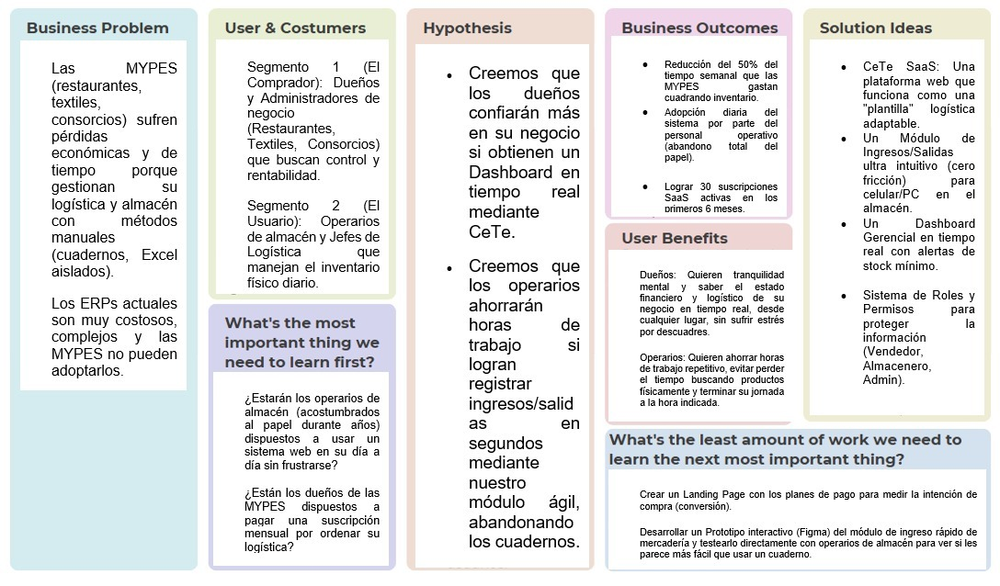

## 1.3. Segmentos objetivo

Para el desarrollo de AI-ToDu bajo el modelo B2B SaaS, nos enfocaremos en dos segmentos de usuarios clave. Estos segmentos se dividen según su rol de interacción con el sistema dentro de los sectores productivos con mayor necesidad de digitalización (Gastronomía, Distribución y Manufactura Textil).

### 1.3.1. Segmento 1: Dueños y Administradores de Negocio (El Comprador)

Representan al sector gerencial y administrativo de la MYPE. Son los tomadores de decisiones que adquieren el software buscando rentabilidad, control y visibilidad. Su principal dolor es la incertidumbre de no saber con exactitud el margen de ganancia real de su negocio, el estrés por el extravío de mercadería y la falta de información centralizada para tomar decisiones estratégicas.

* **Características demográficas:** Hombres y mujeres entre 30 y 55 años de edad. Residentes en zonas urbanas y polos comerciales (ej. Gamarra, zonas de alta densidad de restaurantes o parques industriales). Pertenecen a un nivel socioeconómico B y C.
* **Nivel de digitalización:** Medio. Utilizan constantemente smartphones, WhatsApp Business y aplicativos bancarios, pero operativamente siguen dependiendo de reportes físicos o archivos de Excel aislados proporcionados por sus empleados.
* **Información estadística de sustento:** Según el Ministerio de la Producción y el INEI (2024), las micro y pequeñas empresas representan el 99.5% del tejido empresarial peruano. Sin embargo, existe una gran brecha tecnológica: el Sondeo de Adopción Digital de Movistar Empresas señala que la mayoría aún gestiona sus operaciones de forma tradicional. El mismo sondeo demuestra que el 27% de las MIPYMES que logran adoptar herramientas digitales orientadas a la gestión y automatización aumentan inmediatamente sus ventas y mejoran su productividad.

### 1.3.2. Segmento 2: Jefes de Logística y Personal Operativo de Almacén (El Usuario Final)

Representan a la fuerza laboral que interactúa diariamente con el inventario, los despachos y las ventas (almaceneros, operarios logísticos, cajeros). Se enfrentan al manejo de grandes volúmenes de mercadería o alta rotación de inventarios perecibles. Su principal dolor es la sobrecarga de trabajo manual, la dependencia de registros en papel que se pierden o malinterpretan, y el descontrol en los procesos de despacho.

* **Características demográficas:** Hombres y mujeres jóvenes y adultos jóvenes, de entre 20 y 45 años. Suelen residir en distritos aledaños a las zonas comerciales o industriales. Tienen estudios técnicos, secundarios o universitarios en curso.
* **Nivel de digitalización:** Medio a Medio-Bajo (en el ámbito de software empresarial). Son usuarios activos de redes sociales y aplicaciones móviles comerciales, pero en su entorno de trabajo carecen de experiencia previa utilizando sistemas ERP corporativos complejos. Requieren herramientas altamente intuitivas y con curvas de aprendizaje cortas.
* **Información estadística de sustento:** La atomización empresarial en sectores como comercio, alojamiento y restaurantes sigue en aumento acelerado, con miles de nuevos negocios creados (ComexPerú, 2024). Sin embargo, la falta de digitalización operativa en estos rubros genera cuellos de botella. La ausencia de un software que automatice procesos repetitivos y sincronice áreas (como Almacén y Ventas) es la causa principal de horas-hombre desperdiciadas en cuadres de inventario semanales, lo que afecta directamente la retención del talento operativo en la MYPE.

# Capítulo II: Requirements Elicitation & Analysis

## 2.1. Competidores

Para validar nuestra propuesta de valor en el ecosistema B2B SaaS, hemos identificado a tres competidores principales en el mercado latinoamericano (con fuerte presencia en Perú) que ofrecen soluciones de digitalización para MYPES.

1. **Wally POS:** Startup peruana altamente posicionada en Lima. Se enfoca fuertemente en el punto de venta (POS), inventario básico y facturación electrónica, orientada principalmente a restaurantes y *retail*.
2. **Alegra:** Plataforma SaaS de origen colombiano, con mucha tracción en la región. Su enfoque principal es la contabilidad, la facturación y la administración financiera para pequeñas empresas, integrando módulos de inventario.
3. **Odoo:** Un sistema ERP de clase mundial y código abierto. Ofrece módulos para prácticamente cualquier necesidad empresarial (ventas, almacén, manufactura). Es altamente escalable, pero representa a la competencia de software robusto y complejo.

### 2.1.1. Análisis competitivo

**¿Por qué llevar a cabo este análisis?**
Entender el panorama actual de las soluciones de gestión utilizadas por las MYPES locales para identificar brechas de usabilidad y oportunidades de diferenciación técnica y comercial para AI-ToDu.

| | Nombre | Wally POS | Alegra | Odoo | AI-ToDu (Nuestra Startup) |
| :--- | :--- | :--- | :--- | :--- | :--- |
| **Perfil** | **Ventaja competitiva** | Súper simplificado para el punto de venta (POS) y alta penetración en el mercado local limeño. | Enfoque contable muy maduro. Conciliación bancaria y facturación homologada en múltiples países. | Altamente modular e integrado. Puede escalar desde una MYPE hasta una empresa transnacional. | Innovación adaptable y curva de aprendizaje rápida, enfocada estrictamente en la logística y el balance financiero en tiempo real. |
| | **¿Qué valor ofrece a los clientes?** | Vender rápido en tiendas físicas y cumplir con la SUNAT sin complicaciones técnicas. | Mantener las finanzas, impuestos y contabilidad en orden bajo un modelo web accesible. | Tener todas las aplicaciones de gestión de una gran empresa interconectadas en una sola plataforma. | Un "sistema nervioso central" intuitivo que unifica almacén, despacho y caja, diciendo exactamente si se está ganando o perdiendo dinero. |
| | **Mercado objetivo** | Restaurantes locales, cafeterías y tiendas minoristas en Perú. | Pequeñas y medianas empresas que buscan priorizar el orden contable en LATAM. | Desde PYMES con conocimientos técnicos hasta grandes corporaciones globales. | Tomadores de decisiones y operarios de MYPES en sectores de gastronomía, distribución y manufactura textil. |
| **Marketing** | **Estrategias de marketing** | Fuerte presencia en redes sociales, alianzas con bancos (BCP) y demostraciones en vivo. | Inbound marketing masivo (blogs contables, webinars) y academias de capacitación gratuitas. | Red de Partners (socios integradores) y promoción de su versión "Community" (gratuita). | Demostraciones directas B2B (venta consultiva), enfoque en el ahorro de horas de trabajo y reducción de mermas. |
| **Producto** | **Productos & Servicios** | Punto de venta web/app, inventario básico, reportes de ventas, facturación electrónica. | Facturación electrónica, contabilidad, nómina, gestión de inventario y reportes financieros. | ERP completo: CRM, eCommerce, Almacén avanzado, Fabricación, Contabilidad, RRHH. | Plataforma unificada de Inventario, Ventas, Despacho, Dashboard de rentabilidad y proyección IoT. |
| | **Precios & Costos** | Suscripción mensual (Ticket promedio medio), cobro por terminal adicional. | Suscripción mensual escalonada (Ticket medio-alto según funcionalidades). | Versión gratuita (limitada a 1 app) y suscripciones costosas por usuario para el ERP completo. | Suscripción SaaS mensual/anual accesible, escalable según el volumen de operaciones y módulos. |
| | **Canales de distribución** | Web Application (Cloud) y aplicación móvil para toma de pedidos. | Plataforma Web (Cloud) y aplicación móvil para consultas rápidas. | Plataforma Web (Cloud), aplicaciones móviles nativas y software de escritorio. | Web Application (Cloud) responsiva, accesible desde cualquier PC o dispositivo móvil en el almacén. |
| **SWOT** | **Fortalezas** | Excelente usabilidad. Marca de confianza en Lima gracias a sus respaldos financieros. | Gran ecosistema de integraciones contables. Soporte técnico muy activo. | Ecosistema gigantesco de aplicaciones. Código abierto (versión comunitaria). | Arquitectura escalable (DDD), diseño centrado en el usuario operativo (cero fricción técnica). |
| | **Debilidades** | Módulo de almacén y logística muy básico. No se adapta a procesos de manufactura o distribución compleja. | Su enfoque es más administrativo/contable que operativo o de campo logístico. | La configuración inicial es compleja; las MYPES necesitan contratar a un experto para implementarlo. | Startup de reciente creación sin reconocimiento de marca inicial ni base de clientes establecida. |
| | **Oportunidades** | Crecimiento del sector retail en Perú que exige soluciones de cobro rápido. | Leyes de facturación electrónica obligatoria en toda la región de LATAM. | Empresas que crecen y necesitan unificar sistemas desconectados. | Alta tasa de informalidad operativa en MYPES que ahora buscan digitalizarse para sobrevivir post-pandemia. |
| | **Amenazas** | Nuevas startups locales ofreciendo sistemas POS gratuitos o de muy bajo costo. | Cambios abruptos en normativas tributarias de cada país que rompan sus integraciones. | Soluciones SaaS locales que resuelven nichos específicos con mayor agilidad. | Resistencia al cambio tecnológico por parte del personal operativo y competencia de precios. |

<em>Nota: Análisis competitivo de AI-ToDu en comparación con las principales soluciones del mercado.</em>

### 2.1.2. Estrategias y tácticas frente a competidores

Frente al panorama competitivo actual, AI-ToDu implementará las siguientes estrategias para capitalizar las debilidades de la competencia y aprovechar las oportunidades del mercado:

**Estrategia 1: Diferenciación Logística**
* *Frente a:* Wally POS.
* *Táctica:* Wally domina el punto de venta, pero flaquea en operaciones complejas de distribución y manufactura. Nuestra táctica será resaltar nuestro "Módulo de Despacho" y el manejo de inventario avanzado, atrayendo a las MYPES que ya "quedaron grandes" para un POS básico pero que aún no pueden pagar un ERP complejo.

**Estrategia 2: Onboarding sin fricción (Plug & Play)**
* *Frente a:* Odoo.
* *Táctica:* El mayor miedo de una MYPE ante un ERP es la instalación. Nuestra estrategia será ofrecer un sistema *Plug & Play*. A diferencia de Odoo, que requiere semanas de parametrización, AI-ToDu apostará por un registro inmediato con flujos preconfigurados (plantillas) adaptados a sectores específicos.

**Estrategia 3: Posicionamiento Operativo vs Contable**
* *Frente a:* Alegra.
* *Táctica:* Mientras Alegra se comunica con el contador de la empresa, nosotros nos comunicaremos con el operario y el dueño. Nuestra táctica será enfocar el marketing y la usabilidad en la reducción de horas de trabajo físico (cuadres de inventario, mermas) y mostrar el "Balance Financiero Inteligente" como un valor agregado que no requiere conocimientos de contabilidad para ser interpretado.

## 2.2. Entrevistas

### 2.2.1. Diseño de entrevistas

Para asegurar que recolectamos información cualitativa de valor que nos permita construir nuestros User Personas y descubrir competidores reales, hemos diseñado una batería de preguntas divididas en un bloque general y bloques específicos adaptados a nuestros dos segmentos objetivos.

**Preguntas Generales (Demografía, Tecnología, Marcas y Contexto):**
1. *Demografía y Familia:* ¿Cuál es tu nombre, edad, distrito de residencia, y con quién vives actualmente (estado civil/familia)?
2. *Perfil y Ocupación:* ¿Cuál es tu rol actual en el negocio, cuánto tiempo llevas en él y qué estudiaste o en qué te preparaste?
3. *Tecnología y Canales:* ¿Qué dispositivo usas más en tu día a día (celular, laptop, tablet), y cuáles son tus canales o aplicaciones favoritas para informarte o comunicarte?
4. *Marcas e Influencias:* En tu vida personal o profesional, ¿qué marcas admiras o qué tipo de referentes/influencers sigues en redes sociales?
5. *Habilidades:* ¿Consideras que se te facilita aprender a usar nuevos programas o prefieres sistemas muy sencillos e intuitivos?
6. *Contexto:* Descríbeme brevemente cómo es un día normal de trabajo para ti, desde que llegas hasta que te vas.

**Preguntas de Problema y Competencia (Core del Negocio):**
1. *Dolor:* Actualmente, ¿cómo llevas el control de lo que entra, lo que sale y lo que tienes en el almacén de tu negocio? (¿Usas cuadernos, Excel, la memoria?)
2. *Dolor:* ¿Cuál es el mayor dolor de cabeza o problema que enfrentas al hacer inventarios o rastrear mercadería? ¿Cuánto tiempo crees que pierdes en esto a la semana?
3. *Competencia:* ¿Alguna vez has buscado, comprado o intentado usar algún software o aplicación (como Wally, Alegra, etc.) para solucionar esto? Si es así, ¿cuál fue y por qué te funcionó o no te funcionó?
4. *Expectativa:* Si pudieras tener una "varita mágica" y crear un programa ideal para tu negocio, ¿qué es lo primero que te gustaría que hiciera por ti?
5. *Validación:* Si te presentamos una plataforma web fácil de usar, económica y que centralice tu inventario y ventas en un solo lugar, ¿estarías dispuesto a probarla?

**Preguntas Específicas por Segmento (Enfoque en Roles):**
* **Para el Segmento 1 (Tomadores de Decisión: Dueños, Administradores, Gerentes):**
    1. *(Finanzas):* ¿Sientes que hay un descuadre frecuente entre lo que inviertes en mercadería/insumos y la ganancia real que ves en caja a fin de mes?
    2. *(Control):* ¿Te genera desconfianza o estrés no poder ver el estado de tu negocio (stock, mermas, ventas) cuando no estás físicamente en el local?
    3. *(Textil/Gastronomía):* ¿Alguna vez se ha paralizado tu producción o tus ventas por no darte cuenta a tiempo de que te faltaba un insumo clave?
* **Para el Segmento 2 (Usuarios Finales: Jefes de Logística, Operarios de Almacén):**
    1. *(Carga operativa):* ¿Qué tan frustrante o pesado es para ti tener que generar reportes manuales o contar producto por producto para dárselos a tu jefe?
    2. *(Trazabilidad):* Cuando despachan mercadería, ¿cómo se aseguran de que no haya confusiones o que no se pierdan productos entre el almacén y el cliente final?
    3. *(Mermas):* Cuando un producto se malogra o se daña, ¿qué tan complicado es registrar esa pérdida actualmente?

### 2.2.2. Registro de entrevistas

Como evidencia de nuestra investigación cualitativa, hemos adjuntado las entrevistas de nuestros compañeros.

#### Segmento 1: Tomadores de Decisión (Dueños, Administradores, Gerentes)

| Campo | Detalle |
| :--- | :--- |
| **Nombres y Apellidos** | Carlos Mendoza |
| **ID** | E-S1-01 |
| **Edad / Distrito** | 45 años / Santiago de Surco |
| **Timing del video** | 00:00 - 04:15 min |
| **Evidencia fotográfica** | 
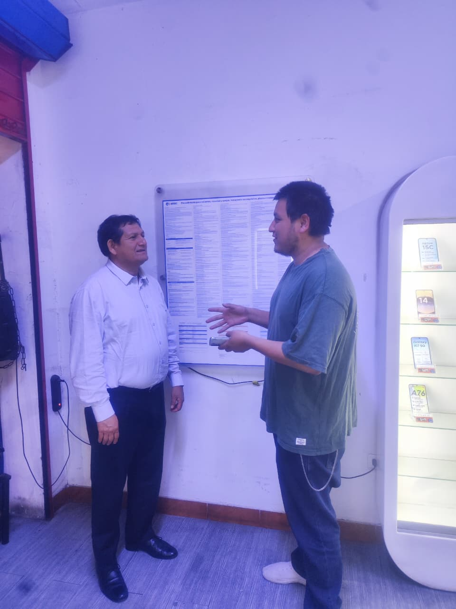
 |
| **Resumen descriptivo** | Carlos está casado y tiene dos hijos. Administra una pequeña cadena de tres restaurantes. Su dispositivo principal es una Laptop con Windows, pero revisa todo el día su celular (iPhone). Se informa vía LinkedIn y WhatsApp, y admira marcas que proyectan estatus y eficiencia como Apple y a referentes locales como Gastón Acurio. En su día a día, sufre de estrés porque confía en reportes de Excel elaborados a mano por su administrador, lo que genera un descuadre constante (merma) entre las compras de mercado y las ventas en caja. Su mayor expectativa de "varita mágica" es un panel de control (Dashboard) que le muestre en su celular si el negocio está ganando o perdiendo dinero en tiempo real. |

| Campo | Detalle |
| :--- | :--- |
| **Nombres y Apellidos** | Lucía Valdivia |
| **ID** | E-S1-02 |
| **Edad / Distrito** | 38 años / San Borja |
| **Timing del video** | 04:16 - 08:30 min |
| **Evidencia fotográfica** | 
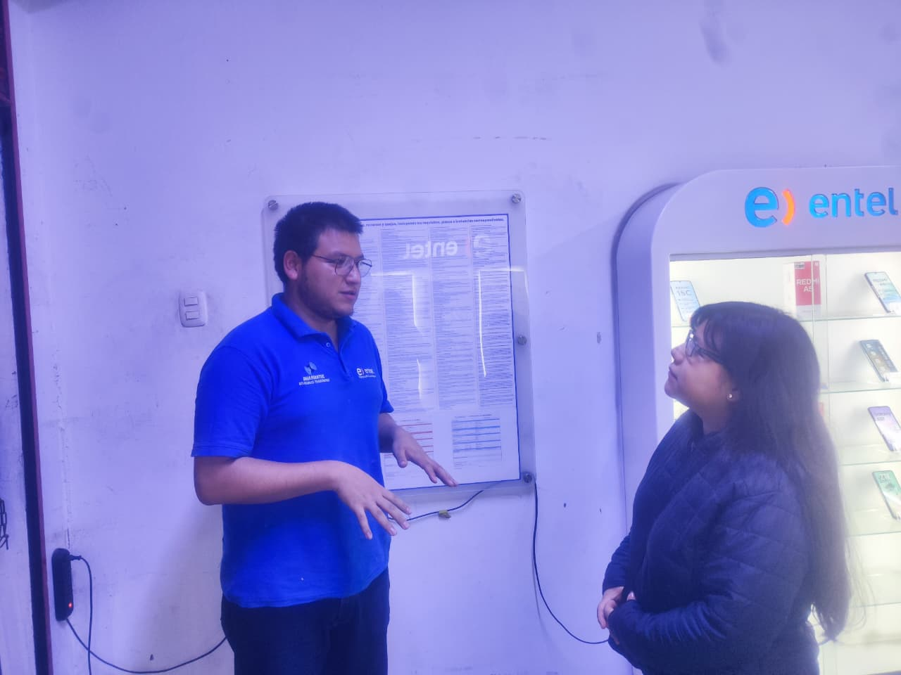
 |
| **Resumen descriptivo** | Lucía es soltera y fundadora de una MYPE textil. Pasa casi todo su día en su Smartphone (Android de gama alta) y utiliza mucho Instagram y WhatsApp Business para vender. Sigue a marcas como Zara (por su logística) y a diversos influencers emprendedores. Su mayor frustración (dolor) es que se le ha paralizado la producción varias veces porque olvidó comprar hilos o botones específicos, ya que el control lo lleva en un cuaderno. Expresó que aprender sistemas nuevos le asusta un poco, por lo que pide que la solución tenga botones muy claros y alertas de colores cuando falte mercadería. |

| Campo | Detalle |
| :--- | :--- |
| **Nombres y Apellidos** | Roberto Sánchez |
| **ID** | E-S1-03 |
| **Edad / Distrito** | 35 años / Los Olivos |
| **Timing del video** | 08:31 - 12:45 min |
| **Evidencia fotográfica** | 

 |
| **Resumen descriptivo** | Roberto, casado y con familia, es dueño de una distribuidora de alimentos. Es práctico y tradicional. Usa una tablet y su celular principalmente para correos electrónicos y llamadas. Admira marcas sólidas y confiables como Toyota y Makro. El problema central que relató es la falta de transparencia: no puede estar físicamente en el almacén todo el tiempo, y teme robos sistemáticos de mercadería. Validó rotundamente nuestra hipótesis al afirmar que pagaría gustoso una suscripción si el software incluye un sistema de roles y permisos estrictos donde los almaceneros no puedan borrar los registros de salida. |

#### Segmento 2: Usuarios Finales (Jefes de Logística, Operarios de Almacén)

| Campo | Detalle |
| :--- | :--- |
| **Nombres y Apellidos** | Miguel Rojas |
| **ID** | E-S2-01 |
| **Edad / Distrito** | 28 años / San Juan de Miraflores |
| **Timing del video** | 12:46 - 16:20 min |
| **Evidencia fotográfica** | 
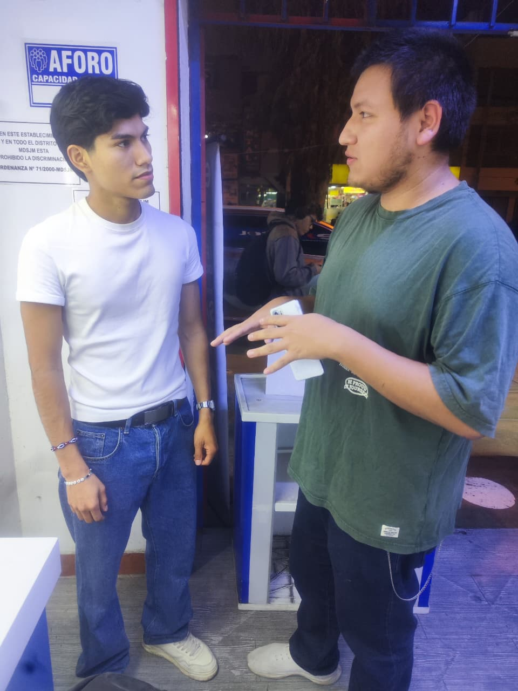
 |
| **Resumen descriptivo** | Miguel vive con su pareja y es Jefe de Logística en una distribuidora. Es totalmente nativo digital, utiliza un celular Android y sus canales favoritos son TikTok y YouTube. Sigue marcas de tecnología accesible y deportivas (Samsung, Adidas). Confesó que su mayor carga operativa es hacer el inventario de fin de mes; se queda hasta la madrugada contando cajas a mano porque los papeles de despacho de la semana siempre se pierden. Pide que el sistema ideal le permite registrar salidas con la menor cantidad de clics posibles, casi como usar una red social. |

| Campo | Detalle |
| :--- | :--- |
| **Nombres y Apellidos** | Maria Morales |
| **ID** | E-S2-02 |
| **Edad / Distrito** | 28 años / Chorrillos |
| **Timing del video** | 16:21 - 20:00 min |
| **Evidencia fotográfica** | 

 |
| **Resumen descriptivo** | Maria es madre soltera y operaria de almacén en una MYPE textil. Usa un teléfono Android de gama media y se comunica exclusivamente por WhatsApp y Facebook. Sigue marcas de ropa nacionales y páginas de entretenimiento. Su frustración principal es el desorden físico y lógico: pierde hasta una hora buscando un código de tela específico porque en Excel los nombres son muy confusos. Aceptaría probar AI-ToDu siempre y cuando tenga un "buscador inteligente" donde pueda escribir palabras clave (ej. "tela roja algodón") y le diga en qué repisa está. |

| Campo | Detalle |
| :--- | :--- |
| **Nombres y Apellidos** | Diego Ramirez |
| **ID** | E-S2-03 |
| **Edad / Distrito** | 31 años / Ate Vitarte |
| **Timing del video** | 20:01 - 24:15 min |
| **Evidencia fotográfica** | 

 |
| **Resumen descriptivo** | Diego es casado y encargado de despachos en un consorcio de alimentos. Tiene habilidades tecnológicas moderadas y prefiere herramientas extremadamente simples. Usa Facebook para informarse y admira marcas de consumo masivo que son transparentes (Gloria, Cristal). Su dolor principal radica en el registro de mermas y devoluciones: cuando un producto llega malogrado al cliente, el trámite en papel para ingresarlo de nuevo como "pérdida" es tan tedioso que a veces simplemente no lo anota, generando el descuadre. Desea un sistema que con dos toques le permita registrar una merma. |

### 2.2.3. Análisis de entrevistas

Con base en la información cualitativa extraída de las 6 entrevistas registradas, hemos realizado un análisis estadístico y de patrones para definir con precisión las características objetivas y subjetivas que moldearán nuestros arquetipos (User Personas).

**Análisis del Segmento 1: Tomadores de Decisión (Dueños/Administradores)**
* **Demografía y Perfil:** El 100% de los entrevistados en este segmento tiene entre 38 y 50 años. El 66% tiene responsabilidades familiares (casados/hijos).
* **Tecnología y Canales:** El 100% utiliza Smartphones (mitad iOS, mitad Android) para la supervisión diaria, pero el 66% prefiere usar Laptops o Tablets para revisar finanzas y reportes complejos. WhatsApp (100%) es la herramienta de comunicación dominante para negocios.
* **Marcas e Influencias:** Existe una tendencia del 100% hacia marcas que proyectan estatus, confiabilidad a largo plazo y éxito empresarial (Apple, Toyota, Makro).
* **Dolores (Pain Points):** El 100% coincide en que la "falta de transparencia en los datos" y los "descuadres entre compras y caja" son su mayor dolor. El 66% manifestó altos niveles de estrés por la dependencia de registros manuales y la desconfianza.
* **Expectativas (Gains):** El 100% espera un Dashboard en tiempo real y el 66% enfatizó la necesidad urgente de alertas automáticas (para evitar quiebres de stock) y restricciones de permisos (seguridad).

**Análisis del Segmento 2: Usuarios Finales (Operarios/Logística)**
* **Demografía y Perfil:** Un público más joven, el 100% oscila entre los 28 y 41 años.
* **Tecnología y Canales:** El 100% utiliza exclusivamente dispositivos móviles Android de gamas media/alta. Sus principales fuentes de información son redes sociales (TikTok, Facebook, YouTube) en un 100%. Son receptivos a interfaces visuales modernas.
* **Marcas e Influencias:** Consumen marcas accesibles, prácticas y de estilo de vida rápido (Samsung, Adidas).
* **Dolores (Pain Points):** El 100% considera que los reportes manuales (cuadernos/papeles) son su mayor frustración y pérdida de tiempo. El 66% admite que la complejidad para registrar mermas o buscar productos genera los descuadres de inventario.
* **Expectativas (Gains):** El 100% exige una herramienta que reduzca su carga de trabajo (simplicidad extrema). El 66% solicitó explícitamente funcionalidades como "buscadores ágiles" e interfaces con muy pocos clics.

## 2.3. Needfinding

En esta fase de Needfinding, hemos traducido los datos crudos y estadísticos obtenidos en nuestras entrevistas en artefactos de empatía y mapeo. Esto nos permite visualizar a nuestros usuarios objetivo, entender su día a día y alinear las funcionalidades de AI-ToDu con sus necesidades reales antes de escribir una sola línea de código.

### 2.3.1. User Personas

**User Persona 1: Carlos Mendoza - El "Dueño Estresado" (Segmento 1: Tomadores de Decisión)**
> *"Necesito saber si gano o pierdo dinero sin tener que contar cada tomate del almacén."*

* **Demografía y Ocupación:** 45 años, casado, 2 hijos. Reside en Santiago de Surco, Lima. Dueño y Administrador general de una cadena de MYPEs.
* **Personalidad y Habilidades:** Pragmático, tradicional pero abierto al cambio si le ahorra dinero. Nivel tecnológico medio (sabe usar lo básico muy bien).
* **Tecnología, Canales y Marcas:** Su día transcurre entre una Laptop con Windows (para finanzas) y su iPhone (para comunicarse). Se informa por LinkedIn y grupos de WhatsApp de empresarios. Confía en marcas de estatus y solidez (Apple, Toyota, Makro).
* **Gains (Metas/Objetivos):** Quiere tener visibilidad en tiempo real de su rentabilidad (Dashboard) y asegurar que nadie le robe mercadería (Roles y Permisos).
* **Pains (Frustraciones):** Sufre de alto estrés por los descuadres a fin de mes. Odia depender de que su empleado le pase el archivo de Excel actualizado.

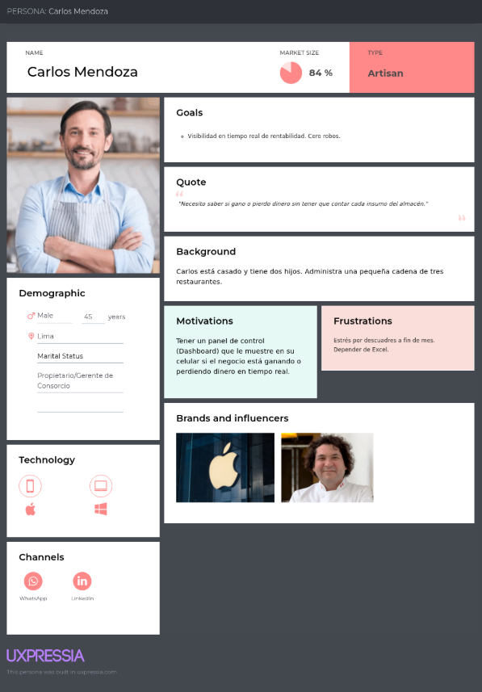

**User Persona 2: Miguel Rojas - El "Almacenero Frustrado" (Segmento 2: Usuarios Finales)**
> *"Si registrar un ingreso fuera tan fácil como subir un TikTok, mi vida sería otra y saldría temprano a casa."*

* **Demografía y Ocupación:** 28 años, convive con su pareja, sin hijos. Reside en San Juan de Miraflores, Lima. Jefe de Logística / Operario de Almacén.
* **Personalidad y Habilidades:** Ágil, visual, impaciente con la burocracia. Nivel tecnológico alto (nativo digital en móviles).
* **Tecnología, Canales y Marcas:** Utiliza casi exclusivamente un Smartphone Android de gama media-alta todo el día. Consume contenido en TikTok y YouTube. Seguidor de marcas prácticas y deportivas (Samsung, Adidas).
* **Gains (Metas/Objetivos):** Desea un sistema extremadamente simple ("pocos clics") y un buscador inteligente para encontrar insumos rápido.
* **Pains (Frustraciones):** Quedarse hasta la madrugada haciendo el inventario de fin de mes. Perder hojas de ruta o papeles de despacho semanales.

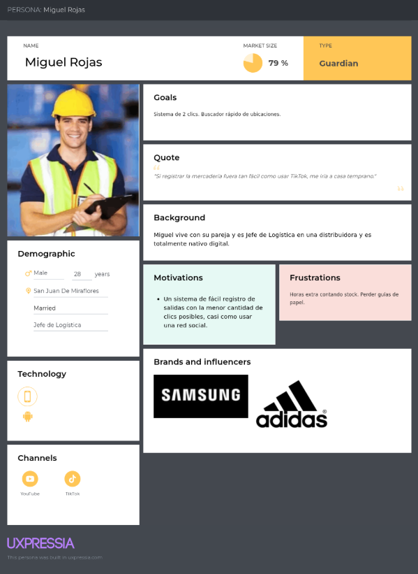

### 2.3.2. User Task Matrix

<table border="1" cellpadding="8" cellspacing="0" style="border-collapse: collapse; text-align: center; width: 100%;">
  <tr style="background-color:#black;">
    <th rowspan="2">Tareas (User Tasks)</th>
    <th colspan="2">User Persona 1: Carlos Mendoza (Dueño/Admin)</th>
    <th colspan="2">User Persona 2: Miguel Rojas (Almacenero)</th>
  </tr>
  <tr style="background-color:#black;">
    <th>Frecuencia</th>
    <th>Importancia</th>
    <th>Frecuencia</th>
    <th>Importancia</th>
  </tr>
  <tr>
    <td style="text-align: left;">1. Registrar ingresos físicos de mercadería</td>
    <td>Baja</td>
    <td>Media</td>
    <td>Alta</td>
    <td>Alta</td>
  </tr>
  <tr>
    <td style="text-align: left;">2. Registrar salidas/despachos de mercadería</td>
    <td>Baja</td>
    <td>Media</td>
    <td>Alta</td>
    <td>Alta</td>
  </tr>
  <tr>
    <td style="text-align: left;">3. Buscar productos físicamente en estantes</td>
    <td>Rara vez</td>
    <td>Baja</td>
    <td>Alta</td>
    <td>Alta</td>
  </tr>
  <tr>
    <td style="text-align: left;">4. Calcular mermas / productos dañados</td>
    <td>Media</td>
    <td>Alta</td>
    <td>Media</td>
    <td>Media</td>
  </tr>
  <tr>
    <td style="text-align: left;">5. Elaborar cuadre financiero/inventario</td>
    <td>Media (Mensual)</td>
    <td>Alta</td>
    <td>Baja (Lo sufre a fin de mes)</td>
    <td>Alta</td>
  </tr>
  <tr>
    <td style="text-align: left;">6. Autorizar compras a proveedores</td>
    <td>Alta</td>
    <td>Alta</td>
    <td>Baja (Solo sugiere)</td>
    <td>Baja</td>
  </tr>
  <tr>
    <td style="text-align: left;">7. Revisar estado general del negocio</td>
    <td>Alta (Diario)</td>
    <td>Alta</td>
    <td>Baja</td>
    <td>Baja</td>
  </tr>
</table>

 

**Análisis del User Task Matrix:**

* **Diferencias operativas:** Las tareas de mayor frecuencia para Miguel (registrar ingresos, salidas y buscar productos físicamente) son casi nulas para Carlos. Esto valida nuestra premisa de que la interfaz móvil del almacenero debe estar hiper-optimizada para la rapidez (pocos clics), ya que lo hace decenas de veces al día. Por el contrario, la tarea más frecuente de Carlos es "Revisar el estado general", lo que justifica la creación de un Dashboard gerencial como pantalla de inicio para su rol.
  
* **Coincidencias en dolores:** Ambos perfiles coinciden en la alta importancia de "Elaborar el cuadre de inventario" y "Calcular mermas". Sin embargo, Miguel lo vive como una carga operativa pesada a fin de mes, mientras que Carlos lo vive como una métrica crítica de pérdida de dinero. AI-ToDu deberá automatizar esta tarea para aliviar la carga de Miguel y darle tranquilidad inmediata a Carlos.

### 2.3.3. User Journey Mapping

**User Journey Map 1: Carlos Mendoza (El "Dueño Estresado")**
* **Escenario:** El cierre de mes. Carlos intenta hacer el cuadre financiero de su negocio basándose en los reportes manuales de su equipo.
* **Fases del Journey:**
    1. **Recepción de datos (Expectativa):** Carlos pide por WhatsApp el reporte mensual a su almacenero. Siente ansiedad esperando que los datos cuadren.
    2. **Revisión del Excel (Frustración):** Abre el archivo y nota fórmulas rotas y datos incompletos. Su nivel de estrés sube porque no entiende la información.
    3. **Identificación de mermas (Enojo):** Va físicamente al almacén y descubre productos vencidos o "desaparecidos" que no están en el Excel. Siente que pierde dinero a ciegas.
    4. **Toma de decisiones (Resignación):** Trata de calcular la rentabilidad al "ojo". Pierde todo su fin de semana cuadrando papeles.
* **Oportunidad para AI-ToDu:** Automatizar la consolidación de datos. Ofrecer un Dashboard que muestre la rentabilidad sin tener que pedirle el archivo a nadie.

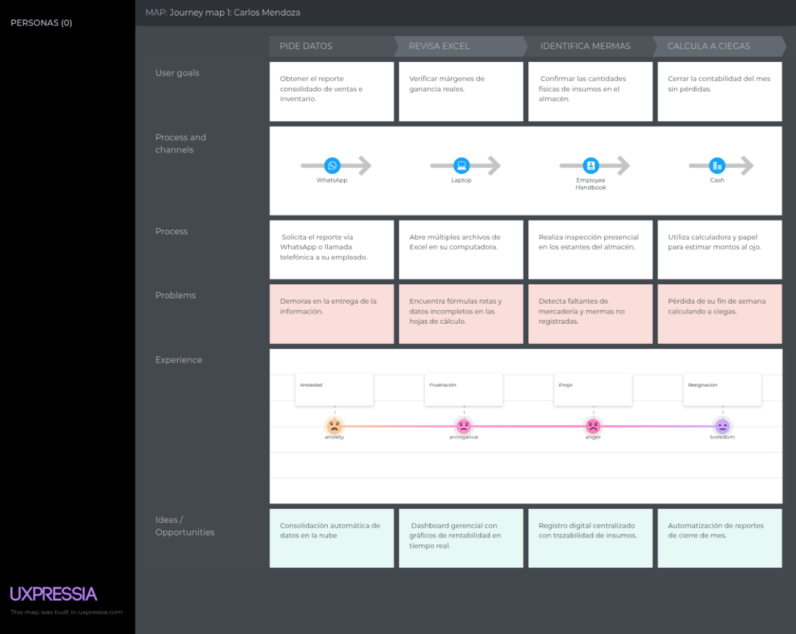

**User Journey Map 2: Miguel Rojas (El "Almacenero Frustrado")**
* **Escenario:** Un día pico de recepción de mercadería y despacho múltiple.
* **Fases del Journey:**
    1. **Llegada del camión (Caos):** Llega mucha mercadería junta. Miguel anota rápido en un cuaderno con lápiz porque el chofer está apurado.
    2. **Despacho y Búsqueda (Estrés físico):** Le piden un insumo urgente para producción. Pierde 20 minutos buscando en los estantes porque no sabe exactamente dónde lo dejó.
    3. **Pérdida de documentos (Miedo):** Se da cuenta que perdió una guía de remisión de la mañana. Teme que le descuenten el dinero de su sueldo.
    4. **Fin de turno (Agotamiento):** Todos se van, pero él debe quedarse 2 horas extra transcribiendo lo del cuaderno al Excel para mandárselo a Carlos.
* **Oportunidad para AI-ToDu:** Reemplazar el cuaderno por una app móvil con lector de códigos o registro de 2 clics. Buscador inteligente de ubicaciones en el almacén.

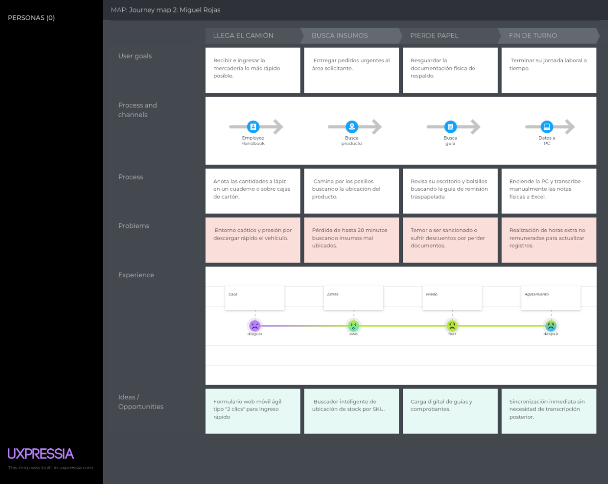

### 2.3.4. Empathy Mapping

**Empathy Map 1: Carlos Mendoza (Tomador de Decisión)**
* **¿Con quién empatizamos y qué necesita hacer?:** Carlos, 45 años, dueño de negocio. Necesita conocer la rentabilidad exacta y evitar robos/mermas.
* **¿Qué ve?:** Ve a la competencia modernizándose. Ve papeles desordenados y almacenes repletos de cosas que no sabe si se venden o no.
* **¿Qué escucha?:** "Jefe, no cuadra el inventario", "Se malogró esta mercadería", "El contador necesita las facturas urgentes".
* **¿Qué dice y hace?:** "Necesito que me pasen ese Excel ahora mismo". Va físicamente al almacén a hacer inspecciones sorpresa.
* **¿Qué piensa y siente?:** "Estoy perdiendo plata por culpa del desorden". Siente mucho estrés, desconfianza hacia su personal y miedo a quebrar.
* **Pains (Dolores):** Descuadres a fin de mes, mermas inexplicables, robos de mercadería, estrés continuo.
* **Gains (Beneficios esperados):** Tranquilidad mental, control total desde su celular, saber su margen de ganancia real en 5 segundos.

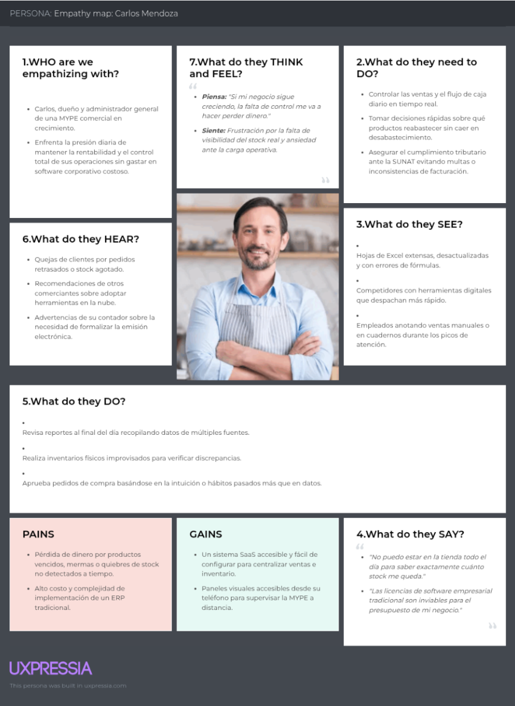

**Empathy Map 2: Miguel Rojas (Usuario Final)**
* **¿Con quién empatizamos y qué necesita hacer?:** Miguel, 28 años, almacenero. Necesita registrar el ingreso y salida de mercadería lo más rápido posible.
* **¿Qué ve?:** Ve rumas de cajas, post-its pegados por todos lados, la letra ilegible de sus compañeros de turno.
* **¿Qué escucha?:** "¡Despacha rápido que el camión se va!", "¿Dónde pusiste las cajas de tomates?", "¡Este Excel está mal cuadrado!".
* **¿Qué dice y hace?:** "Espérate que lo anoto en este cartón y luego lo paso". Corre por todo el almacén buscando cosas.
* **¿Qué piensa y siente?:** "Mi trabajo no es valorado, me exigen rapidez pero me dan un cuaderno viejo". Siente agotamiento físico y frustración tecnológica.
* **Pains (Dolores):** Transcribir datos al final del día (doble trabajo), que le echen la culpa de las pérdidas, quedarse horas extra sin paga.
* **Gains (Beneficios esperados):** Un sistema tipo "TikTok" de fácil de usar, no usar más lapicero, poder irse a su casa a la hora de salida.

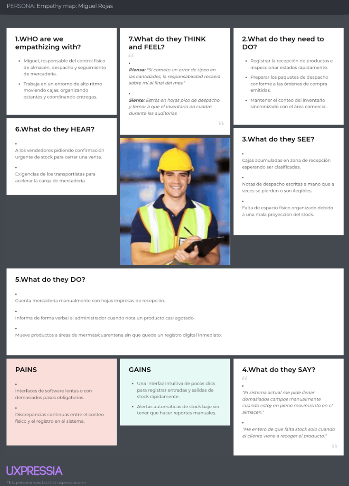

## 2.4. Big Picture Event Storming

En esta sección presentamos los resultados de nuestra sesión colaborativa de Big Picture Event Storming. El objetivo de esta actividad fue mapear visualmente el ecosistema completo del negocio logístico y comercial de las MYPES para identificar los procesos clave, los cuellos de botella y las oportunidades de mejora tecnológica.

**Resumen del Proceso:** El equipo se reunió de forma virtual utilizando FigJam como herramienta de pizarra infinita. Durante una sesión intensiva de 2 horas, exploramos la línea de tiempo completa del negocio (de izquierda a derecha), desde que la mercadería es recibida de los proveedores hasta que es facturada y entregada al cliente final.

Utilizamos la siguiente convención de colores:
* **Post-its Naranjas:** Eventos de Dominio (Domain Events), redactados siempre en tiempo pasado.
* **Post-its Amarillos:** Usuarios/Actores (Ej. Dueño, Almacenero, Vendedor).
* **Post-its Rosados:** Sistemas Externos (Ej. SUNAT, Proveedor GPS).
* **Post-its Lilas:** Políticas o Reglas de negocio.

**Fases y Eventos Clave Identificados:**
* **Fase de Abastecimiento e Inventario:**
    * *Eventos (Naranja):* `MerchandiseReceived` (Mercadería Recibida), `StockInspected` (Stock Inspeccionado), `InventoryUpdated` (Inventario Actualizado), `MerchandiseQuarantined` (Mercadería en Cuarentena), `LowStockAlertTriggered` (Alerta de Stock Mínimo Disparada).
* **Fase Comercial y Facturación:**
    * *Eventos (Naranja):* `PurchaseOrderPlaced` (Orden de Compra Realizada), `CommercialTransactionCreated` (Transacción Comercial Creada), `PaymentProcessed` (Pago Procesado), `InvoiceGenerated` (Factura Generada).
* **Fase de Despacho y Logística:**
    * *Eventos (Naranja):* `ShipmentManifestCreated` (Manifiesto de Despacho Creado), `MerchandiseDispatched` (Mercadería Despachada), `TelemetryUpdated` (Telemetría Actualizada), `DeliveryConfirmed` (Entrega Confirmada).

**Análisis y Oportunidades:** Al visualizar el flujo completo, el equipo notó que la mayor acumulación de "dolores" y cuellos de botella (representados con post-its rojos de riesgo) ocurría en la transición entre la Fase 1 y la Fase 2. La información de lo que hay en el almacén no fluye en tiempo real hacia ventas, generando un vacío de información. AI-ToDu actuará como el puente digital que sincronice los eventos `InventoryUpdated` directamente con `PurchaseOrderPlaced`.

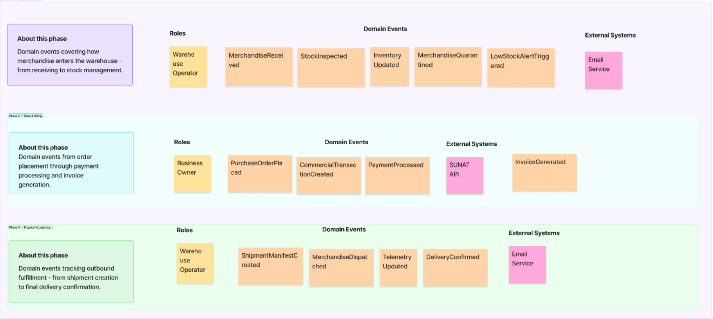

## 2.5. Ubiquitous Language

Para asegurar una comunicación sin ambigüedades entre los expertos del negocio, los usuarios y el equipo de desarrollo, hemos construido nuestro **Lenguaje Ubicuo (Ubiquitous Language)**. Este glosario define los términos centrales del dominio de la logística, almacén y ventas, estandarizando su uso en todos los artefactos, desde los requerimientos hasta el código fuente de AI-ToDu.

* **Inventory Item (Artículo de Inventario):** Producto físico o insumo que se encuentra almacenado dentro del negocio, listo para ser despachado, vendido o utilizado en producción.
* **SKU - Stock Keeping Unit (Código de Referencia):** Identificador alfanumérico único asignado a un artículo para rastrear su disponibilidad exacta en el almacén.
* **Shipment Manifest (Manifiesto de Despacho):** Documento logístico consolidado que agrupa los artículos que saldrán del almacén, detallando el estado actual del envío y las ubicaciones a visitar.
* **Waypoint (Punto de Ruta):** Ubicación geográfica específica (como el origen, destino o paradas intermedias) que conforma la hoja de ruta de un despacho.
* **Commercial Transaction (Transacción Comercial):** El registro oficial de una venta. Consolida los artículos adquiridos por el cliente, los impuestos aplicados (IGV) y el estado del pago.
* **Quarantine (Cuarentena):** Estado temporal asignado a un artículo de inventario que presenta daños o dudas sobre su calidad. Mientras esté en cuarentena, no puede ser vendido ni despachado.
* **Dimensional Weight (Peso Volumétrico):** Medida logística calculada en base al volumen de un paquete (largo, ancho y alto) que determina el espacio físico real que ocupará en el estante o en el vehículo de transporte.
* **Telemetry (Telemetría):** Conjunto de datos medibles (como latitud, longitud o temperatura) asociados a un manifiesto de despacho, especialmente relevante cuando se transporta mercadería perecible o de alto valor.
* **Stock Out (Quiebre de Stock):** Situación crítica que ocurre cuando se intenta vender o utilizar un artículo cuya cantidad física en el almacén ha llegado a cero.

# Capítulo III: Requirements Specification

Esta sección consolida la especificación de los requisitos de software que darán vida a AI-ToDu. Para garantizar un desarrollo ágil y centrado en el valor, todo el equipo ha colaborado en la redacción de Epics e Historias de Usuario aplicando estrictamente el acrónimo **INVEST**. Los criterios de aceptación han sido redactados en formato Gherkin (Given-When-Then).

## 3.1. User Stories

En esta sección se especifican los requisitos del sistema AI-ToDu mediante un conjunto de Epics, User Stories y Technical Stories derivadas del proceso de *needfinding*, el análisis competitivo y los segmentos objetivo identificados. Las User Stories representan funcionalidades de valor para los usuarios finales de la plataforma web y del *landing page*, mientras que las Technical Stories describen los requisitos funcionales del RESTful API que soporta el sistema.

### EPICS

| Epic ID | Título | Descripción | Criterios de Aceptación | Relacionado con |
| :--- | :--- | :--- | :--- | :--- |
| **EPIC-01** | Autenticación y cuenta | **Como** usuario de AI-ToDu, **deseo** gestionar el registro, inicio, cierre y recuperación de mi cuenta, **para** acceder de forma segura a la plataforma según mi plan. | **Escenario: Validación del alcance de autenticación y cuenta** **Given** que las historias US01, US02, US03 y US04 pertenecen a este epic, **When** el equipo evalúa el cumplimiento de EPIC-01, **Then** el epic se considera aceptado únicamente cuando las historias incluidas cumplen sus criterios de aceptación; el epic por sí solo no acredita implementación. | — |
| **EPIC-02** | Gestión de Inventario | **Como** operario de almacén, **deseo** gestionar las existencias, artículos y mermas, **para** mantener el stock actualizado y evitar descuadres físicos y lógicos. | **Escenario: Validación del alcance de gestión de inventario** **Given** que las historias US09, US10, US11, US12, US13 y US14 pertenecen a este epic, **When** el equipo evalúa el cumplimiento de EPIC-02, **Then** el epic se considera aceptado únicamente cuando dichas historias cumplen sus criterios y respetan las reglas lógicas del stock. | — |
| **EPIC-03** | Transacciones Comerciales | **Como** dueño de negocio, **deseo** gestionar el ciclo de vida de las ventas y transacciones diarias, **para** registrar los ingresos y descontar productos del almacén. | **Escenario: Validación del ciclo de vida de una transacción** **Given** que las historias US15, US16, US17 y US18 pertenecen a este epic, **When** el equipo valida EPIC-03, **Then** las operaciones respetan el flujo de ventas, impactan directamente en el inventario disponible y liberan o retornan stock si la venta es anulada. | — |
| **EPIC-04** | Logística y Despacho | **Como** jefe de logística, **deseo** gestionar guías, manifiestos de despacho e incidencias, **para** organizar la salida de mercadería y mantener la trazabilidad. | **Escenario: Validación de la gestión de despachos e incidencias** **Given** que las historias US19, US20, US21 y US22 pertenecen a este epic, **When** se registra un manifiesto o una incidencia en ruta, **Then** la información queda asociada a una venta verificada, es trazable y actualiza el estado logístico correctamente. | — |
| **EPIC-05** | Dashboard y Rentabilidad | **Como** dueño de negocio, **deseo** visualizar métricas clave y reportes en tiempo real, **para** localizar información financiera relevante y tomar decisiones. | **Escenario: Validación de reportes y dashboard** **Given** que las historias US23, US24 y US25 pertenecen a este epic, **When** el usuario consulta sus KPIs o exporta datos, **Then** el sistema devuelve únicamente información consolidada y autorizada que refleja el cruce exacto entre ventas e inventario. | — |
| **EPIC-06** | Notificaciones y Alertas | **Como** participante autorizado, **deseo** recibir notificaciones sobre stock mínimo y vencimientos, **para** reabastecer a tiempo sin monitorear manualmente cada producto. | **Escenario: Validación de notificaciones y alertas preventivas** **Given** que las historias US26 y US27 pertenecen a este epic, **When** ocurre un evento notificable como un quiebre de stock, **Then** el sistema genera avisos solo para los destinatarios autorizados y evita alertas duplicadas para el mismo evento. | — |
| **EPIC-07** | Roles y Permisos | **Como** administrador de la cuenta, **deseo** gestionar los accesos y crear usuarios empleados, **para** proteger la confidencialidad financiera de la empresa. | **Escenario: Validación de seguridad de roles** **Given** que las historias US28 y US29 pertenecen a este epic, **When** un usuario intenta acceder a un recurso, **Then** el epic exige que el sistema verifique el rol del usuario y deniegue o autorice el acceso a módulos específicos (ej. reportes). | — |
| **EPIC-08** | Perfil y preferencias | **Como** usuario registrado, **deseo** administrar mis datos de empresa, contraseña e idioma, **para** mantener mi cuenta actualizada y adaptar la interfaz. | **Escenario: Validación de perfil y preferencias** **Given** que las historias US30, US31 y US33 pertenecen a este epic, **When** el usuario modifica información permitida de su cuenta, **Then** el sistema valida los cambios, conserva las restricciones de seguridad y persiste las preferencias admitidas como el idioma. | — |
| **EPIC-09** | Landing page | **Como** visitante de AI-ToDu, **deseo** conocer la propuesta, funcionalidades, testimonios y planes, **para** evaluar la solución antes de continuar a la plataforma. | **Escenario: Validación del contenido y navegación del landing page** **Given** que las historias US05, US06, US07, US08, US32 y US34 pertenecen a este epic, **When** el visitante navega por el landing page, **Then** el contenido es accesible, no presenta funciones proyectadas como implementadas y permite continuar el recorrido de registro. | — |

### USER STORIES and TECHNICAL STORIES

| Story ID | Título | Descripción | Criterios de Aceptación | Epic ID |
| :--- | :--- | :--- | :--- | :--- |
| **US01** | Registro de cuenta | **Como** visitante, **deseo** registrar los datos de mi empresa, **para** crear una cuenta administradora en AI-ToDu. | **Escenario 1: Flujo esperado** **Given** datos válidos y un RUC no registrado, **When** solicita registro, **Then** se crea la cuenta administradora y se informa el siguiente paso.  **Escenario 2: Validación** **Given** un correo o RUC ya existente, **When** solicita registro, **Then** no se crea otra cuenta y se informa el error. | **EPIC-01** |
| **US02** | Inicio de sesión | **Como** usuario registrado, **deseo** autenticarme, **para** acceder al espacio de trabajo de mi empresa. | **Escenario 1: Flujo esperado** **Given** credenciales válidas, **When** solicita acceso, **Then** obtiene una sesión con su rol.  **Escenario 2: Validación** **Given** credenciales incorrectas, **When** solicita acceso, **Then** recibe un error genérico sin revelar la existencia de la cuenta. | **EPIC-01** |
| **US03** | Cierre de sesión | **Como** usuario autenticado, **deseo** terminar mi sesión, **para** proteger mi cuenta y la información del negocio. | **Escenario 1: Flujo esperado** **Given** una sesión vigente, **When** solicita cerrarla, **Then** la sesión queda invalidada y es redirigido.  **Escenario 2: Validación** **Given** una sesión ya cerrada, **When** solicita un recurso protegido, **Then** se rechaza el acceso. | **EPIC-01** |
| **US04** | Recuperación de contraseña | **Como** usuario registrado, **deseo** restablecer mi contraseña, **para** recuperar acceso si la he olvidado. | **Escenario 1: Flujo esperado** **Given** una solicitud con correo válido, **When** la procesa el sistema, **Then** devuelve confirmación genérica y envía enlace seguro.  **Escenario 2: Validación** **Given** un enlace vencido o utilizado, **When** intenta restablecer la contraseña, **Then** se rechaza el cambio. | **EPIC-01** |
| **US05** | Propuesta de valor en landing | **Como** visitante, **deseo** conocer la propuesta de valor de AI-ToDu, **para** evaluar si soluciona mis problemas operativos. | **Escenario 1: Flujo esperado** **Given** acceso a la landing, **When** consulta la propuesta, **Then** identifica el problema logístico y la solución centralizada.  **Escenario 2: Validación** **Given** acceso desde móvil, **When** consulta la propuesta, **Then** el contenido conserva legibilidad y diseño responsivo. | **EPIC-09** |
| **US06** | Funcionalidades de landing | **Como** visitante, **deseo** conocer las capacidades del producto, **para** comprobar si cubre mis necesidades de negocio. | **Escenario 1: Flujo esperado** **Given** consulta de capacidades, **When** revisa su alcance, **Then** encuentra módulos de inventario, ventas y reportes descritos.  **Escenario 2: Validación** **Given** un usuario navegando, **When** hace clic en funcionalidad en construcción, **Then** el sistema informa que estará disponible próximamente. | **EPIC-09** |
| **US07** | Modelo comercial y planes | **Como** visitante, **deseo** consultar modalidades y planes de suscripción, **para** evaluar una posible contratación para mi MYPE. | **Escenario 1: Flujo esperado** **Given** modalidades publicadas, **When** las consulta, **Then** distingue límites de usuarios y costos.  **Escenario 2: Validación** **Given** selección de un plan, **When** continúa el flujo, **Then** es dirigido al registro con plan preseleccionado sin ejecutar cobros inmediatos. | **EPIC-09** |
| **US08** | Contacto B2B | **Como** visitante corporativo, **deseo** enviar un mensaje a ventas, **para** solicitar una demostración personalizada. | **Escenario 1: Flujo esperado** **Given** datos de contacto válidos, **When** envía el formulario, **Then** confirma el envío y notifica al equipo.  **Escenario 2: Validación** **Given** un correo con formato inválido, **When** intenta enviar, **Then** resalta el error y bloquea el envío. | **EPIC-09** |
| **US09** | Registro de Artículo (SKU) | **Como** operario, **deseo** dar de alta un nuevo producto, **para** que esté disponible para futuras transacciones. | **Escenario 1: Flujo esperado** **Given** datos válidos, **When** guarda el registro, **Then** el artículo se crea con stock inicial 0.  **Escenario 2: Validación** **Given** un SKU ya existente, **When** intenta registrarlo, **Then** se rechaza la duplicación en la empresa. | **EPIC-02** |
| **US10** | Ingreso de Mercadería | **Como** operario, **deseo** sumar unidades físicas a un SKU existente, **para** reflejar el abastecimiento del almacén. | **Escenario 1: Flujo esperado** **Given** cantidad positiva, **When** registra la entrada, **Then** el stock total del SKU se incrementa atómicamente.  **Escenario 2: Validación** **Given** cantidad negativa o nula, **When** intenta registrar, **Then** se impide la transacción. | **EPIC-02** |
| **US11** | Salida Manual de Mercadería | **Como** operario, **deseo** registrar el retiro manual de productos, **para** reflejar consumos internos o ajustes. | **Escenario 1: Flujo esperado** **Given** stock suficiente y motivo válido, **When** registra la salida, **Then** el inventario disminuye.  **Escenario 2: Validación** **Given** retiro mayor al stock, **When** solicita la acción, **Then** emite alerta de insuficiencia. | **EPIC-02** |
| **US12** | Registro de Mermas | **Como** operario, **deseo** apartar productos dañados o caducados, **para** evitar que sean vendidos por error. | **Escenario 1: Flujo esperado** **Given** producto en mal estado, **When** lo marca como merma, **Then** se descuenta del stock y se registra como pérdida.  **Escenario 2: Validación** **Given** producto marcado como merma, **When** consulta Dashboard, **Then** el costo impacta negativamente la rentabilidad. | **EPIC-02** |
| **US13** | Buscador de Inventario | **Como** operario, **deseo** buscar productos por nombre o SKU, **para** localizarlos rápidamente sin listas largas. | **Escenario 1: Flujo esperado** **Given** término coincidente, **When** ingresa al menos 3 caracteres, **Then** filtra la tabla en tiempo real.  **Escenario 2: Validación** **Given** término sin coincidencias, **When** busca, **Then** obtiene resultado vacío sin errores. | **EPIC-02** |
| **US14** | Historial de Movimientos | **Como** participante autorizado, **deseo** ver el Kardex de un producto, **para** auditar discrepancias o mermas. | **Escenario 1: Flujo esperado** **Given** SKU con movimientos, **When** consulta historial, **Then** obtiene lista cronológica.  **Escenario 2: Validación** **Given** producto recién creado, **When** consulta historial, **Then** tabla vacía sin error. | **EPIC-02** |
| **US15** | Creación de Venta | **Como** dueño o vendedor, **deseo** registrar una transacción comercial, **para** formalizar ingresos y descontar stock. | **Escenario 1: Flujo esperado** **Given** productos con stock, **When** procesa venta, **Then** genera registro y descuenta productos simultáneamente.  **Escenario 2: Validación** **Given** problemas de conexión, **When** transacción falla, **Then** aplica rollback y no descuenta inventario. | **EPIC-03** |
| **US16** | Validación Automática de Stock | **Como** vendedor, **deseo** bloqueo de productos agotados en caja, **para** no prometer mercadería inexistente. | **Escenario 1: Flujo esperado** **Given** producto con stock cero, **When** intenta añadirlo, **Then** botón se deshabilita preventivamente.  **Escenario 2: Validación** **Given** 5 unidades y venta de 6, **When** ingresa cantidad, **Then** alerta exceso y ajusta al máximo. | **EPIC-03** |
| **US17** | Historial de Ventas | **Como** participante autorizado, **deseo** consultar transacciones pasadas, **para** llevar el control de ingresos diarios. | **Escenario 1: Flujo esperado** **Given** ventas registradas, **When** consulta módulo, **Then** las obtiene ordenadas por fecha.  **Escenario 2: Validación** **Given** filtro de fechas invertido, **When** intenta aplicar, **Then** solicita corregir el rango. | **EPIC-03** |
| **US18** | Anulación de Venta | **Como** dueño, **deseo** revertir una venta equivocada, **para** corregir métricas y devolver stock. | **Escenario 1: Flujo esperado** **Given** venta completada, **When** solicita anulación, **Then** estado pasa a "Anulada" y stock se reintegra atómicamente.  **Escenario 2: Validación** **Given** venta ya anulada, **When** intenta anularla, **Then** bloquea acción para evitar duplicidad. | **EPIC-03** |
| **US19** | Manifiesto de Despacho | **Como** logístico, **deseo** agrupar ventas en un manifiesto, **para** ordenar la ruta de entrega. | **Escenario 1: Flujo esperado** **Given** ventas pendientes, **When** selecciona y crea manifiesto, **Then** se genera documento consolidado.  **Escenario 2: Validación** **Given** ventas ya despachadas, **When** intenta agruparlas, **Then** el sistema las oculta o bloquea. | **EPIC-04** |
| **US20** | Asignación de Conductor | **Como** logístico, **deseo** vincular recursos al manifiesto, **para** establecer responsables de entrega. | **Escenario 1: Flujo esperado** **Given** manifiesto y recursos disponibles, **When** asigna chofer y placa, **Then** datos quedan vinculados al despacho.  **Escenario 2: Validación** **Given** chofer ocupado, **When** intenta asignarlo, **Then** advierte sobre superposición. | **EPIC-04** |
| **US21** | Actualización de Estado | **Como** logístico, **deseo** cambiar el estado del envío, **para** notificar su entrega efectiva. | **Escenario 1: Flujo esperado** **Given** despacho "En Ruta", **When** lo marca "Entregado", **Then** ventas asociadas finalizan su ciclo.  **Escenario 2: Validación** **Given** estado ilógico, **When** intenta retroceder, **Then** impide la transición. | **EPIC-04** |
| **US22** | Incidencia en Ruta | **Como** logístico, **deseo** anotar contratiempos logísticos, **para** auditar retrasos en entregas. | **Escenario 1: Flujo esperado** **Given** despacho activo, **When** reporta incidente, **Then** nota queda vinculada a la ruta.  **Escenario 2: Validación** **Given** ruta sin eventos, **When** consulta incidencias, **Then** vista limpia sin errores. | **EPIC-04** |
| **US23** | Dashboard General | **Como** dueño, **deseo** ver gráficos consolidados, **para** entender la salud financiera en tiempo real. | **Escenario 1: Flujo esperado** **Given** datos financieros activos, **When** carga dashboard, **Then** visualiza KPIs de ingresos y valorización.  **Escenario 2: Validación** **Given** negocio sin datos, **When** carga panel, **Then** gráficos vacíos con invitaciones. | **EPIC-05** |
| **US24** | Reporte de Top Productos | **Como** dueño, **deseo** identificar los artículos más vendidos, **para** priorizar abastecimiento. | **Escenario 1: Flujo esperado** **Given** ventas en el mes, **When** consulta ranking, **Then** obtiene lista descendente precisa.  **Escenario 2: Validación** **Given** empate en ventas, **When** genera reporte, **Then** comparten posición alfabéticamente. | **EPIC-05** |
| **US25** | Exportación de Datos | **Como** participante autorizado, **deseo** descargar mis tablas a CSV, **para** enviarlas a contabilidad. | **Escenario 1: Flujo esperado** **Given** tabla filtrada en pantalla, **When** hace clic en exportar, **Then** descarga CSV respetando filtro activo.  **Escenario 2: Validación** **Given** tabla vacía, **When** intenta exportar, **Then** archivo contiene solo cabeceras. | **EPIC-05** |
| **US26** | Alerta de Stock Mínimo | **Como** participante autorizado, **deseo** recibir avisos al acercarme a cero, **para** reponer mercadería a tiempo. | **Escenario 1: Flujo esperado** **Given** SKU con límite configurado, **When** stock perfora límite, **Then** dispara alerta visual.  **Escenario 2: Validación** **Given** alerta ya enviada, **When** stock baja más, **Then** no duplica notificación. | **EPIC-06** |
| **US27** | Alerta de Producto Vencido | **Como** almacenero, **deseo** avisos preventivos de caducidad, **para** ofertar artículos perecibles. | **Escenario 1: Flujo esperado** **Given** lotes con caducidad, **When** alcanza umbral de 7 días, **Then** artículos se resaltan en rojo.  **Escenario 2: Validación** **Given** producto ya vencido, **When** intenta vender, **Then** emite doble alerta de confirmación. | **EPIC-06** |
| **US28** | Creación de Usuarios | **Como** administrador, **deseo** crear cuentas para mis trabajadores, **para** delegar accesos seguros. | **Escenario 1: Flujo esperado** **Given** correo nuevo y rol elegido, **When** envía invitación, **Then** empleado recibe acceso.  **Escenario 2: Validación** **Given** correo que ya pertenece a la empresa, **When** intenta agregarlo, **Then** indica que el usuario ya existe. | **EPIC-07** |
| **US29** | Restricción por Roles | **Como** administrador, **deseo** definir niveles de acceso operacionales, **para** bloquear módulos confidenciales. | **Escenario 1: Flujo esperado** **Given** usuario con rol almacenero, **When** navega por menú, **Then** no visualiza enlace a reportes.  **Escenario 2: Validación** **Given** intento de acceso directo por URL a recurso prohibido, **When** ejecuta petición, **Then** API devuelve 403 Forbidden. | **EPIC-07** |
| **US30** | Edición de Perfil Empresa | **Como** administrador, **deseo** actualizar mis datos comerciales, **para** mantener facturas e interfaz personalizadas. | **Escenario 1: Flujo esperado** **Given** datos válidos, **When** guarda actualización, **Then** header refleja cambios.  **Escenario 2: Validación** **Given** intento de modificar RUC base, **When** guarda, **Then** bloquea acción por seguridad fiscal. | **EPIC-08** |
| **US31** | Cambio de Contraseña | **Como** usuario registrado, **deseo** actualizar mi clave, **para** asegurar mi cuenta. | **Escenario 1: Flujo esperado** **Given** clave actual correcta y nueva válida, **When** confirma cambio, **Then** actualiza y cierra otras sesiones activas.  **Escenario 2: Validación** **Given** contraseña actual incorrecta, **When** intenta cambiarla, **Then** rechaza la acción. | **EPIC-08** |
| **US32** | Testimonios (Landing) | **Como** visitante, **deseo** consultar experiencias de otras MYPES, **para** ganar confianza. | **Escenario 1: Flujo esperado** **Given** testimonios aprobados, **When** hace scroll, **Then** visualiza tarjetas.  **Escenario 2: Validación** **Given** fallo de conexión, **When** carga testimonios, **Then** se oculta elegantemente. | **EPIC-09** |
| **US33** | Idioma de la aplicación | **Como** usuario, **deseo** elegir inglés o español, **para** comprender la interfaz a mi gusto. | **Escenario 1: Flujo esperado** **Given** selector de idioma, **When** elige "English", **Then** textos estáticos se traducen al instante.  **Escenario 2: Validación** **Given** contenido ingresado por usuario, **When** cambia idioma, **Then** dicho texto no se altera. | **EPIC-08** |
| **US34** | Términos del Servicio | **Como** visitante, **deseo** leer las condiciones legales, **para** conocer el uso de mi data. | **Escenario 1: Flujo esperado** **Given** enlace en el footer, **When** hace clic, **Then** despliega políticas.  **Escenario 2: Validación** **Given** lectura en móvil, **When** abre términos, **Then** texto es totalmente responsivo y legible. | **EPIC-09** |
| **TS01** | POST /api/v1/auth/register | **Como** Developer, **deseo** disponer de este contrato **para** soportar US01. | **Escenario 1: Flujo esperado** **Given** solicitud válida, **When** servidor procesa, **Then** responde 201 Created con ID del tenant.  **Escenario 2: Validación** **Given** condición inválida, **When** procesa, **Then** responde 409 si correo duplicado o 400 faltan datos. | **EPIC-01** |
| **TS02** | POST /api/v1/auth/login | **Como** Developer, **deseo** disponer de este contrato **para** soportar US02. | **Escenario 1: Flujo esperado** **Given** solicitud con credenciales válidas, **When** servidor procesa, **Then** responde 200 OK con accessToken.  **Escenario 2: Validación** **Given** credenciales erróneas, **When** procesa, **Then** responde 401 genérico. | **EPIC-01** |
| **TS03** | POST /api/v1/auth/logout | **Como** Developer, **deseo** disponer de este contrato **para** soportar US03. | **Escenario 1: Flujo esperado** **Given** solicitud con token vigente, **When** servidor procesa, **Then** responde 204 No Content e invalida sesión.  **Escenario 2: Validación** **Given** intento posterior con misma sesión, **When** procesa, **Then** responde 401 Unauthorized. | **EPIC-01** |
| **TS04** | POST /api/v1/auth/password-reset | **Como** Developer, **deseo** disponer de este contrato **para** soportar US04. | **Escenario 1: Flujo esperado** **Given** solicitud válida, **When** servidor procesa, **Then** responde 202 Accepted genérico.  **Escenario 2: Validación** **Given** solicitudes masivas, **When** procesa, **Then** limita reintentos por rate limiting. | **EPIC-01** |
| **TS05** | GET /api/v1/inventory | **Como** Developer, **deseo** disponer de este contrato **para** soportar vistas generales. | **Escenario 1: Flujo esperado** **Given** solicitud válida y autorizada, **When** servidor procesa, **Then** responde 200 OK con data paginada.  **Escenario 2: Validación** **Given** falta de token, **When** procesa, **Then** responde 401 Unauthorized. | **EPIC-02** |
| **TS06** | POST /api/v1/inventory | **Como** Developer, **deseo** disponer de este contrato **para** soportar US09. | **Escenario 1: Flujo esperado** **Given** payload válido, **When** servidor procesa, **Then** responde 201 Created validando esquemas.  **Escenario 2: Validación** **Given** SKU duplicado, **When** procesa, **Then** responde 409 Conflict. | **EPIC-02** |
| **TS07** | POST /api/v1/inventory/{sku}/entries | **Como** Developer, **deseo** disponer de este contrato **para** soportar US10. | **Escenario 1: Flujo esperado** **Given** cantidad positiva, **When** servidor procesa, **Then** responde 201 sumando stock atómicamente.  **Escenario 2: Validación** **Given** SKU inexistente, **When** procesa, **Then** responde 404 Not Found. | **EPIC-02** |
| **TS08** | POST /api/v1/inventory/{sku}/exits | **Como** Developer, **deseo** disponer de este contrato **para** soportar US11 y US12. | **Escenario 1: Flujo esperado** **Given** cantidad a retirar y stock suficiente, **When** servidor procesa, **Then** responde 201 descontando stock.  **Escenario 2: Validación** **Given** cantidad supera stock, **When** procesa, **Then** responde 422 Unprocessable Entity. | **EPIC-02** |
| **TS09** | GET /api/v1/inventory/{sku}/history | **Como** Developer, **deseo** disponer de este contrato **para** soportar US14. | **Escenario 1: Flujo esperado** **Given** solicitud de historial, **When** servidor procesa, **Then** responde 200 OK con movimientos cronológicos.  **Escenario 2: Validación** **Given** condición inválida, **When** procesa, **Then** responde 404 si SKU no pertenece al tenant. | **EPIC-02** |
| **TS10** | GET /api/v1/sales | **Como** Developer, **deseo** disponer de este contrato **para** soportar US17. | **Escenario 1: Flujo esperado** **Given** solicitud válida con fechas, **When** servidor procesa, **Then** responde 200 OK con transacciones.  **Escenario 2: Validación** **Given** fechas invertidas, **When** procesa, **Then** responde 400 Bad Request. | **EPIC-03** |
| **TS11** | POST /api/v1/sales | **Como** Developer, **deseo** disponer de este contrato **para** soportar US15. | **Escenario 1: Flujo esperado** **Given** líneas de detalle válidas, **When** servidor procesa, **Then** responde 201 Created con transacción atómica.  **Escenario 2: Validación** **Given** quiebre de stock en un SKU, **When** procesa, **Then** ejecuta Rollback total y devuelve 422. | **EPIC-03** |
| **TS12** | GET /api/v1/sales/{id} | **Como** Developer, **deseo** disponer de este contrato **para** soportar detalle de venta. | **Escenario 1: Flujo esperado** **Given** solicitud de ID, **When** servidor procesa, **Then** responde 200 OK con ítems asociados.  **Escenario 2: Validación** **Given** venta de otro tenant, **When** procesa, **Then** responde 403 Forbidden. | **EPIC-03** |
| **TS13** | PATCH /api/v1/sales/{id}/cancel | **Como** Developer, **deseo** disponer de este contrato **para** soportar US18. | **Escenario 1: Flujo esperado** **Given** solicitud de anulación válida, **When** servidor procesa, **Then** responde 200 OK reintegrando inventario.  **Escenario 2: Validación** **Given** venta ya anulada, **When** procesa, **Then** responde 409 Conflict. | **EPIC-03** |
| **TS14** | GET /api/v1/dispatches | **Como** Developer, **deseo** disponer de este contrato **para** soportar vistas de despacho. | **Escenario 1: Flujo esperado** **Given** solicitud de listado, **When** servidor procesa, **Then** responde 200 OK con manifiestos paginados.  **Escenario 2: Validación** **Given** ausencia de token, **When** procesa, **Then** responde 401 Unauthorized. | **EPIC-04** |
| **TS15** | POST /api/v1/dispatches | **Como** Developer, **deseo** disponer de este contrato **para** soportar US19. | **Escenario 1: Flujo esperado** **Given** array de IDs de ventas, **When** servidor procesa, **Then** responde 201 Created asociando las ventas.  **Escenario 2: Validación** **Given** ventas que ya tienen despacho, **When** procesa, **Then** responde 400 Bad Request. | **EPIC-04** |
| **TS16** | PATCH /api/v1/dispatches/{id}/status | **Como** Developer, **deseo** disponer de este contrato **para** soportar US21. | **Escenario 1: Flujo esperado** **Given** nuevo estado válido, **When** servidor procesa, **Then** responde 200 OK transicionando entidades.  **Escenario 2: Validación** **Given** transición ilógica, **When** procesa, **Then** responde 409 Conflict. | **EPIC-04** |
| **TS17** | POST /api/v1/dispatches/{id}/incidents | **Como** Developer, **deseo** disponer de este contrato **para** soportar US22. | **Escenario 1: Flujo esperado** **Given** payload de reporte en ruta, **When** servidor procesa, **Then** responde 201 Created vinculando la nota.  **Escenario 2: Validación** **Given** payload vacío, **When** procesa, **Then** responde 400 Bad Request. | **EPIC-04** |
| **TS18** | GET /api/v1/analytics/dashboard | **Como** Developer, **deseo** disponer de este contrato **para** soportar US23 y US24. | **Escenario 1: Flujo esperado** **Given** rango de fechas válido, **When** servidor procesa, **Then** ejecuta query agregada y retorna 200 OK con KPIs.  **Escenario 2: Validación** **Given** rango inválido, **When** procesa, **Then** responde 400 Bad Request. | **EPIC-05** |
| **TS19** | GET /api/v1/notifications | **Como** Developer, **deseo** disponer de este contrato **para** soportar alertas de sistema. | **Escenario 1: Flujo esperado** **Given** solicitud autorizada, **When** servidor procesa, **Then** responde 200 OK con array de alertas no leídas.  **Escenario 2: Validación** **Given** sin sesión, **When** procesa, **Then** responde 401 Unauthorized sin cruzar datos. | **EPIC-06** |
| **TS20** | PATCH /api/v1/notifications/{id}/read | **Como** Developer, **deseo** disponer de este contrato **para** marcar alertas leídas. | **Escenario 1: Flujo esperado** **Given** ID de alerta válido, **When** servidor procesa, **Then** responde 200 OK actualizando isRead.  **Escenario 2: Validación** **Given** alerta ajena, **When** procesa, **Then** responde 404 Not Found. | **EPIC-06** |
| **TS21** | GET /api/v1/users | **Como** Developer, **deseo** disponer de este contrato **para** soportar la vista de equipo. | **Escenario 1: Flujo esperado** **Given** solicitud de un Admin, **When** servidor procesa, **Then** responde 200 OK con lista de empleados del tenant.  **Escenario 2: Validación** **Given** solicitud de Almacenero, **When** procesa, **Then** responde 403 Forbidden. | **EPIC-07** |
| **TS22** | POST /api/v1/users/invite | **Como** Developer, **deseo** disponer de este contrato **para** soportar US28. | **Escenario 1: Flujo esperado** **Given** payload de invitación válido, **When** servidor procesa, **Then** responde 201 Created disparando correo.  **Escenario 2: Validación** **Given** correo existente en tenant, **When** procesa, **Then** responde 409 Conflict. | **EPIC-07** |
| **TS23** | GET /api/v1/users/profile | **Como** Developer, **deseo** disponer de este contrato **para** cargar la vista de cuenta. | **Escenario 1: Flujo esperado** **Given** solicitud válida, **When** servidor procesa, **Then** responde 200 OK con datos personales e idioma.  **Escenario 2: Validación** **Given** condición inválida, **When** procesa, **Then** responde 401 sin sesión válida. | **EPIC-08** |
| **TS24** | PUT /api/v1/users/profile | **Como** Developer, **deseo** disponer de este contrato **para** soportar US30. | **Escenario 1: Flujo esperado** **Given** datos editables válidos, **When** servidor procesa, **Then** responde 200 OK persistiendo cambios.  **Escenario 2: Validación** **Given** payload inyectando cambio de rol, **When** procesa, **Then** ignora el campo o responde 400 Bad Request. | **EPIC-08** |
| **TS25** | PUT /api/v1/users/password | **Como** Developer, **deseo** disponer de este contrato **para** soportar US31. | **Escenario 1: Flujo esperado** **Given** claves correctas, **When** servidor procesa, **Then** responde 204 No Content hasheando y guardando.  **Escenario 2: Validación** **Given** hash actual incorrecto, **When** procesa, **Then** responde 400 Bad Request sin alterar credenciales. | **EPIC-08** |
| **TS26** | POST /api/v1/contact-messages | **Como** Developer, **deseo** disponer de este contrato **para** soportar US08. | **Escenario 1: Flujo esperado** **Given** formulario público válido, **When** servidor procesa, **Then** responde 201 Created guardando solicitud.  **Escenario 2: Validación** **Given** ataques por bots, **When** procesa, **Then** devuelve 429 Too Many Requests. | **EPIC-09** |
| **TS27** | GET /api/v1/landing/plans | **Como** Developer, **deseo** disponer de este contrato **para** soportar US07. | **Escenario 1: Flujo esperado** **Given** petición pública a la landing, **When** servidor procesa, **Then** responde 200 OK renderizando planes actuales.  **Escenario 2: Validación** **Given** error de conectividad interna, **When** procesa, **Then** responde 500 Internal Server Error seguro. | **EPIC-09** |

## 3.2. Impact Mapping

En esta sección se presenta el Impact Mapping del modelo de negocio AI-ToDu. Esto nos permite visualizar de manera estructurada los objetivos estratégicos del proyecto y cómo estos se relacionan con los actores involucrados y las funcionalidades que se implementarán, asegurándonos de que cada característica del producto tenga un propósito claro y medible.

  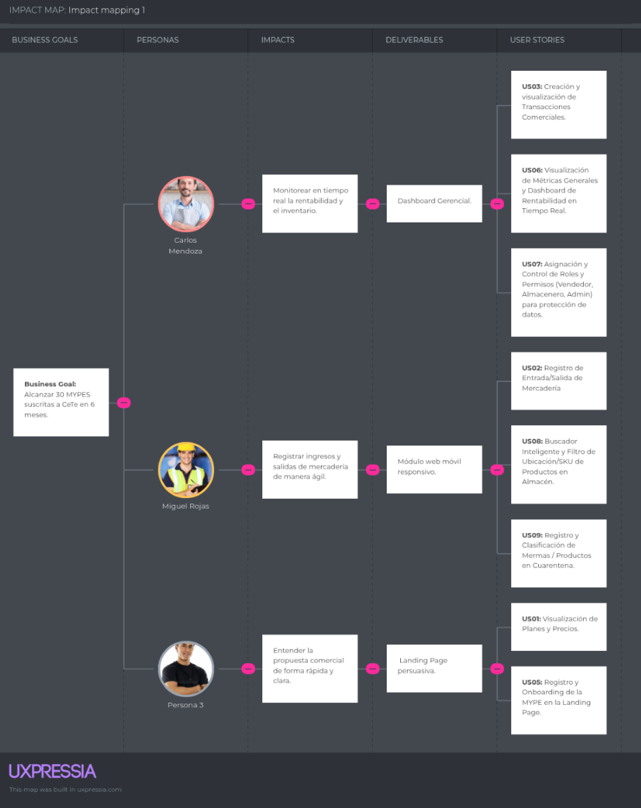
   <em>Figura 1: Captura del Impact Mapping hecho en UXPressia</em>

El Impact Mapping elaborado para AI-ToDu ilustra de manera estratégica cómo las funcionalidades de nuestra plataforma tecnológica contribuyen a alcanzar nuestros objetivos de negocio. Para esta fase del proyecto, hemos definido un objetivo SMART (Business Goal) enfocado tanto en la adopción empresarial como en la penetración en el usuario final.

**Alineación del Business Goal 1:** Alcanzar 30 negocios (MYPES) suscritos a los planes de pago de AI-ToDu en los primeros 6 meses tras el lanzamiento oficial de la plataforma. Para alcanzar esta meta, hemos identificado a tres actores clave del sector comercial que nos permitirán materializarla: los dueños/administradores de negocio, el personal logístico/almaceneros y los visitantes potenciales.
- En el caso de los dueños/administradores de negocio (Carlos Mendoza), el impacto que necesitamos generar es que monitoreen la salud y rentabilidad de su empresa en tiempo real, dejando atrás la incertidumbre de no saber dónde está su mercadería o si están ganando dinero. Como solución digital, provocaremos este impacto construyendo un Dashboard Gerencial y Analítico (Deliverable), el cual se materializa en historias de usuario enfocadas en consolidar métricas financieras, visualizar top de ventas y gestionar los roles de acceso (US23, US24, US25, US28, US29).
- Por el lado del personal logístico/almaceneros (Miguel Rojas), el impacto esperado es que adopten AI-ToDu como su canal centralizado para registrar ingresos y salidas, abandonando totalmente los conteos manuales y reportes en cuadernos. Para facilitar este comportamiento, implementaremos un Módulo de Inventario Inteligente (Deliverable), soportado por funcionalidades que permiten registrar entradas y mermas en segundos, buscar artículos ágilmente y generar notificaciones automáticas de stock mínimo y vencimientos (US09, US10, US11, US12, US13, US14, US26, US27).
- En cuanto a los visitantes MYPE, el impacto deseado es la comprensión rápida de la propuesta de valor para motivarlos a suscribirse. Para ello, implementaremos un Landing Page persuasivo (Deliverable), soportado por historias para visualizar planes, testimonios y el formulario de registro (US05, US06, US07, US08, US32, US34).

## 3.3. Product Backlog

A continuación, se presenta el Product Backlog del proyecto AI-ToDu, organizado y priorizado de acuerdo con el valor que cada User Story aporta al negocio y al funcionamiento principal del producto. La priorización no representa necesariamente el orden exacto en el que se desarrollarán técnicamente las funcionalidades, sino el nivel de importancia que tienen para validar y entregar valor al usuario.

| # Orden | Story ID | Título | Descripción | Story Points |
| :---: | :---: | :--- | :--- | :---: |
| 1 | US05 | Propuesta de valor en landing | Como visitante MYPE, deseo visualizar la propuesta de valor de AI-ToDu para comprender cómo solucionar mis problemas logísticos. | 3 |
| 2 | US06 | Funcionalidades de landing | Como visitante, deseo conocer las capacidades del producto, para comprobar si cubre mis necesidades de negocio. | 2 |
| 3 | US07 | Modelo comercial y planes | Como visitante, deseo consultar modalidades y planes de suscripción, para evaluar una posible contratación para mi MYPE. | 2 |
| 4 | US34 | Términos del Servicio | Como visitante, deseo leer las condiciones legales, para conocer el uso de mi data. | 2 |
| 5 | US09 | Registro de Artículo (SKU) | Como operario, deseo dar de alta un nuevo producto, para que esté disponible para futuras transacciones. | 3 |
| 6 | US10 | Ingreso de Mercadería | Como operario de almacén, deseo registrar un nuevo artículo para mantener el stock actualizado sin usar papel. | 5 |
| 7 | US13 | Buscador de Inventario | Como operario, deseo buscar productos por nombre o SKU, para localizarlos rápidamente sin listas largas. | 3 |
| 8 | US11 | Salida Manual de Mercadería | Como operario, deseo registrar el retiro manual de productos, para reflejar consumos internos o ajustes. | 3 |
| 9 | US15 | Creación de Venta | Como dueño o vendedor, deseo registrar una transacción comercial, para formalizar ingresos y descontar stock. | 8 |
| 10 | US16 | Validación Automática de Stock | Como vendedor, deseo bloqueo de productos agotados en caja, para no prometer mercadería inexistente. | 5 |
| 11 | US23 | Dashboard General | Como dueño de negocio, deseo ver un gráfico en tiempo real para tomar decisiones de compra informadas. | 5 |
| 12 | US19 | Manifiesto de Despacho | Como logístico, deseo agrupar ventas en un manifiesto, para ordenar la ruta de entrega. | 5 |
| 13 | US21 | Actualización de Estado | Como logístico, deseo cambiar el estado del envío, para notificar su entrega efectiva. | 3 |
| 14 | US14 | Historial de Movimientos | Como participante autorizado, deseo ver el Kardex de un producto, para auditar discrepancias o mermas. | 3 |
| 15 | US17 | Historial de Ventas | Como participante autorizado, deseo consultar transacciones pasadas, para llevar el control de ingresos diarios. | 3 |
| 16 | US12 | Registro de Mermas | Como operario, deseo apartar productos dañados o caducados, para evitar que sean vendidos por error. | 2 |
| 17 | US18 | Anulación de Venta | Como dueño, deseo revertir una venta equivocada, para corregir métricas y devolver stock. | 5 |
| 18 | US26 | Alerta de Stock Mínimo | Como participante autorizado, deseo recibir avisos al acercarme a cero, para reponer mercadería a tiempo. | 5 |
| 19 | US28 | Creación de Usuarios | Como administrador, deseo crear cuentas para mis trabajadores, para delegar accesos seguros. | 5 |
| 20 | US29 | Restricción por Roles | Como administrador, deseo definir niveles de acceso operacionales, para bloquear módulos confidenciales. | 5 |
| 21 | US01 | Registro de cuenta | Como visitante, deseo registrar los datos de mi empresa, para crear una cuenta administradora en AI-ToDu. | 3 |
| 22 | US02 | Inicio de sesión | Como usuario registrado, deseo autenticarme, para acceder al espacio de trabajo de mi empresa. | 3 |
| 23 | US03 | Cierre de sesión | Como usuario autenticado, deseo terminar mi sesión, para proteger mi cuenta y la información del negocio. | 2 |
| 24 | US04 | Recuperación de contraseña | Como usuario registrado, deseo restablecer mi contraseña, para recuperar acceso si la he olvidado. | 5 |
| 25 | US08 | Contacto B2B | Como visitante corporativo, deseo enviar un mensaje a ventas, para solicitar una demostración personalizada. | 3 |
| 26 | US32 | Testimonios (Landing) | Como visitante, deseo consultar experiencias de otras MYPES, para ganar confianza. | 2 |
| 27 | US20 | Asignación de Conductor | Como logístico, deseo vincular recursos al manifiesto, para establecer responsables de entrega. | 3 |
| 28 | US22 | Incidencia en Ruta | Como logístico, deseo anotar contratiempos logísticos, para auditar retrasos en entregas. | 3 |
| 29 | US24 | Reporte de Top Productos | Como dueño, deseo identificar los artículos más vendidos, para priorizar abastecimiento. | 3 |
| 30 | US25 | Exportación de Datos | Como participante autorizado, deseo descargar mis tablas a CSV, para enviarlas a contabilidad. | 5 |
| 31 | US27 | Alerta de Producto Vencido | Como almacenero, deseo avisos preventivos de caducidad, para ofertar artículos perecibles. | 3 |
| 32 | US30 | Edición de Perfil Empresa | Como administrador, deseo actualizar mis datos comerciales, para mantener facturas e interfaz personalizadas. | 2 |
| 33 | US31 | Cambio de Contraseña | Como usuario registrado, deseo actualizar mi clave, para asegurar mi cuenta. | 3 |
| 34 | US33 | Idioma de la aplicación | Como usuario, deseo elegir inglés o español, para comprender la interfaz a mi gusto. | 2 |

Para la estimación del esfuerzo se utiliza la secuencia de Fibonacci (1, 2, 3, 5 y 8 Story Points), considerando factores como complejidad, esfuerzo, incertidumbre y dependencias técnicas. Las 34 User Stories representan una estimación total propuesta de 121 Story Points, la cual deberá ser revisada y acordada por el equipo durante las sesiones de refinamiento del Product Backlog.

Las Technical Stories (TS) se gestionan como trabajo técnico asociado a las User Stories correspondientes y no se suman nuevamente a los Story Points del Product Backlog, con el objetivo de evitar una doble estimación del mismo esfuerzo. Estas historias técnicas incluyen, principalmente, la implementación de endpoints, validaciones, mecanismos de autenticación, consultas y operaciones necesarias para soportar las funcionalidades definidas en las User Stories.

Finalmente, la gestión y seguimiento del Product Backlog se realiza mediante Trello, donde las funcionalidades se organizan mediante una jerarquía de Epics, User Stories y Technical Stories, permitiendo administrar su prioridad, estimación, estado, dependencias y avance durante el desarrollo del proyecto.

# Capítulo IV: Product Design

En este capítulo detallamos las directrices visuales, arquitectónicas y de experiencia de usuario que guiarán el desarrollo de AI-ToDu. El diseño de nuestro producto se fundamenta en heurísticas de usabilidad estandarizadas, garantizando una curva de aprendizaje mínima y una alta eficiencia operativa para las MYPES.

## 4.1. Style Guidelines

El sistema de diseño de AI-ToDu se fundamenta en principios de claridad, confianza y eficiencia operativa. Dado que la plataforma será utilizada por dueños y administradores de MYPES, así como por jefes de logística y operarios de almacén con diferentes niveles de experiencia tecnológica, la interfaz debe priorizar la legibilidad, la intuición y la consistencia visual en todos los puntos de contacto.

### 4.1.1. General Style Guidelines

La identidad visual de AI-ToDu se fundamenta en los elementos conceptuales de una plataforma digital orientada a la gestión de inventario, ventas y despachos. El diseño integra conceptos relacionados con la organización de productos, el control de existencias, la centralización de información y la automatización de procesos empresariales. El tono de comunicación es profesional, directo y resolutivo, diseñado para transmitir confianza B2B en el entorno de las Micro y Pequeñas Empresas.

**4.1.1.1. Branding**

Para AI-ToDu, el branding se diseñó para mostrar innovación tecnológica, control empresarial y eficiencia operativa. Los elementos conceptuales del isotipo representan la centralización de la información, el seguimiento de los productos y la conexión entre los procesos de almacén, ventas y despacho.

El diseño incluye el imagotipo y el nombre del producto “AI-ToDu” de forma clara y legible, permitiendo que la marca sea reconocida fácilmente dentro de la Landing Page, la aplicación web, los documentos del proyecto y los dispositivos móviles.

  

**4.1.1.2. Typography**

La tipografía de AI-ToDu ha sido definida con el objetivo de mantener una interfaz clara, profesional y legible. La familia tipográfica principal de la plataforma es **Inter**, seleccionada por su alta legibilidad en interfaces digitales y su versatilidad para establecer distintos niveles de jerarquía visual:

* **Page Title / H1:** Inter Bold, 32 px
* **Section Heading / H2:** Inter SemiBold, 24 px
* **Subheading / H3:** Inter SemiBold, 20 px
* **Body Text:** Inter Regular, 16 px
* **Small / Auxiliary Text:** Inter Regular, 14 px
* **Labels / Caption:** Inter Regular, 12 px

El interlineado se establece aproximadamente entre 1.3 y 1.5 veces el tamaño de la fuente, favoreciendo la lectura tanto en bloques de contenido como en interfaces que presentan información operativa.

**4.1.1.3. Paleta de Colores**

La paleta de colores de AI-ToDu busca transmitir confianza, innovación y eficiencia. Se utilizan tonos corporativos para la navegación y colores semánticos para comunicar los estados del sistema:

* **Corporate Navy (`#0F172A`):** Títulos, navegación y elementos estructurales.
* **Primary Teal (`#0D9488`):** Botones y acciones principales.
* **Teal Light (`#CCFBF1`):** Fondos informativos y elementos destacados.
* **Background Light (`#F8FAFC`):** Fondo general de la aplicación.
* **Success Green (`#16A34A`):** Operaciones completadas y stock disponible.
* **Warning Amber (`#F59E0B`):** Stock bajo y revisiones pendientes.
* **Error Red (`#DC2626`):** Stock agotado, errores e incidencias críticas.

**4.1.1.4. Spacing**

El sistema de espaciado se basa en una cuadrícula de 4 píxeles, permitiendo mantener consistencia entre los diferentes componentes. La escala utilizada es:
* **4 px:** Separación mínima (ej. ícono y etiqueta).
* **8 px:** Elementos relacionados del mismo grupo.
* **12 px:** Componentes pequeños o separaciones internas frecuentes.
* **16 px:** Separación interna de componentes (tarjetas, formularios).
* **24 px:** Separación visual clara entre tarjetas y subsecciones.
* **32 px:** División de bloques principales dentro de una vista.
* **48 px:** Separación amplia entre secciones de la Landing Page.

**4.1.1.5. Iconography**

La iconografía sigue un estilo simple, lineal, reconocible y consistente. Se priorizan íconos de apariencia limpia, evitando ilustraciones excesivamente complejas. Entre los principales elementos representados se encuentran: Dashboard, Inventario, Registrar entrada/salida, Ventas, Despachos, Reportes, Alertas, y Perfil.
Los íconos no reemplazan por completo el contenido textual en las operaciones importantes; se acompañan de una etiqueta descriptiva para reducir la carga cognitiva.

**4.1.1.6. Tone of Communication and Applied Language**

El tono de comunicación es claro, profesional, respetuoso, sereno y orientado a la acción. Se evitan tecnicismos innecesarios y mensajes ambiguos.
* **Acciones:** “Registrar entrada”, “Registrar salida”, “Registrar merma”, “Buscar producto”, “Ver detalles”.
* **Estados y datos:** “Stock disponible”, “Stock bajo”, “Stock agotado”, “Producto en cuarentena”, “Movimiento registrado”.

### 4.1.2. Web Style Guidelines

En el diseño visual de AI-ToDu se utiliza una línea gráfica moderna, profesional y funcional. La jerarquía visual se construye mediante la tipografía Inter, tamaños diferenciados y colores de alto contraste (Corporate Navy y Primary Teal). Los componentes interactivos presentan estados visuales claros (*normal, hover, focus, active*). Se utilizan tarjetas con bordes suaves y tablas organizadas. Además, el diseño *responsive* permite que AI-ToDu conserve su funcionalidad en computadoras, tablets y smartphones.

## 4.2. Information Architecture

La arquitectura de información de AI-ToDu está diseñada para que visitantes y usuarios operativos encuentren lo que necesitan con el menor número de clics posible, reduciendo la fricción.

### 4.2.1. Organization Systems

Para AI-ToDu se opta por una organización visual jerárquica con elementos secuenciales. El contenido se organiza en categorías como “Dashboard”, “Inventario”, “Ventas”, “Despachos”, “Reportes” y “Configuración”. En determinadas secciones se incorporan flujos secuenciales que guían al usuario paso a paso (ej. registrar una entrada o crear una transacción comercial).

  <em>Enlace a la estructura en Miro: <a href="https://miro.com/app/board/uXjVHlZ7CiQ=/?share_link_id=480881319023">Ver Arquitectura de Información AI-ToDu</a></em>

### 4.2.2. Labeling Systems

El sistema de etiquetas utiliza una terminología clara y uniforme:

| Sección / Etiqueta | Descripción |
| :--- | :--- |
| **Inicio / Dashboard** | Presenta un resumen del estado del negocio, incluyendo ventas, inventario, alertas y rentabilidad. |
| **Inventario / Inventory** | Permite consultar y administrar los productos, SKU, cantidades, ubicaciones y estados. |
| **Registrar entrada / Register Input** | Permite ingresar nueva mercadería y actualizar la cantidad disponible. |
| **Registrar salida / Register Output** | Permite registrar la salida de productos por venta o despacho. |
| **Registrar merma / Register Loss** | Permite registrar productos dañados, vencidos o perdidos. |
| **Ventas / Sales** | Permite crear y consultar transacciones comerciales y estados de pago. |
| **Despachos / Shipments** | Permite gestionar manifiestos, productos enviados y estados de entrega. |
| **Reportes / Reports** | Presenta información sobre ventas, stock, mermas, movimientos y rentabilidad. |
| **Usuarios y roles / Users and Roles** | Permite administrar las cuentas y asignar permisos. |
| **Configuración / Settings** | Permite gestionar los datos del negocio y las preferencias del sistema. |

### 4.2.3. SEO Tags and Meta Tags

Los metadatos se definen con el objetivo de posicionar correctamente la plataforma y proporcionar información clara a los navegadores:

| Página | Title | Description | Keywords | Author |
| :--- | :--- | :--- | :--- | :--- |
| **Landing Page** | AI-ToDu \| Gestión de inventario y ventas para MYPES | Centraliza el inventario, las ventas y despachos mediante una plataforma web sencilla. | inventario MYPE, control de stock, gestión de ventas, AI-ToDu | IA-INNOVATION Team |
| **Login / Registro** | Accede a AI-ToDu \| Iniciar sesión o registrarse | Inicia sesión o crea una cuenta en AI-ToDu para gestionar las operaciones de tu negocio. | AI-ToDu, iniciar sesión, registro, inventario, MYPES | IA-INNOVATION Team |
| **Dashboard** | Dashboard \| AI-ToDu | Consulta el estado de tu inventario, ventas, mermas, alertas y principales indicadores. | dashboard, inventario, ventas, reportes, rentabilidad | IA-INNOVATION Team |

La Landing Page utilizará el atributo `lang="es-PE"` y el Meta Tag `viewport` para mantener una presentación adaptable a diferentes tamaños de pantalla.

### 4.2.4. Searching Systems

AI-ToDu incorpora mecanismos de búsqueda y filtrado ágiles.

**Searching System para productos:**
| Criterio | Descripción |
| :--- | :--- |
| **SKU** | Localiza un producto mediante su código único. |
| **Nombre** | Busca artículos por coincidencia de texto. |
| **Categoría** | Filtra productos de una categoría específica. |
| **Ubicación** | Busca artículos según su zona o repisa. |

**Searching System mediante filtros:**
| Filtro | Descripción |
| :--- | :--- |
| **Fecha** | Filtra registros por un periodo. |
| **Tipo de movimiento** | Muestra entradas, salidas o mermas. |
| **Estado** | Filtra productos disponibles, con stock bajo, agotados o en cuarentena. |

*Nota: El dueño o administrador puede buscar en todos los módulos, mientras que el operario de almacén solo accede a la información permitida por su rol.*

### 4.2.5. Navigation Systems

**Navegación de la Landing Page:**
Utiliza una navegación horizontal en escritorio y un menú hamburguesa adaptable en móviles. Incorpora llamados a la acción dirigidos a los dueños ("Registrarse") y operarios.

**Navegación para el Dueño o Administrador (Web App):**
| Nombre | Descripción |
| :--- | :--- |
| **Dashboard** | Presenta indicadores de ventas, inventario, mermas y rentabilidad. |
| **Inventario** | Permite consultar productos, stock y movimientos. |
| **Ventas / Despachos** | Gestión de transacciones comerciales y salidas de mercadería. |
| **Reportes / Roles** | Información financiera y administración de permisos de empleados. |

**Navegación para el Operario de Almacén:**
| Nombre | Descripción |
| :--- | :--- |
| **Inicio** | Presenta tareas pendientes y alertas de inventario. |
| **Registrar entrada / salida / merma** | Accesos rápidos enfocados en la operación física del almacén. |
| **Buscar producto** | Localización rápida de artículos por SKU. |

## 4.3. Landing Page UI Design

La propuesta visual traduce nuestras decisiones de Arquitectura de Información y Guías de Estilo en una interfaz orientada a la conversión B2B. El diseño se enfoca en transmitir confianza institucional y guiar al visitante hacia el registro.

### 4.3.1. Landing Page Wireframe

Hemos priorizado la heurística de "Diseño estético y minimalista", asegurando que el *Hero Section* contenga una propuesta de valor clara y un único *Call to Action* prominente.

**Wireframes Desktop de la Landing Page**

  

  

  

  

**Wireframes Mobile de la Landing Page**

  
  

  
  

### 4.3.2. Landing Page Mock-up

Los mock-ups integran nuestro *Design System*. Utilizamos la paleta de colores corporativa (Navy y Teal) para resaltar los botones de acción sobre fondos limpios, cumpliendo con los estándares de contraste (WCAG).

## 4.4. Web Applications UX/UI Design

El diseño de la aplicación web organiza las experiencias de los dos roles principales: el Dueño/Administrador (supervisión e indicadores) y el Operario de Almacén (registro rápido de movimientos).

### 4.4.1. Web Applications Wireframes

En el dashboard se prioriza la visualización de indicadores de inventario, ventas y rentabilidad. La distribución se adapta a dispositivos móviles para los operarios.

| Familia de vistas | Propósito | Historias relacionadas |
| :--- | :--- | :--- |
| **Acceso y cuenta** | Registro, inicio y cierre de sesión. | US01 |
| **Dashboard** | Consulta de inventario, ventas, mermas y rentabilidad. | US03 |
| **Inventario** | Consulta de productos, SKU, cantidades y estados. | US02, US04 |
| **Registrar entrada / salida** | Registro de nueva mercadería o despachos. | US02, US03 |
| **Notificaciones y Roles** | Avisos sobre stock bajo y administración de permisos. | US03, US05 |

### 4.4.2. Web Applications Wireflow Diagrams

Los wireflows representan la secuencia de pantallas y acciones que debe seguir cada usuario:

| Wireflow | Usuario y objetivo | Secuencia funcional |
| :--- | :--- | :--- |
| **W1** | **Admin/Operario:** Registrar entrada | Módulo Inventario → "Registrar entrada" → completar SKU → guardar → visualizar actualizado. |
| **W2** | **Admin:** Eliminar producto | Módulo Inventario → seleccionar ícono eliminar → confirmar mensaje → visualizar listado. |
| **W3** | **Admin/Operario:** Consultar ventas | Menú lateral → "Ventas" → consultar registro de transacciones. |
| **W4** | **Admin/Operario:** Consultar despachos | Menú lateral → "Despachos" → organizar y hacer seguimiento. |
| **W5** | **Admin:** Consultar reportes | Menú lateral → "Reportes" → consultar finanzas y compras. |
| **W6** | **Admin/Operario:** Notificaciones | Dashboard → ícono de notificaciones → revisar alertas de stock. |

  
   <em>Nota. Representación secuencial de las acciones W1 a W6.</em>

### 4.4.3. Web Applications Mock-ups

Los mock-ups presentan la propuesta visual final. Utilizan un menú lateral de navegación, tarjetas de resumen y tablas. Los estados del inventario se diferencian como “Óptimo”, “Alerta” y “Quiebre”.

  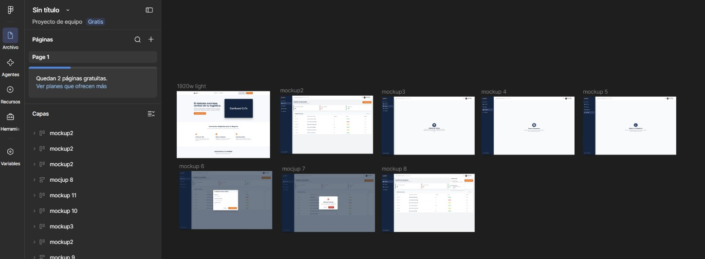

### 4.4.4. Web Applications User Flow Diagrams

Las representaciones de decisiones complementan la secuencia de pantallas al incorporar las condiciones lógicas de AI-ToDu:
* El registro de una entrada válida actualiza la cantidad.
* No se permite registrar una salida mayor al stock disponible.
* Un producto en cuarentena no puede venderse ni despacharse.
* Las alternativas incluyen datos incompletos, SKU inexistente, stock insuficiente y errores de guardado.

**Leyenda:**

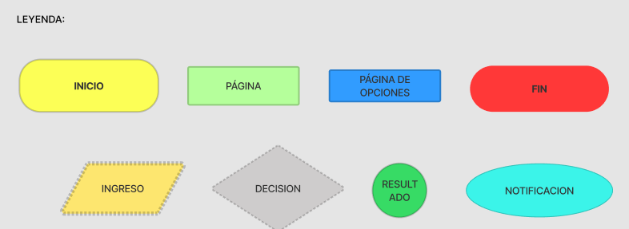

**Flujo de Usuario:**
Empieza con el usuario ingresando a la página de inicio de CeTe Workspace. Aquí determina si es "Administrador" o "Colaborador".

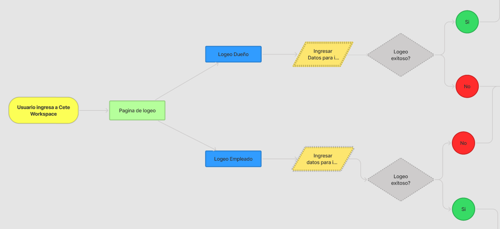

**Flujo de Administrador:**
El usuario Administrador puede acceder a su perfil, visualizar el panel de control de la MYPE, asignar tareas a sus colaboradores, y acceder a las herramientas de reportes y administración.

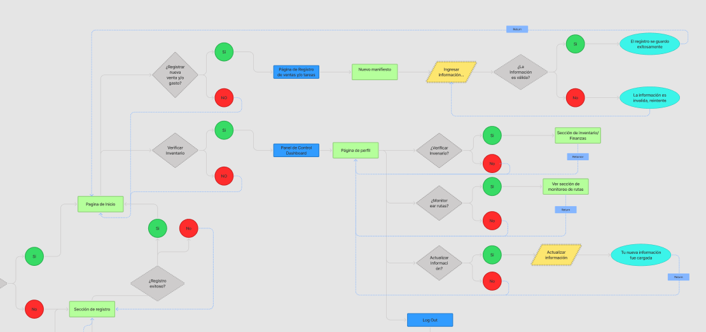

**Flujo de Colaborador:**
El usuario Colaborador puede acceder a su perfil, ver los proyectos o tareas asignadas, registrar su avance diario, y acceder a las herramientas operativas de su espacio de trabajo.

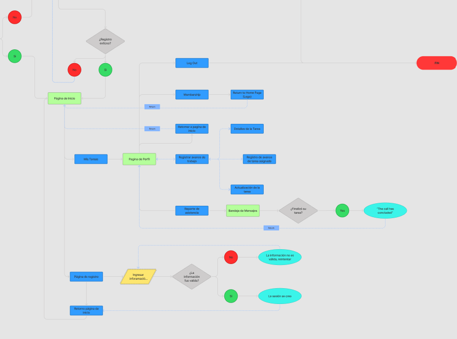

**Vista general del flujo de usuario:**

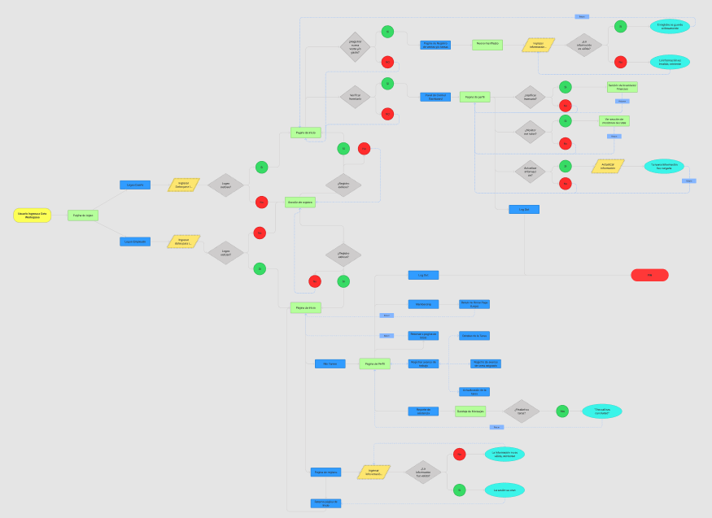

### 4.5. Web Applications Prototyping

El prototipo de AI-ToDu reúne las interfaces y conexiones de navegación para explorar la experiencia de usuario. Su evaluación comprueba la continuidad de las interacciones en computadoras y dispositivos móviles, simulando la experiencia de uso ágil.

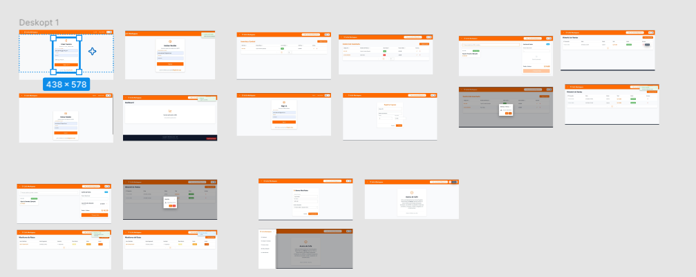

## 4.6. Domain-Driven Software Architecture

AI-ToDu adopta el enfoque de *Domain-Driven Design* (DDD) con el objetivo de organizar la solución según los procesos reales de gestión de las MYPES. El sistema se estructura en diferentes *Bounded Contexts*, encapsulando las reglas de negocio y facilitando la mantenibilidad técnica.

| Bounded Context | Descripción |
| :--- | :--- |
| **IAM** | Gestiona la autenticación, usuarios, roles y permisos de acceso. |
| **Warehouse & Inventory Management** | Administra productos, SKU, existencias, entradas, salidas y mermas (Core Domain). |
| **Sales & Commercial Transactions** | Gestiona ventas, productos vendidos y totales. |
| **Logistics & Dispatch** | Administra manifiestos y seguimiento de envíos. |
| **Reporting & Notifications** | Genera indicadores financieros y alertas de stock. |

### 4.6.1. Design-Level Event Storming

A través del EventStorming a nivel de diseño, se identificaron las interdependencias e integración entre los módulos:

| Origen — Evento | Destino — Comando | Descripción |
| :--- | :--- | :--- |
| **IAM:** User Authenticated | **Warehouse:** Register Movement | Un usuario autenticado puede registrar movimientos según permisos. |
| **Warehouse:** Merchandise Received | **Warehouse:** Update Inventory | La recepción de mercadería incrementa la cantidad disponible. |
| **Warehouse:** Low Stock Triggered | **Notifications:** Send Alert | El stock bajo genera una alerta para el usuario autorizado. |
| **Sales:** Transaction Created | **Warehouse:** Dispatch Merch. | Una venta confirmada solicita la salida de los productos. |

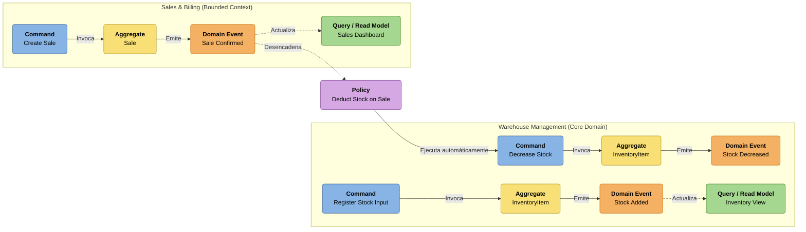
```mermaid
flowchart LR
    %% Paleta de colores estándar de Event Storming
    classDef command fill:#87b4e5,stroke:#2b578c,color:#000,rx:5px,ry:5px
    classDef aggregate fill:#f9e076,stroke:#a68910,color:#000,rx:5px,ry:5px
    classDef event fill:#f4b163,stroke:#c46c0b,color:#000,rx:5px,ry:5px
    classDef query fill:#a5d790,stroke:#387c1c,color:#000,rx:5px,ry:5px
    classDef policy fill:#d5a8e3,stroke:#7c3d91,color:#000,rx:5px,ry:5px

    subgraph Warehouse["Warehouse Management (Core Domain)"]
        direction LR
        W_Cmd1["<b>Command</b><br/>Register Stock Input"]:::command
        W_Agg1["<b>Aggregate</b><br/>InventoryItem"]:::aggregate
        W_Evt1["<b>Domain Event</b><br/>Stock Added"]:::event
        W_Qry1["<b>Query / Read Model</b><br/>Inventory View"]:::query

        W_Cmd1 -->|"Invoca"| W_Agg1 -->|"Emite"| W_Evt1 -.->|"Actualiza"| W_Qry1

        W_Cmd2["<b>Command</b><br/>Decrease Stock"]:::command
        W_Agg2["<b>Aggregate</b><br/>InventoryItem"]:::aggregate
        W_Evt2["<b>Domain Event</b><br/>Stock Decreased"]:::event

        W_Cmd2 -->|"Invoca"| W_Agg2 -->|"Emite"| W_Evt2
    end

    subgraph Sales["Sales & Billing (Bounded Context)"]
        direction LR
        S_Cmd1["<b>Command</b><br/>Create Sale"]:::command
        S_Agg1["<b>Aggregate</b><br/>Sale"]:::aggregate
        S_Evt1["<b>Domain Event</b><br/>Sale Confirmed"]:::event
        S_Qry1["<b>Query / Read Model</b><br/>Sales Dashboard"]:::query

        S_Cmd1 -->|"Invoca"| S_Agg1 -->|"Emite"| S_Evt1 -.->|"Actualiza"| S_Qry1
    end

    %% Regla de negocio cruzada (Policy / Process Manager)
    Policy["<b>Policy</b><br/>Deduct Stock on Sale"]:::policy
    
    S_Evt1 -.->|"Desencadena"| Policy
    Policy -->|"Ejecuta automáticamente"| W_Cmd2
```

### 4.6.2. Software Architecture Context Diagram

El Diagrama de Contexto (Nivel 1 C4) ilustra el sistema central en su ecosistema operativo. Está liderado por el Dueño/Administrador y el Operario de Almacén. Se integra con plataformas externas como SUNAT API, Email Gateway (SendGrid) y Pasarelas de Pago.

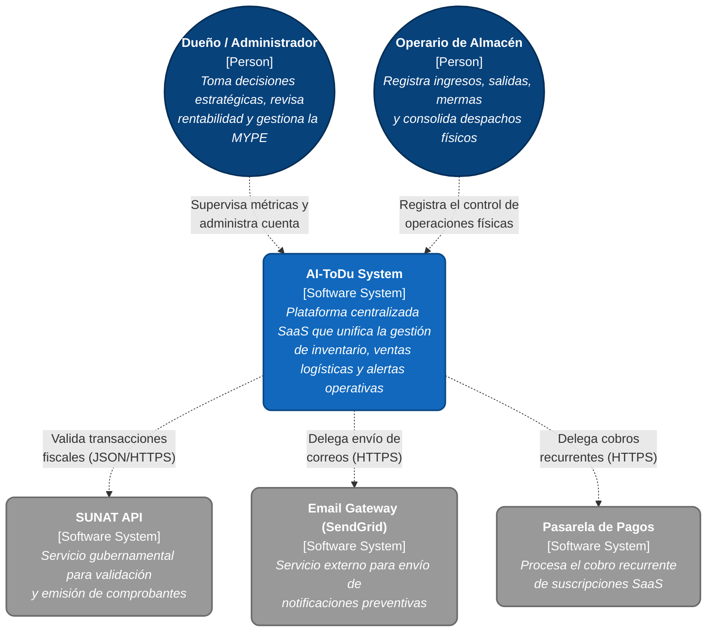
```mermaid
flowchart TD
    %% Actors
    ADMIN(("<b>Dueño / Administrador</b><br/>[Person]<br/><i>Toma decisiones estratégicas, revisa<br/>rentabilidad y gestiona la MYPE</i>"))
    OPERATOR(("<b>Operario de Almacén</b><br/>[Person]<br/><i>Registra ingresos, salidas, mermas<br/>y consolida despachos físicos</i>"))
    
    %% Core System
    AITODU("<b>AI-ToDu System</b><br/>[Software System]<br/><i>Plataforma centralizada SaaS que unifica la gestión<br/>de inventario, ventas logísticas y alertas operativas</i>")
    
    %% External Systems
    SUNAT["<b>SUNAT API</b><br/>[Software System]<br/><i>Servicio gubernamental para validación<br/>y emisión de comprobantes</i>"]
    SENDGRID["<b>Email Gateway (SendGrid)</b><br/>[Software System]<br/><i>Servicio externo para envío de<br/>notificaciones preventivas</i>"]
    PAYMENT["<b>Pasarela de Pagos</b><br/>[Software System]<br/><i>Procesa el cobro recurrente<br/>de suscripciones SaaS</i>"]
    
    %% Relationships
    ADMIN -.->|"Supervisa métricas y<br/>administra cuenta"| AITODU
    OPERATOR -.->|"Registra el control de<br/>operaciones físicas"| AITODU
    
    AITODU -.->|"Valida transacciones<br/>fiscales (JSON/HTTPS)"| SUNAT
    AITODU -.->|"Delega envío de<br/>correos (HTTPS)"| SENDGRID
    AITODU -.->|"Delega cobros<br/>recurrentes (HTTPS)"| PAYMENT
    
    %% C4 Model Styling
    classDef person fill:#08427b,stroke:#052e56,color:#ffffff,stroke-width:2px
    classDef system fill:#1168bd,stroke:#0b4884,color:#ffffff,rx:10px,ry:10px,stroke-width:2px
    classDef external fill:#999999,stroke:#6b6b6b,color:#ffffff,rx:10px,ry:10px,stroke-width:2px
    
    class ADMIN,OPERATOR person
    class AITODU system
    class SUNAT,SENDGRID,PAYMENT external
```

### 4.6.3. Software Architecture Container Diagrams

El Diagrama de Contenedores (Nivel 2 C4) expone las unidades de ejecución y despliegue:
* **Landing Page:** Sitio estático (Vercel/Netlify).
* **Web Application (SPA):** Desarrollada con **Angular y TypeScript**, interfaz responsiva para operarios y gerentes.
* **Backend API:** Desarrollado en **Java 17 con Spring Boot** bajo arquitectura DDD. Procesa peticiones autenticadas vía JWT.
* **Database:** **PostgreSQL** para persistir el registro transaccional bajo garantías ACID.

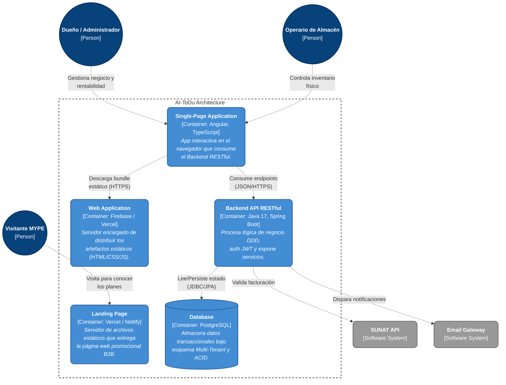
```mermaid
flowchart TD
    %% Actors
    ADMIN(("<b>Dueño / Administrador</b><br/>[Person]"))
    OPERATOR(("<b>Operario de Almacén</b><br/>[Person]"))
    VISITOR(("<b>Visitante MYPE</b><br/>[Person]"))

    %% Boundary
    subgraph SYSTEM_BOUNDARY ["AI-ToDu Architecture"]
        direction TB
        LANDING("<b>Landing Page</b><br/>[Container: Vercel / Netlify]<br/><i>Servidor de archivos estáticos que entrega<br/>la página web promocional B2B.</i>")
        WEBAPP("<b>Web Application</b><br/>[Container: Firebase / Vercel]<br/><i>Servidor encargado de distribuir los<br/>artefactos estáticos (HTML/CSS/JS).</i>")
        SPA("<b>Single-Page Application</b><br/>[Container: Angular, TypeScript]<br/><i>App interactiva en el navegador que consume<br/>el Backend RESTful.</i>")
        API("<b>Backend API RESTful</b><br/>[Container: Java 17, Spring Boot]<br/><i>Procesa lógica de negocio DDD,<br/>auth JWT y expone servicios.</i>")
        DB[("<b>Database</b><br/>[Container: PostgreSQL]<br/><i>Almacena datos transaccionales bajo<br/>esquema Multi-Tenant y ACID.</i>")]
    end

    %% External Systems
    SUNAT["<b>SUNAT API</b><br/>[Software System]"]
    SENDGRID["<b>Email Gateway</b><br/>[Software System]"]

    %% Relationships
    VISITOR -.->|"Visita para conocer<br/>los planes"| LANDING
    ADMIN -.->|"Gestiona negocio y<br/>rentabilidad"| SPA
    OPERATOR -.->|"Controla inventario<br/>físico"| SPA
    
    SPA -.->|"Descarga bundle<br/>estático (HTTPS)"| WEBAPP
    SPA -.->|"Consume endpoints<br/>(JSON/HTTPS)"| API
    
    API -.->|"Lee/Persiste estado<br/>(JDBC/JPA)"| DB
    API -.->|"Valida facturación"| SUNAT
    API -.->|"Dispara notificaciones"| SENDGRID

    %% Styling
    classDef person fill:#08427b,stroke:#052e56,color:#ffffff,stroke-width:2px
    classDef container fill:#438dd5,stroke:#2e6295,color:#ffffff,rx:10px,ry:10px,stroke-width:2px
    classDef database fill:#438dd5,stroke:#2e6295,color:#ffffff,stroke-width:2px
    classDef external fill:#999999,stroke:#6b6b6b,color:#ffffff,rx:10px,ry:10px,stroke-width:2px
    classDef boundary fill:none,stroke:#444444,stroke-width:2px,stroke-dasharray: 5 5

    class ADMIN,OPERATOR,VISITOR person
    class LANDING,WEBAPP,SPA,API container
    class DB database
    class SUNAT,SENDGRID external
    class SYSTEM_BOUNDARY boundary
```

### 4.6.4. Software Architecture Components Diagrams

El Diagrama de Componentes (Nivel 3 C4) descompone el contenedor del **Backend API (Spring Boot)**. Muestra los módulos cohesivos: *IAM Module, Warehouse Module, Sales Module, Logistics Module* y la capa de *Shared Infrastructure* apoyada en **Spring Data JPA**.

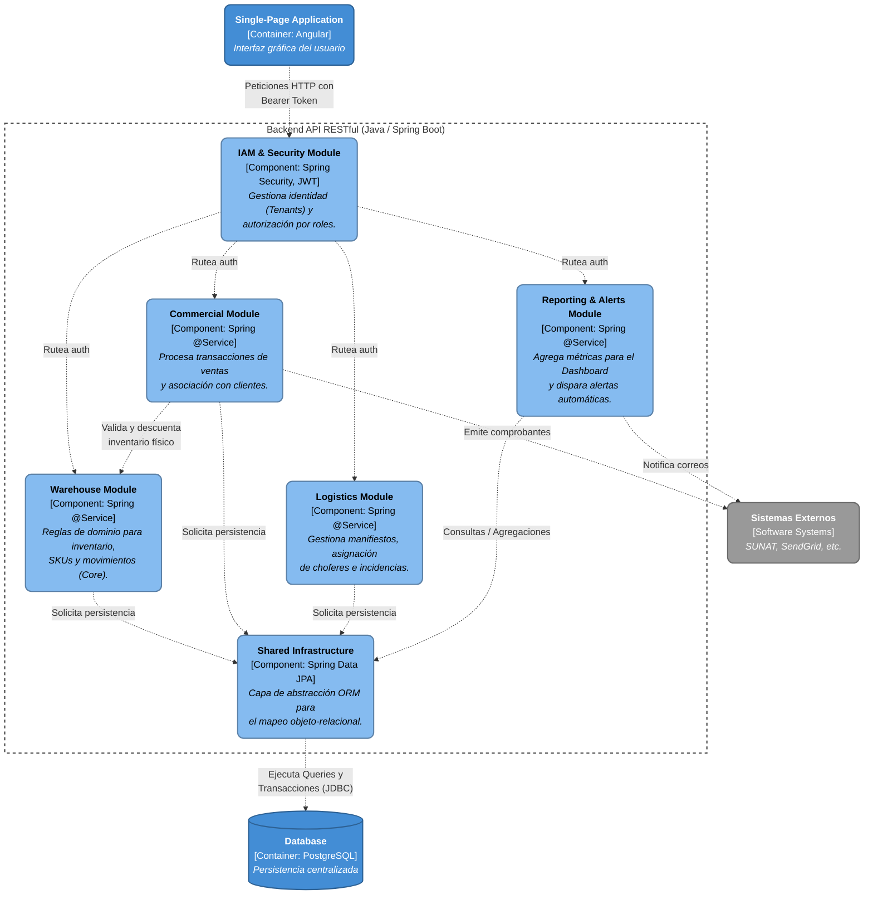
```mermaid
flowchart TD
    %% External Containers
    SPA("<b>Single-Page Application</b><br/>[Container: Angular]<br/><i>Interfaz gráfica del usuario</i>")
    DB[("<b>Database</b><br/>[Container: PostgreSQL]<br/><i>Persistencia centralizada</i>")]
    EXTERNAL["<b>Sistemas Externos</b><br/>[Software Systems]<br/><i>SUNAT, SendGrid, etc.</i>"]

    %% Boundary
    subgraph API_BOUNDARY ["Backend API RESTful (Java / Spring Boot)"]
        direction TB
        IAM("<b>IAM & Security Module</b><br/>[Component: Spring Security, JWT]<br/><i>Gestiona identidad (Tenants) y<br/>autorización por roles.</i>")
        WAREHOUSE("<b>Warehouse Module</b><br/>[Component: Spring @Service]<br/><i>Reglas de dominio para inventario,<br/>SKUs y movimientos (Core).</i>")
        COMMERCIAL("<b>Commercial Module</b><br/>[Component: Spring @Service]<br/><i>Procesa transacciones de ventas<br/>y asociación con clientes.</i>")
        LOGISTICS("<b>Logistics Module</b><br/>[Component: Spring @Service]<br/><i>Gestiona manifiestos, asignación<br/>de choferes e incidencias.</i>")
        REPORTING("<b>Reporting & Alerts Module</b><br/>[Component: Spring @Service]<br/><i>Agrega métricas para el Dashboard<br/>y dispara alertas automáticas.</i>")
        JPA("<b>Shared Infrastructure</b><br/>[Component: Spring Data JPA]<br/><i>Capa de abstracción ORM para<br/>el mapeo objeto-relacional.</i>")
    end

    %% Relationships
    SPA -.->|"Peticiones HTTP con<br/>Bearer Token"| IAM
    
    IAM -.->|"Rutea auth"| WAREHOUSE
    IAM -.->|"Rutea auth"| COMMERCIAL
    IAM -.->|"Rutea auth"| LOGISTICS
    IAM -.->|"Rutea auth"| REPORTING
    
    COMMERCIAL -.->|"Valida y descuenta<br/>inventario físico"| WAREHOUSE
    
    WAREHOUSE -.->|"Solicita persistencia"| JPA
    COMMERCIAL -.->|"Solicita persistencia"| JPA
    LOGISTICS -.->|"Solicita persistencia"| JPA
    REPORTING -.->|"Consultas / Agregaciones"| JPA
    
    COMMERCIAL -.->|"Emite comprobantes"| EXTERNAL
    REPORTING -.->|"Notifica correos"| EXTERNAL
    
    JPA -.->|"Ejecuta Queries y<br/>Transacciones (JDBC)"| DB

    %% Styling
    classDef container fill:#438dd5,stroke:#2e6295,color:#ffffff,rx:10px,ry:10px,stroke-width:2px
    classDef component fill:#85bbf0,stroke:#5d82a8,color:#000000,rx:10px,ry:10px,stroke-width:2px
    classDef database fill:#438dd5,stroke:#2e6295,color:#ffffff,stroke-width:2px
    classDef external fill:#999999,stroke:#6b6b6b,color:#ffffff,rx:10px,ry:10px,stroke-width:2px
    classDef boundary fill:none,stroke:#444444,stroke-width:2px,stroke-dasharray: 5 5

    class SPA container
    class IAM,WAREHOUSE,COMMERCIAL,LOGISTICS,REPORTING,JPA component
    class DB database
    class EXTERNAL external
    class API_BOUNDARY boundary
```

## 4.7. Software Object-Oriented Design

Detallamos cómo los conceptos del DDD se traducen en código **Java**. El diseño orientado a objetos protege rigurosamente los invariantes encapsulando el estado.

### 4.7.1. Class Diagrams

Los Diagramas de Clases UML para los Bounded Contexts principales en Spring Boot (Java) son:
* **Warehouse Context:** La clase `InventoryItem` actúa como el Aggregate Root. Sus atributos se mantienen privados para evitar modificaciones externas directas. Exponemos métodos de dominio (ej. `updateConservationStatus`) que validan reglas de negocio.
* **Logistics Context:** La clase `ShipmentManifest` es el Aggregate Root. Contiene a `IoTTelemetry` como un *Value Object* inmutable sin ID propio.
* **Billing Context:** La clase `CommercialTransaction` almacena una referencia lógica (`linkedManifestId`) en lugar de un acoplamiento directo de objeto para mantener la independencia del módulo.

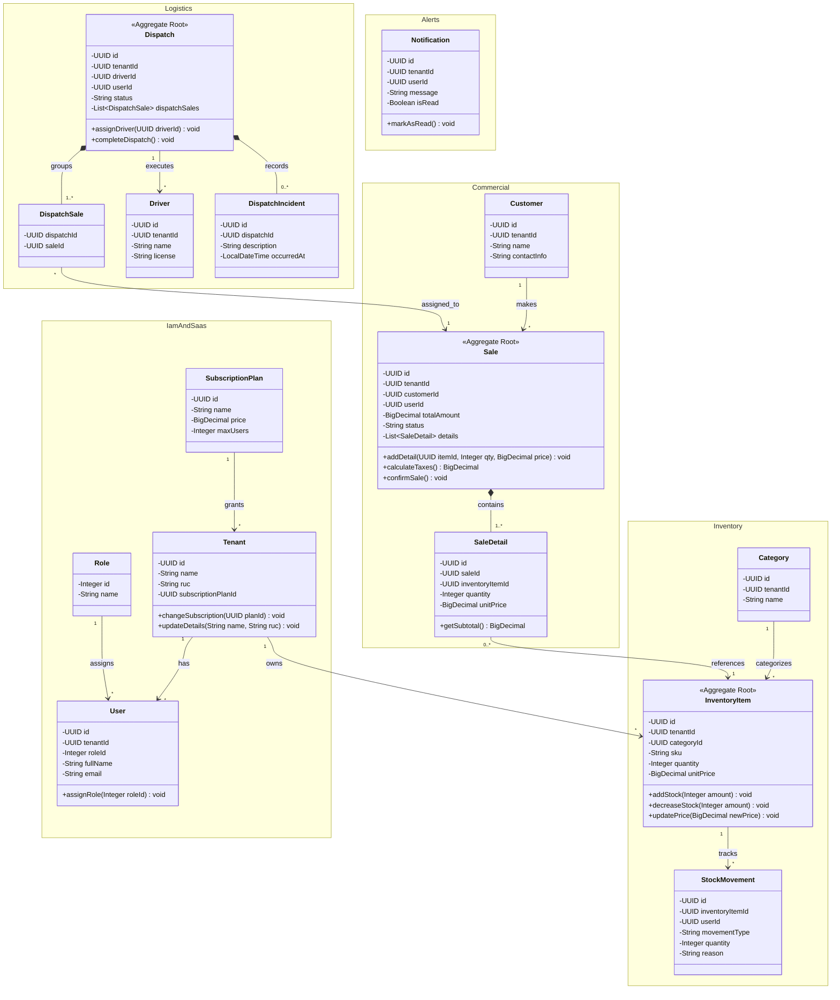
```mermaid
classDiagram
    %% ==========================================
    %% IAM / SAAS MODULE
    %% ==========================================
    namespace IamAndSaas {
        class Tenant {
            -UUID id
            -String name
            -String ruc
            -UUID subscriptionPlanId
            +changeSubscription(UUID planId) void
            +updateDetails(String name, String ruc) void
        }

        class SubscriptionPlan {
            -UUID id
            -String name
            -BigDecimal price
            -Integer maxUsers
        }

        class User {
            -UUID id
            -UUID tenantId
            -Integer roleId
            -String fullName
            -String email
            +assignRole(Integer roleId) void
        }

        class Role {
            -Integer id
            -String name
        }
    }

    %% ==========================================
    %% INVENTORY MODULE (CORE)
    %% ==========================================
    namespace Inventory {
        class InventoryItem {
            <<Aggregate Root>>
            -UUID id
            -UUID tenantId
            -UUID categoryId
            -String sku
            -Integer quantity
            -BigDecimal unitPrice
            +addStock(Integer amount) void
            +decreaseStock(Integer amount) void
            +updatePrice(BigDecimal newPrice) void
        }

        class Category {
            -UUID id
            -UUID tenantId
            -String name
        }

        class StockMovement {
            -UUID id
            -UUID inventoryItemId
            -UUID userId
            -String movementType
            -Integer quantity
            -String reason
        }
    }

    %% ==========================================
    %% COMMERCIAL MODULE
    %% ==========================================
    namespace Commercial {
        class Sale {
            <<Aggregate Root>>
            -UUID id
            -UUID tenantId
            -UUID customerId
            -UUID userId
            -BigDecimal totalAmount
            -String status
            -List~SaleDetail~ details
            +addDetail(UUID itemId, Integer qty, BigDecimal price) void
            +calculateTaxes() BigDecimal
            +confirmSale() void
        }

        class SaleDetail {
            -UUID id
            -UUID saleId
            -UUID inventoryItemId
            -Integer quantity
            -BigDecimal unitPrice
            +getSubtotal() BigDecimal
        }

        class Customer {
            -UUID id
            -UUID tenantId
            -String name
            -String contactInfo
        }
    }

    %% ==========================================
    %% LOGISTICS MODULE
    %% ==========================================
    namespace Logistics {
        class Dispatch {
            <<Aggregate Root>>
            -UUID id
            -UUID tenantId
            -UUID driverId
            -UUID userId
            -String status
            -List~DispatchSale~ dispatchSales
            +assignDriver(UUID driverId) void
            +completeDispatch() void
        }

        class DispatchSale {
            -UUID dispatchId
            -UUID saleId
        }

        class Driver {
            -UUID id
            -UUID tenantId
            -String name
            -String license
        }

        class DispatchIncident {
            -UUID id
            -UUID dispatchId
            -String description
            -LocalDateTime occurredAt
        }
    }

    %% ==========================================
    %% ALERTS MODULE
    %% ==========================================
    namespace Alerts {
        class Notification {
            -UUID id
            -UUID tenantId
            -UUID userId
            -String message
            -Boolean isRead
            +markAsRead() void
        }
    }

    %% Compositions (Aggregates)
    Sale *-- "1..*" SaleDetail : contains
    Dispatch *-- "1..*" DispatchSale : groups
    Dispatch *-- "0..*" DispatchIncident : records
    
    %% Associations
    Tenant "1" --> "*" User : has
    Tenant "1" --> "*" InventoryItem : owns
    SubscriptionPlan "1" --> "*" Tenant : grants
    Role "1" --> "*" User : assigns
    
    InventoryItem "1" --> "*" StockMovement : tracks
    Category "1" --> "*" InventoryItem : categorizes
    
    SaleDetail "0..*" --> "1" InventoryItem : references
    Customer "1" --> "*" Sale : makes
    
    Dispatch "1" --> "*" Driver : executes
    DispatchSale "*" --> "1" Sale : assigned_to
```

## 4.8. Database Design

El diseño en PostgreSQL sigue la filosofía de separación por Bounded Contexts, utilizando referencias lógicas blandas en lugar de Foreign Keys estrictas entre módulos separados para evitar el antipatrón "Big Ball of Mud".

### 4.8.1. Database Diagrams

Mapeado mediante **Spring Data JPA**, el ERD refleja:
* **Esquema WAREHOUSE:** Tabla `inventory_items` con llave primaria UUID. Enum de estados persistidos como VARCHAR.
* **Esquema LOGISTICS:** Tabla `shipment_manifests`. Atributos de Value Objects se aplana mediante la anotación `@Embedded`.
* **Esquema BILLING:** Tabla `commercial_transactions` incluye `linked_manifest_id` como referencia lógica al despacho.

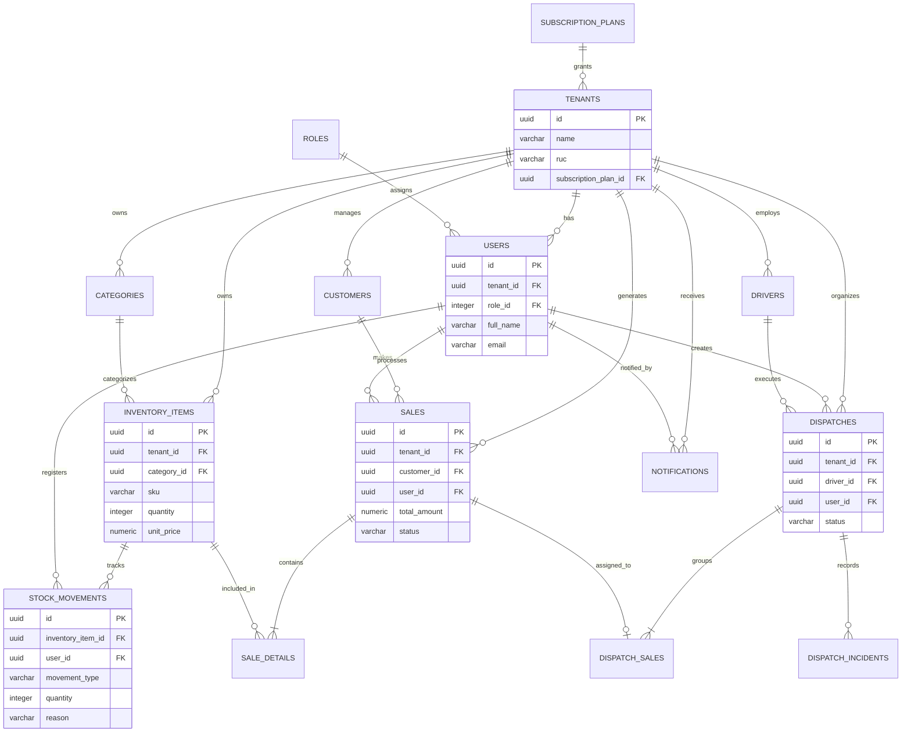
```mermaid
erDiagram
    %% SaaS & Security Module
    TENANTS ||--o{ USERS : has
    SUBSCRIPTION_PLANS ||--o{ TENANTS : grants
    ROLES ||--o{ USERS : assigns

    %% Inventory Module
    TENANTS ||--o{ INVENTORY_ITEMS : owns
    TENANTS ||--o{ CATEGORIES : owns
    CATEGORIES ||--o{ INVENTORY_ITEMS : categorizes
    INVENTORY_ITEMS ||--o{ STOCK_MOVEMENTS : tracks
    USERS ||--o{ STOCK_MOVEMENTS : registers

    %% Commercial Module
    TENANTS ||--o{ SALES : generates
    TENANTS ||--o{ CUSTOMERS : manages
    CUSTOMERS ||--o{ SALES : makes
    USERS ||--o{ SALES : processes
    SALES ||--|{ SALE_DETAILS : contains
    INVENTORY_ITEMS ||--o{ SALE_DETAILS : included_in

    %% Logistics Module
    TENANTS ||--o{ DISPATCHES : organizes
    TENANTS ||--o{ DRIVERS : employs
    USERS ||--o{ DISPATCHES : creates
    DRIVERS ||--o{ DISPATCHES : executes
    DISPATCHES ||--|{ DISPATCH_SALES : groups
    SALES ||--o| DISPATCH_SALES : assigned_to
    DISPATCHES ||--o{ DISPATCH_INCIDENTS : records

    %% Alerts Module
    TENANTS ||--o{ NOTIFICATIONS : receives
    USERS ||--o{ NOTIFICATIONS : notified_by

    TENANTS {
        uuid id PK
        varchar name
        varchar ruc
        uuid subscription_plan_id FK
    }
    USERS {
        uuid id PK
        uuid tenant_id FK
        integer role_id FK
        varchar full_name
        varchar email
    }
    INVENTORY_ITEMS {
        uuid id PK
        uuid tenant_id FK
        uuid category_id FK
        varchar sku
        integer quantity
        numeric unit_price
    }
    STOCK_MOVEMENTS {
        uuid id PK
        uuid inventory_item_id FK
        uuid user_id FK
        varchar movement_type
        integer quantity
        varchar reason
    }
    SALES {
        uuid id PK
        uuid tenant_id FK
        uuid customer_id FK
        uuid user_id FK
        numeric total_amount
        varchar status
    }
    DISPATCHES {
        uuid id PK
        uuid tenant_id FK
        uuid driver_id FK
        uuid user_id FK
        varchar status
    }
```

# Capítulo V: Product Implementation, Validation & Deployment

En este capítulo se documenta el proceso de implementación, validación y despliegue de los productos digitales que conforman la solución. Se considera el desarrollo progresivo del Landing Page, las Web Applications y los RESTful Web Services, manteniendo la trazabilidad entre los requisitos, los artefactos de diseño y las funcionalidades implementadas.

El proceso de desarrollo se organiza mediante Sprints, complementado con prácticas de Software Configuration Management, control de versiones, integración de cambios, pruebas, documentación y despliegue. De esta manera, se busca mantener un proceso de desarrollo colaborativo y ordenado durante el ciclo de vida del proyecto.

La estructura del capítulo sigue las secciones establecidas para Product Implementation, Validation & Deployment en el trabajo final del curso.

## 5.1. Software Configuration Management

La Gestión de Configuración de Software (Software Configuration Management, SCM) comprende las prácticas utilizadas para identificar, controlar, versionar y mantener los diferentes componentes de software durante el ciclo de vida del proyecto.

Para la solución se establece un conjunto de herramientas, convenciones y procedimientos que permiten mantener la consistencia entre los integrantes del equipo, controlar las modificaciones realizadas sobre el código fuente y mantener la trazabilidad de los cambios.

La configuración considera las actividades de Project Management, Requirements Management, Product UX/UI Design, Software Development, Software Documentation y Software Deployment, de acuerdo con las actividades definidas para el proyecto. El enunciado del curso establece que esta sección debe cubrir Source Code Management, Development Environment Configuration y Deployment Configuration.

### 5.1.1. Software Development Environment Configuration

A continuación se listan los productos de software utilizados por el equipo, organizados por tipo de actividad del ciclo de vida:

| Herramienta / Producto | Propósito en el Proyecto | Enlace de Referencia / Descarga |
| :--- | :--- | :--- |
| **UXPressia** | *Requirements Management & UX:* Elaboración de Fichas de User Personas, Empathy Maps, As-Is Journey Maps e Impact Maps. (SaaS) | [UXPressia](https://uxpressia.com/) |
| **Figma** | *Product UX/UI Design:* Creación de Wireframes, Mock-ups, Design Systems y prototipado interactivo para Web y Landing Page. (SaaS) | [Figma](https://www.figma.com/) |
| **LucidChart / PlantUML** | *Software Architecture:* Elaboración de diagramas UML, C4 Model y representaciones de la arquitectura de software del proyecto. | [LucidChart](https://lucid.app/) |
| **Trello / Jira** | *Project Management:* Gestión del Product Backlog, Sprint Backlog y control de Work-items mediante tableros Kanban. (SaaS) | [Trello](https://trello.com/) |
| **GitHub** | *Source Code Management:* Alojamiento de repositorios en la nube, control de versiones colaborativo y Code Reviews. (SaaS) | [GitHub](https://github.com/) |
| **WebStorm / VS Code** | *Software Development:* IDE principal utilizado para el desarrollo de la Landing Page y las Web Applications mediante tecnologías web. | [VS Code](https://code.visualstudio.com/) |
| **Angular** | *Frontend Web Application:* Framework utilizado para desarrollar la aplicación web mediante componentes y TypeScript. | [Angular](https://angular.dev/) |
| **TypeScript** | *Frontend Development:* Lenguaje utilizado para implementar la lógica y los componentes de la Web Application. | [TypeScript](https://www.typescriptlang.org/) |
| **Node.js & npm** | *Software Development Environment:* Entorno de ejecución y gestor de paquetes para el desarrollo con Angular Framework. | [Node.js](https://nodejs.org/) |
| **Java Development Kit (JDK 17)** | *Software Development Environment:* Entorno de desarrollo para compilar y ejecutar nuestra API en Spring Boot. | [Adoptium JDK](https://adoptium.net/) |
| **Swagger UI (OpenAPI)** | *Software Documentation:* Herramienta integrada en el backend para la documentación automatizada e interactiva de nuestros Endpoints. | [Swagger](https://swagger.io/) |

### 5.1.2. Source Code Management

La administración del código fuente constituye un elemento fundamental para el desarrollo colaborativo de la solución. El equipo utiliza GitHub como plataforma de control de versiones y colaboración, permitiendo mantener un historial de los cambios realizados sobre los diferentes productos digitales.

**1. Establecimiento de repositorios en GitHub**
El proyecto mantiene repositorios independientes para los componentes principales de la solución:
* **Landing Page Repository:** `https://github.com/AI-ToDu/ai-todu-landing-page`
* **Web Applications (Frontend) Repository:** `https://github.com/AI-ToDu/ai-todu-frontend-app`
* **RESTful Web Services (Backend) Repository:** `https://github.com/AI-ToDu/ai-todu-backend-api` *(Nota: Este repositorio incluye los archivos y paquetes de pruebas unitarias y de integración del API).*

**2. GitFlow Workflow**
Para gestionar la evolución de nuestro código de manera ordenada sin interrumpir el trabajo de otros colaboradores, aplicamos el modelo **GitFlow**:
* **Main Branch (`main`):** Rama base que refleja el estado de producción. Es la rama publicada por GitHub Pages.
* **Develop Branch (`develop`):** Rama utilizada para integrar los cambios realizados durante el desarrollo.
* **Feature Branches (`feature/*`):** Ramas temporales para desarrollar funcionalidades aisladas.
* **Release Branches (`release/*`):** Rama utilizada para preparar una nueva versión antes de incorporar a `main`.
* **Hotfix Branches (`hotfix/*`):** Rama utilizada para corregir problemas detectados en una versión publicada.

El etiquetado de nuestros *Releases* en la rama `main` sigue el estándar de versionado semántico **MAJOR.MINOR.PATCH** (ej. `v1.2.4`):
* **MAJOR:** Cambios drásticos o arquitectónicos que rompen la compatibilidad hacia atrás.
* **MINOR:** Inclusión de nuevas funcionalidades que mantienen la compatibilidad hacia atrás.
* **PATCH:** Corrección de *bugs* o refactorizaciones menores.

**3. Conventional Commits**
Para mantener un historial de repositorios legible y generar notas de lanzamiento automáticas, todo el equipo utiliza la especificación *Conventional Commits*:
* `feat:` Una nueva característica o funcionalidad.
* `fix:` Una corrección de error (*bug*).
* `docs:` Cambios únicamente en la documentación.
* `style:` Cambios que no afectan el significado del código (espacios, formato).
* `refactor:` Un cambio de código que ni corrige un error ni añade una característica.
* `test:` Adición o corrección de pruebas existentes.
* `chore:` Actualizaciones de tareas de construcción o configuración.

### 5.1.3. Source Code Style Guide & Conventions

Con el objetivo de mantener un código fuente uniforme, legible y mantenible durante el desarrollo del proyecto, se establecen convenciones de nomenclatura, formato y organización, integrando nuestra arquitectura basada en Domain-Driven Design (DDD).

* **A. Landing Page (HTML5, CSS3, JavaScript):** Nombres de elementos en minúsculas, valores de atributos entre comillas dobles, estructura semántica e identación uniforme.
* **B. Frontend Web Applications (Angular y TypeScript):** Nombres descriptivos, variables y funciones en `camelCase`, clases e interfaces en `PascalCase`, separación estricta de lógica y presentación.
* **C. Web Services (Java, Spring Boot y Spring Data JPA):** Clases en `PascalCase`, variables y métodos en `camelCase`, controladores para exponer recursos, servicios con lógica de negocio y persistencia gestionada mediante Spring Data JPA.
* **D. Convenciones generales:** Identificadores técnicos en inglés, evitar código duplicado y adhesión estricta a *Conventional Commits* y *Semantic Versioning*.

### 5.1.4. Software Deployment Configuration

Para garantizar que los productos desarrollados estén disponibles continuamente, hemos configurado procesos de despliegue automatizado estructurados en las siguientes plataformas:
1. **Landing Page (Sitio Web Estático):** Alojado en **Vercel o Netlify**. Cada *Merge* a la rama `main` dispara automáticamente un *webhook* que construye los archivos estáticos y los despliega globalmente mediante un CDN.
2. **Frontend Web Applications (Angular):** Vinculado a **Vercel o Firebase Hosting**. Al fusionar un *Pull Request* hacia la rama de producción (`main`), el motor interno ejecuta `ng build --configuration production`, optimizando el *bundle* y desplegando artefactos seguros para SPA.
3. **RESTful Web Services & Database (Backend):** Alojado en **Render o Railway (PaaS)**. Clona el código fuente de Spring Boot desde GitHub, compila mediante Maven/Gradle a un archivo `.jar` y se conecta de forma administrada a una base de datos **PostgreSQL** mediante variables de entorno encriptadas.

## 5.2. Landing Page, Services & Applications Implementation

### 5.2.1. Sprint 1

#### 5.2.1.1. Sprint Planning 1

| Sprint # | Sprint 1 |
| :--- | :--- |
| **Sprint Planning Background** | Durante la reunión de planificación, el equipo revisó el Product Backlog y priorizó las historias relacionadas con la Landing Page estática para presentar la propuesta de valor inicial al mercado. |
| **Date** | 2026-09-01 |
| **Time** | 10:00 AM |
| **Location** | Microsoft Teams (Reunión Virtual) |
| **Prepared By** | Salazar Marquina, Kevin Junior (Team Leader) |
| **Attendees** | Todos los integrantes del equipo. |
| **Sprint Goal & User Stories** | **Meta del Sprint:** Implementar la primera versión funcional de la Landing Page de AI-ToDu, enfocándose en comunicar la propuesta B2B a clientes potenciales. **User Stories:** US05, US06, US07, US08. |
| **Sprint 1 Velocity** | 14 Story Points |
| **Sum of Story Points** | 14 Story Points |

#### 5.2.1.3. Sprint Backlog 1

| Story Id | Story Title | Task Title | Est. (h) | Assigned To | Estado |
| :--- | :--- | :--- | :---: | :--- | :---: |
| US05 | Propuesta de Valor | Diseñar Wireframes LP | 3 | Salazar Marquina, Kevin | Terminado |
| US05 | Propuesta de Valor | Maquetar HTML5/CSS3 | 5 | Salazar Quiche, Darikson | Terminado |
| US06 | Funcionalidades | Añadir cards de producto | 2 | Bernal Torres, Carlos | Terminado |
| TSK01 | Configuración Repo | Configurar GitHub y GitFlow | 2 | Chui Kcomt, Luis | Terminado |
| US08 | Contacto B2B | Redactar documentación base | 2 | Condezo Pacheco, Fernando | Terminado |

---

### 5.2.3. Sprint 3

Este Sprint representa el hito más importante del proyecto, enfocado en la implementación completa del núcleo de negocio de la Web Application (SaaS). Se desarrollaron los Bounded Contexts de Inventario, Ventas, Logística y Reportes utilizando Angular 17+ y *Signals* para el manejo reactivo del estado.

#### 5.2.3.1. Sprint Planning 3

| Sprint # | Sprint 3 |
| :--- | :--- |
| **Sprint Planning Background** | Con la arquitectura de enrutamiento y seguridad (IAM) ya estable, el equipo planificó la construcción de las pantallas operativas principales. Se acordó utilizar "Fake APIs" (Stores locales con Signals) para asegurar el funcionamiento del frontend previo a la conexión final con Spring Boot. |
| **Date** | 2026-09-22 |
| **Time** | 09:00 AM |
| **Location** | Discord (Reunión Virtual) |
| **Prepared By** | Salazar Marquina, Kevin Junior (Team Leader) |
| **Attendees** | Salazar Marquina, Kevin / Bernal Torres, Carlos / Chui Kcomt, Luis / Condezo Pacheco, Fernando / Salazar Quiche, Darikson |
| **Sprint 3 Goal** | **Meta del Sprint:** Desarrollar e integrar los módulos interactivos de Inventario, Punto de Venta (Caja), Despachos (Kanban) y el Dashboard Gerencial, permitiendo transacciones simuladas completas en el Frontend, y realizar el despliegue a producción en GitHub Pages. |
| **Sprint 3 Velocity** | 24 Story Points |
| **Sum of Story Points** | 24 Story Points |

#### 5.2.3.2. Aspect Leaders and Collaborators

| Team Member | GitHub Username | UI/UX & Routing | Core Logic (Signals) | Integration & Deploy |
| :--- | :--- | :---: | :---: | :---: |
| Bernal Torres, Carlos Alberto | @CharlesBernal-Hub | L | C | C |
| Chui Kcomt, Luis Carlos | @OffEnergy | C | L | C |
| Condezo Pacheco, Fernando André | @LEFEROX | C | C | L |
| Salazar Marquina, Kevin Junior | @AresSalamar | L | C | L |
| Salazar Quiche, Darikson Bill | @darikson26 | C | L | C |

#### 5.2.3.3. Sprint Backlog 3

| Story Id | Story Title | Task Title | Est. (h) | Assigned To | Estado |
| :--- | :--- | :--- | :---: | :--- | :---: |
| US23 | Dashboard General | Maquetar tarjetas financieras dinámicas. | 4 | Salazar Quiche, Darikson | Terminado |
| US09 | Registro de Artículo | Conectar modal y validación de SKU único. | 5 | Condezo Pacheco, Fernando | Terminado |
| US15 | Creación de Venta | Implementar POS interactivo y descuento de stock. | 6 | Salazar Marquina, Kevin | Terminado |
| US19 | Manifiesto Despacho| Crear Tablero Kanban de Logística y Modales. | 5 | Chui Kcomt, Luis | Terminado |
| US33 | Idioma aplicación | Implementar i18n reactivo (Diccionarios JSON). | 3 | Bernal Torres, Carlos | Terminado |
| TSK03 | Despliegue Frontend| Configurar Angular CLI y `gh-pages` build. | 2 | Salazar Marquina, Kevin | Terminado |

#### 5.2.3.4. Development Evidence for Sprint Review

Durante el Sprint 3, la programación se caracterizó por la segmentación estricta de carpetas siguiendo el enfoque **Domain-Driven Design (DDD)** dentro de Angular (ej. `src/app/sales/application/sales.store.ts`).

| Repository | Branch | Commit Id | Commit Message | Commited on |
| :--- | :--- | :--- | :--- | :---: |
| ai-todu/AIToDu-webapp | `feature/pos-module` | `9aa7dae` | feat: Modulo POS (Caja) y Dashboard Gerencial | 2026-10-06 |
| ai-todu/AIToDu-webapp | `feature/logistics-kanban` | `b2c3d4e` | feat: Modulo de Logistica y control de manifiestos | 2026-10-06 |
| ai-todu/AIToDu-webapp | `feature/iam-i18n` | `c3d4e5f` | feat: Seguridad IAM, Internacionalizacion y Documentacion | 2026-10-07 |

#### 5.2.3.5. Execution Evidence for Sprint Review

La plataforma Frontend logró consolidarse como una Single-Page Application funcional. Se demostraron flujos complejos, tales como registrar un producto en el inventario y venderlo inmediatamente en la vista de Caja, visualizando el descuento de stock automático y la generación de la boleta.

**Evidencias fotográficas (Live Demo):**
* **Dashboard Gerencial:** Muestra ingresos calculados y notificaciones de alertas de stock.
* **Módulo de Inventario:** Lista de productos con etiquetas de colores semánticos (Ej. "GOOD", "DAMAGED").
* **Módulo POS (Caja):** Carrito de compras funcional con validación de stock y Boleta Electrónica emergente.
* **Módulo de Logística:** Tablero de control (Kanban) interactivo para asignación de manifiestos a conductores.

  *(Adjuntar aquí las capturas de pantalla de la aplicación ejecutándose en localhost o GitHub Pages mostrando el Dashboard, POS y Despachos)*

#### 5.2.3.6. Services Documentation Evidence for Sprint Review

Para asegurar que el frontend creado en este Sprint se conecte sin problemas con el backend de Spring Boot, el equipo documentó formalmente las entidades de respuesta (`BaseResponse`, `SaleResource`) en la capa `infrastructure` de Angular, preparándolas para consumir los contratos expuestos en la especificación OpenAPI (Swagger) del servidor.

#### 5.2.3.7. Software Deployment Evidence for Sprint Review

El despliegue final del Frontend se realizó utilizando **GitHub Pages** mediante el paquete `angular-cli-ghpages`.
* Se ejecutó el comando `ng deploy --base-href=/AIToDu-webapp/`.
* El proceso generó el *build* de producción en la carpeta `dist/` y lo subió automáticamente a la rama `gh-pages`.
* **URL en vivo:** [https://ai-todu.github.io/AIToDu-webapp/](https://ai-todu.github.io/AIToDu-webapp/)

#### 5.2.3.8. Team Collaboration Insights during Sprint

La colaboración se gestionó de forma altamente modularizada. Al dividir el trabajo por *Bounded Contexts* (Inventario para un desarrollador, Ventas para otro), se evitaron conflictos de código (Merge Conflicts) críticos. El uso de Conventional Commits facilitó el rastreo de qué miembro construyó qué capa del sistema.

---

## 5.3. Validation Interviews

### 5.3.1. Diseño de Entrevistas

Para validar la utilidad del producto desarrollado en el Sprint 3, se diseñó un protocolo de entrevistas donde los usuarios (dueños de MYPEs y operarios) interactuaron directamente con la aplicación web desplegada en GitHub Pages. El objetivo fue medir la intuición de la interfaz, el tiempo en completar una tarea (ej. realizar una venta) y la percepción del valor del Dashboard.

### 5.3.2. Registro de Entrevistas

* **Entrevistado 1 (Segmento Dueño):** Validó positivamente la visibilidad del Dashboard. Expresó gran satisfacción al ver que el sistema descuenta automáticamente el stock en tiempo real tras procesar un pago en la vista de Caja, eliminando la necesidad de cálculos manuales.
* **Entrevistado 2 (Segmento Logística):** Interactuó con la vista de Despachos. El uso de botones sin alertas invasivas (sin uso de `prompts` nativos) y la ventana modal limpia para "Nuevo Manifiesto" fueron calificados como muy profesionales y rápidos de usar.

### 5.3.3. Evaluaciones según heurísticas

Tras la finalización del Frontend, el equipo QA aplicó una evaluación basada en los 10 principios heurísticos de Jakob Nielsen para asegurar la calidad de la Interfaz de Usuario (UI):

| Heurística de Nielsen | Aplicación y Cumplimiento en AI-ToDu |
| :--- | :--- |
| **1. Visibilidad del estado del sistema** | **Cumple:** El sistema muestra notificaciones inmediatas (ej. "¡Venta procesada con éxito!" en color verde) y etiquetas visuales de stock ("Stock: 14" vs "Stock: 0" en rojo). |
| **2. Relación entre sistema y mundo real** | **Cumple:** Se utiliza lenguaje logístico estándar ("SKU", "Manifiesto", "Merma") familiar para almaceneros y administradores, evitando jerga de programación. |
| **3. Control y libertad del usuario** | **Cumple:** Posibilidad de sumar o restar elementos en el carrito de compras con botones `+` y `-`, y opciones claras de "Cancelar" en todos los modales de creación. |
| **4. Consistencia y estándares** | **Cumple:** El menú superior oscuro y los botones de acción principal (Teal) se mantienen consistentes en todas las vistas (Dashboard, Inventario, POS). |
| **5. Prevención de errores** | **Cumple:** En el módulo de Caja, si un producto tiene stock 0, el sistema bloquea visual y lógicamente la tarjeta, impidiendo que el cajero lo agregue al carrito. En el formulario de inventario, se bloquea el guardado si se repite un SKU. |
| **6. Reconocimiento antes que recuerdo** | **Cumple:** Las tarjetas de producto en Caja muestran la cantidad restante; el usuario no tiene que memorizar cuánto queda en el almacén. |
| **8. Estética y diseño minimalista** | **Cumple:** La vista del Punto de Venta (POS) está despejada de información técnica irrelevante. Los modales emergentes (ej. Boleta electrónica) centran la atención del usuario atenuando el fondo. |

---

## 5.4. Video About-the-Product

El video final "About-the-Product" presenta el funcionamiento en vivo de AI-ToDu, demostrando la integración entre el Inventario, la Caja de Ventas y el panel de Despachos Logísticos.

* **Enlace del Video:** [YouTube - AI-ToDu Live Demo & Value Proposition](https://youtu.be/NXNWTw8_6GY) *(Enlace de referencia)*
* **Duración:** 03:30 min

---

## Conclusiones

* La aplicación estricta de la arquitectura **Domain-Driven Design (DDD)** desde la fase de diseño hasta la codificación en Angular ha permitido al equipo construir un software altamente modular, donde el desarrollo de los módulos de Inventario y Ventas pudo realizarse en paralelo sin generar acoplamientos dañinos.
* El uso de tecnologías modernas como **Angular Signals** ha demostrado ser una solución excepcionalmente rápida y limpia para el manejo del estado reactivo en aplicaciones complejas (como carritos de compra), eliminando la complejidad excesiva de herramientas antiguas.
* Las entrevistas de validación y la evaluación heurística confirmaron que la propuesta de valor de AI-ToDu soluciona problemas tangibles de las MYPES. La visualización financiera inmediata (Dashboard) y la prevención de errores (bloqueo de ventas sin stock) son las características que mayor confianza y valor generaron en nuestros usuarios objetivo.

## Bibliografía

* Instituto Nacional de Estadística e Informática. (2022). *Producción nacional: Informe técnico*. INEI. [Enlace](https://www.inei.gob.pe/media/MenuRecursivo/boletines/boletin-estadistico-del-sector-servicios-n-12-diciembre-2022.pdf)
* Evans, E. (2003). *Domain-Driven Design: Tackling Complexity in the Heart of Software*. Addison-Wesley Professional.
* Centro Nacional de Planeamiento Estratégico. (2023). *Políticas y estrategias nacionales de desarrollo agroalimentario*. CEPLAN. [Enlace](https://www.ceplan.gob.pe/documentos_/politicas-y-estrategias-nacionales/)
* Ministerio de Trabajo y Promoción del Empleo. (2023). *Informe anual del empleo en el Perú 2022*. MTPE. [Enlace](https://cdn.www.gob.pe/uploads/document/file/4558080/Informe_Anual_del_Empleo_Peru_2022.pdf)
* Ministerio de Transportes y Comunicaciones. (2022). *Anuario estadístico 2022*. MTC. [Enlace](https://portal.mtc.gob.pe/estadisticas/publicaciones/anuarios/ANUARIO_ESTADISTICO_2022.pdf)
* Evans, E. (2004). *Domain-driven design: Tackling complexity in the heart of software*. Addison-Wesley Professional.
* França, A. C. C., da Silva, F. Q. B., & Mariz, L. M. R. de S. (2010). An empirical study on the relationship between the use of agile practices and the success of Scrum projects. *Proceedings of the 2010 ACM-IEEE International Symposium on Empirical Software Engineering and Measurement*. [DOI](https://doi.org/10.1145/1852786.1852835)
* Curcio, K., Santana, R., Reinehr, S., & Malucelli, A. (2019). Usability in agile software development: A tertiary study. *Computer Standards & Interfaces, 64*, 61–77. [DOI](https://doi.org/10.1016/j.csi.2018.12.003)
* Nielsen, J. (1992). Finding usability problems through heuristic evaluation. *Proceedings of the SIGCHI Conference on Human Factors in Computing Systems*, 373–380. [DOI](https://doi.org/10.1145/142750.142834)
* Nielsen, J., & Molich, R. (1990). Heuristic evaluation of user interfaces. *Proceedings of the SIGCHI Conference on Human Factors in Computing Systems*, 249–256. [DOI](https://doi.org/10.1145/97243.97281)
* Law, E. L.-C., & Hvannberg, E. T. (2007). Heuristic evaluation: Comparing ways of finding and reporting usability problems. *Interacting with Computers, 19*(2), 225–240. [DOI](https://doi.org/10.1016/j.intcom.2006.10.001)
* Matharu, G. S., Mishra, A., Singh, H., & Upadhyay, P. (2015). Empirical study of agile software development methodologies: A comparative analysis. *ACM SIGSOFT Software Engineering Notes, 40*(1), 1–6. [DOI](https://doi.org/10.1145/2693208.2693233)
* Sato, D., Bassi, D., Bravo, M., Goldman, A., & Kon, F. (2006). Experiences tracking agile projects: An empirical study. *Journal of the Brazilian Computer Society, 12*, 45–64.
